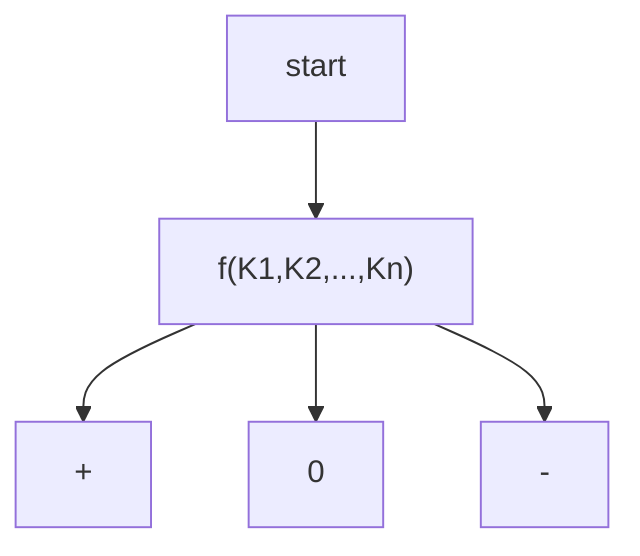
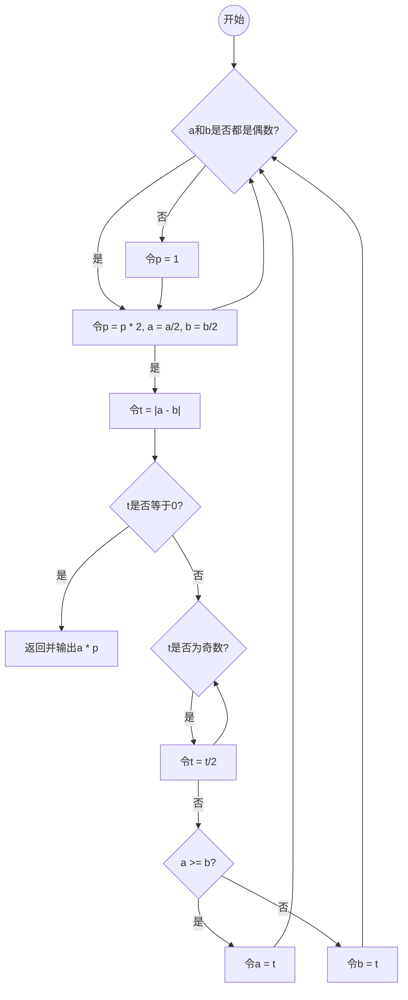

## Algorithm
$$
Algorithm + Data\ Structure=Program
$$

$$
(Algo+DS)\times Efficiency=Computation
$$

## 时间复杂度
### T-notation
$$
T_A(P)=算法A求解问题P的计算成本
$$
$$
T_A(n)=算法A求解问题规模为n的计算成本
$$
A 在上下文确定时，可以省略。

$$
T(n)=max\{T(P)\ |\ |P|=n\}
$$
只关注成本最高者。
### big-O-notation
渐进分析 (Asymptotic analysis)：只关心问题规模足够大（$n\rightarrow \infty$）后，计算成本的增长趋势。

**大 O 记号**：
$$
T(n)=O(f(n))
$$
当且仅当，$\forall n\gg 2,\exists c>0,使得\ T(n)<c\cdot f(n)$

推论：
1. $n\gg2时，O(f(n))=O(c\cdot f(n))$;
2. $O(n^{a}+n^{b})=O(n^{a}),a\ge b> 0$;
3. $\lim_{n\rightarrow\infty} \frac{T(n)}{f(n)}$ 不一定存在;

举例：
$$
\begin{align*}
&\sqrt{5n[3n(n+2)+4]+6} \\
&< \sqrt{5n[6n^2+4]+6} \\
&< \sqrt{35n^{3+6}} \\
&< 6 \cdot n^{1.5} \\
&= O(n^{1.5})
\end{align*}
$$

$O(f(n))$ 是 $T(n)$ 的上界渐进，作为 n 充分大时对 $T(n)$ 的悲观估计。

### Ω-notation
当且仅当 $\forall n\gg2,\exists c>0,使得 T(n)>c\cdot f(n)$，记为：
$$
T(n)=\Omega(f(n))
$$

$\Omega(f(n))$ 是 $T(n)$ 的下界渐进，作为 n 充分大时对 $T(n)$ 的乐观估计。

### Θ-notation

当且仅当 $\forall n\gg2,\exists c_{1}>c_{2}>0,使得 c_{1}\cdot f(n)>T(n)>c_{2}\cdot f(n)$，记为：
$$
T(n)=\Theta(f(n))
$$

$\Theta(f(n))$ 是 $T(n)$ 的确界，作为 n 充分大时对 $T(n)$ 渐近紧致的估计。

![[图01-04.大O记号、大Omega记号和大theda记号.png]]

### 大 O 记号的多项式
#### $O (1)$: constant

#### $O (logn)$: ploy-log
- 底数无所谓；
- 常系数无所谓；
- 常数次幂无所谓：$\forall c>0,logn^{c}=c\cdot logn=\Theta(logn)$;
	- 举例：
$$
\begin{equation}
\begin{aligned}
123\cdot \log^{321}n &+ \log^{205}(7\cdot n^{2}-15n+31) \\
&< 123\cdot \log^{321}n + \log^{205}(8n^{2}) \\
&< 123\cdot \log^{321}n + 2\cdot \log^{205}(3n) \\
&= \Theta(\log^{321}n)
\end{aligned}
\end{equation}
$$
- 复杂度接近常数：$\forall c>0,logn=O(n^c)$;
	- $\lim_{n\rightarrow \infty} \frac{ln(n)}{n^{c}}=0$;


#### $O (n^c)$: polynomial
$a_{k}\cdot n^{k}+a_{k-1}\cdot n^{k-1}+\cdots+a_{2}\cdot n^{2}+a_{1}\cdot n^{1}+a_{0}=O(n^{k}),a_{k}>0$

#### $O (2^n)$: exponential
无穷级数表示指数： $e^n=1+n+\frac{n^{2}}{2!}+\frac{n^{3}}{3!}+\dots$
因而 $\forall c>1,n^{c}<e^{n}=O(2^{n})$ 

$O(n^{c})$ 到 $O(2^{n})$ 是有效算法到无效算法的分水岭。

**NPC 问题**：No-Polynomial complete
典型如 2-Subset 问题，其有定理 $|2^{S}|=2^{|S|}=2^{n}$

![[算法复杂度层次级别.png]]
- $log^{*}n$ 表示对数迭代函数，即取多少次对数，使得 $logn$ 的值小于等于 1，返回的是对数运算的次数；
	- $log^{*}_{2}16=3$
	- $log^{*}_{2}2^{1024}=5:$
		- $log_{2}2^{1024}=1024$,
		- $log_{2}1024=10$,
		- $log_{2}10\approx 3.2$,
		- $log_{2}3.2\approx 1.8$,
		- $log_{2}1.8<1$
	- $log^{*}n=O(log^{*}(logn))$ 

## 复杂度分析
### 级数

算术级数：与末项平方同阶
- $T(n)=1+2+...+n=\binom{n+1}{2}=\frac{n(n+1)}{2}=O(n^{2})$

幂方级数：比幂级数高出一阶
- $T(n)=\sum_{k=0}^{n}k^{d}\approx \int_{0}^{n}x^{d}dx=\frac{n^{d+1}}{d+1}=O(n^{d+1})$

几何级数：与末项同阶
- $T_{a}(n)=\sum_{k=0}^{n}=a^{0}+a^{1}+...+a^{n}=\frac{a^{n+1}-1}{a-1}=O(a^{n}),1<a$
- 即等比数列求和


**收敛**：
收敛级数：$O(1)$
- $\sum\limits_{k=2}^{n}\frac{1}{(k-1)\cdot k}=\frac{1}{1\cdot 2}+\frac{1}{2\cdot 3}+...+\frac{1}{(n-1)\cdot n}=1-\frac{1}{n}=O(1)$
- $\sum\limits_{k\ is\ a\ perfect\ power}\frac{1}{k-1}=\frac{1}{3}+\frac{1}{7}+\frac{1}{8}+\frac{1}{15}+...=1=O(1)$

几何分布: $O(1)$
- $(1-\lambda)\cdot[1+2\lambda+3\lambda^{2}+4\lambda^{3}+...]=\frac{1}{1-\lambda}=O(1),0<\lambda<1$
- 举例：对于一个抛硬币实验，正面向上概率为 $\lambda$，则抛若干次至第一次出现正面向上的期望为 $(1-\lambda)\cdot[1+2\lambda+3\lambda^{2}+4\lambda^{3}+...]=\frac{1}{1-\lambda}=O(1),0<\lambda<1$


**不收敛，但有限**：
调和级数：$\Theta(logn)$
- $h(n)=\sum\limits_{k=1}^{n}\frac{1}{k}=1+\frac{1}{2}+\frac{1}{3}+...=lnn+\gamma+O(\frac{1}{2n})=\Theta(logn)$

对数级数：$\Theta(nlogn)$
- $\sum\limits_{k=1}^{n}lnk=ln\prod\limits_{k=1}^{n}=ln(n!)\approx (n+0.5)lnn-n=\Theta(nlogn)$
- stirling formulation: $n!\approx \sqrt{2\pi n}\cdot (\frac{n}{e})^n$ 
- stirling approximation: $ln(n!)=n\ln n-n+O(\ln n)$ 

### 迭代
![[涉及级数的迭代时间复杂度估计.png]]

### 习题集结论

#### 1-9 log n = O(n^ε)
对任何 $ε>0$，都有 $\log n=O(n^{ε})$

**证明**：
- 函数 $\ln n$ 增长得极慢，故总存在 $M > 0$，使得 $n > M$ 之后总有 $\ln n < εn$。
- 令 $N = e^M$，则当 $n > N$（即 $\ln n > M$）之后，总有：$\ln(\ln n) < ε\ln n$，亦即：$\ln n < n^ε$。

#### 1-10 等差等比之和的 O-notation
**等差级数之和与其中最大项的平方同阶**：
- 考查首项为常数 x、公差为常数 d > 0、长度为 n 的等差级数： $\{ x, x + d, x + 2d, ..., x + (n - 1)d \}$ 
- 其中末项 $(n - 1)d = \Theta(n)$，各项总和为： $(\frac{d}{2})n^{2} + (x - \frac{d}{2})n = \Theta(n^{2} )$。

**等比级数之和与最大项同阶**：
- 考查首项为常数 x、公比为常数 d > 1、长度为 n 的等比级数： $\{ x, xd, xd^{2} , ..., xd^{n-1} \}$ 
- 其中末项 $xd^{n-1} = \Theta(d^{n} )$，各项总和为： $x(d^{n} -1)/(d-1) = \Theta(d^{n} )$

#### 算法导论中排序渐进增长率的题
![[算法导论中排序渐进增长率.png]]

## 迭代与递归
### 减治
![[减治.png]]

#### 线性递归跟踪
![[递归跟踪.png]]
- 跟踪递归发生了多少次，每次递归占用了多少空间、运行了多少时间，即可计算整体时间复杂度
- 该问题中空间复杂度为 $O(n)$；

#### 线性递推方程
![[递推方程.png]]
- 减治的思想是，每一次操作都将问题规模减小一部分，被减小的平凡部分时间复杂度是固定的 $O(1)$ 或其它，然后递推下去；

### 分治
![[分治.png]]
- 二分查找是减治，归并排序是分治；
- 减治思想是除去平凡的子问题；而分治思想是将原问题切分成若干子问题，对子问题进行同样的操作，直到子问题变为平凡；

#### 二分递归跟踪
![[分治sum.png]]

![[二分递归跟踪.png]]
- sum (0,8)先入栈，接着是 sum (0,4)，接着是 sum (0,2)，最后是 sum (0,1)，此时栈顶为平凡地返回 A[0]，出栈后 sum (1,2)入栈得到 A[1]，出栈后栈顶变为 sum (0,2)则得到 sum (0,1)+sum (1,2)=A[0]+A[1]，以此类推；
- 递归深度为 $\log n$；
#### 二分递推方程

$$
\begin{aligned}
&T(n)=2\cdot T(\frac{n}{2})+O(1) \\
&...\\
&T(1)=O(1) //递归基:sum(A,k,k)\\
\end{aligned}
$$

求解：

$$
\begin{aligned}
T(n)&=2\cdot T(\frac{n}{2})+O(1) \\
&=4\cdot T(\frac{n}{4})+O(3) \\
&=8\cdot T(\frac{n}{8})+O(7)\\
&...\\
&=n\cdot T(1)+O(n-1)\\
&=O(2n-1)\\
&=O(n)
\end{aligned}
$$

### 判断题：关于减治和分治的区分
**判断**: 用分治思想来解决长度为 n 的数组求和问题 (n 足够大), 递归实例的数目会比用减治的方法少. (❌)

**解析**: 
- 减冶算法中递归实例分别是: 1 个规模为 n 的实例, 1 个规模为 n-1 的实例, 1 个规模为 n-2 的实例, … 共 n 个；
- 分治算法中, 递归实例分别是: 1 个规模为 n 的实例, 2 个规模为 $\frac{n}{2}$ 的实例, 4 个规模为 $\frac{n}{4}$ 的实例, 共有 1 + 2 + 4 + … + n 个。

## 主定理
![[主定理.png]]

### Generic form
Master Theorem 是一种用于分析递归算法时间复杂度的工具，特别适用于分治算法中的递归情况。这些算法将输入划分为大小相等的较小子问题，递归求解子问题，然后组合子问题解决方案以给出原始问题的解决方案。这种算法的时间可以通过将它们在递归的顶层执行的工作（将问题划分为子问题，然后组合子问题解决方案）与算法的递归调用中所做的时间相加来表示。

Master Theorem的一般形式如下：

如果递归算法的递归式可以表示为：$T(n) = aT(\frac{n}{b}) + f(n)$，其中：
- $a$ is the number of subproblems in the recursion,
- $b$ is the factor by which the subproblem size is reduced in each recursive call (b>1), (a b 不能与 n 相关)
- $f(n)$ denotes the amount of time taken at the top level of the recurrence.

Recurrences of this form often satisfy one of the three following regimes, based on how the work to split/recombine the problem $f(n)$ relates to the critical exponent 
$$c_{crit}=log_{b}a=\frac{log(subproblems num)}{log(relative subproblem size)} $$.
#### Case 1
Work to split/recombine a problem is dwarfed by subproblems.
- 如果 $f(n) = O(n^{c}),c<c_{crit}$，那么 $T(n) = Θ(n^{c_{crit}})$
- The splitting term does not appear; the recursive tree structure dominates.

#### Case 2
Work to split/recombine a problem is comparable to subproblems.
- 如果 $f(n) = Θ(n^{c_{crit}} * \log^{k} n),k\ge0$，那么 $T(n) = Θ(n^{c_{crit}} * log^{(k+1)} n)$
- rangebound by the critical-exponent polynomial, times zero or more optional $\log$ s,
- The bound is the splitting term, where the log is augmented by a single power.

#### Case 3
Work to split/recombine a problem dominates subproblems.
- 如果 $f(n) = Ω(n^c),c>c_{crit}$，且存在 $k< 1$，使得 $af(\frac{n}{b}) ≤ k{f(n)}$，那么 $T(n) = Θ(f(n))$。


### Example
#### Case 1：
$$T(n)=8T\left({\frac {n}{2}}\right)+1000n^{2}$$

As one can see from the formula above:
$$a=8,\,b=2,\,f(n)=1000n^{2}$$, so
$$f(n) = O\left(n^c\right)$$, where $c=2$.

Next, we see if we satisfy the case 1 condition:
$$\log _{b}a=\log _{2}8=3>c$$
It follows from the first case of the master theorem that
$$T(n) = \Theta\left( n^{\log_b a} \right) = \Theta\left( n^{3} \right)$$

(This result is confirmed by the exact solution of the recurrence relation, which is $T(n)=1001n^{3}-1000n^{2}$, assuming $T(1)=1$).

#### Case 2
$$T (n)=2T\left({\frac {n}{2}}\right)+10n$$
As we can see in the formula above the variables get the following values:
$$a=2,\,b=2,\,c=1,\,f(n)=10n $$
$$f(n)=\Theta \left(n^{c}\log ^{k}n\right) $$ where $c=1,k=0$.

Next, we see if we satisfy the case 2 condition:
$$\log _{b}a=\log _{2}2=1 $$ and therefore, c and $\displaystyle \log _{b}a$ are equal.

So it follows from the second case of the master theorem:

$$T(n)=\Theta \left(n^{\log _{b}a}\log ^{k+1}n\right)=\Theta \left(n^{1}\log ^{1}n\right)=\Theta \left(n\log n\right) $$

Thus the given recurrence relation $T(n)$ was in $\Theta(n \log n)$.

(This result is confirmed by the exact solution of the recurrence relation, which is $T(n)=n+10n\log _{2}n$, assuming $T(1)=1$).

#### Case 3
$$T(n)=2T\left({\frac {n}{2}}\right)+n^{2} $$
As we can see in the formula above the variables get the following values:
$$a=2,\,b=2,\,f(n)=n^{2} $$
$$f(n)=\Omega \left(n^{c}\right) $$, where $c=2$.

Next, we see if we satisfy the case 3 condition:
$$\log _{b}a=\log _{2}2=1 $$, and therefore, yes, $$c>\log _{b}a $$
The regularity condition also holds:
$$2\left({\frac {n^{2}}{4}}\right)\leq kn^{2} $$, choosing $k=\frac{1}{2}$.

So it follows from the third case of the master theorem:
$$T\left(n\right)=\Theta \left(f(n)\right)=\Theta \left(n^{2}\right) $$
Thus the given recurrence relation $T(n)$ was in $\Theta (n^{2})$, that complies with the $f(n)$ of the original formula.

(This result is confirmed by the exact solution of the recurrence relation, which is $T(n)=2n^{2}-n$, assuming $T(1)=1$)

### Inadmissible equations
The following equations cannot be solved using the master theorem:

- $T(n)=2^{n}T\left({\frac {n}{2}}\right)+n^{n}$
    _a_ is not a constant; the number of subproblems should be fixed.

- $T(n)=2T\left({\frac {n}{2}}\right)+{\frac {n}{\log n}}$
    non-polynomial difference between $f(n)$ and $n^{\log _{b}a}$ (see below; extended version applies)

- $T(n)=0.5T\left({\frac {n}{2}}\right)+n$
    ${\displaystyle a<1}$ cannot have less than one sub problem.
    
- $T(n)=64T\left({\frac {n}{8}}\right)-n^{2}\log n$
    $f(n)$, which is the combination time, is not positive

- $T(n)=T\left({\frac {n}{2}}\right)+n(2-\cos n)$
    case 3 but regularity violation.


In the second inadmissible example above, the difference between $f(n)$ and $n^{\log _{b}a}$ can be expressed with the ratio ${\displaystyle {\frac {f(n)}{n^{\log _{b}a}}}={\frac {n/\log n}{n^{\log _{2}2}}}={\frac {n}{n\log n}}={\frac {1}{\log n}}}$. It is clear that ${\frac {1}{\log n}}<n^{\epsilon }$ for any constant $\epsilon >0$. Therefore, the difference is not polynomial and the basic form of the Master Theorem does not apply. The extended form (case 2b) does apply, giving the solution ${\displaystyle T(n)=\Theta (n\log \log n)}$.

### Application
| Algo                  | Recurrence relationship     | Run time     | Comment                                                           |
| --------------------- | --------------------------- | ------------ | ----------------------------------------------------------------- |
| Binary Search         | $T(n)=T(\frac{n}{2})+O(1)$  | $O(\log n)$  | Apply Master theorem case $c=\log _{b}a$, where $a=1,b=2,c=0,k=0$ |
| Binary Tree Traversal | $T(n)=2T(\frac{n}{2})+O(1)$ | $O(n)$       | Apply Master theorem case $c<\log_{b}a$ where $a=2,b=2,c=0$       |
| Merge Sort            | $T(n)=2T(\frac{n}{2})+O(n)$ | $O(n\log n)$ | Apply Master theorem case $c=\log_{b}a$ where $a=2,b=2,c=1,k=0$   |
## 迭代与递归应用：总和最大区段

从整数数列中找出总和最大的区段（有多个时，短者、靠后者优先）。

### 蛮力
![[10-Introduction-gsBF.png]]


### 递增策略
![[10-Introduction-gsIC.png]]
1. 首先，代码定义了一个变量 `gs`，用于存储当前已知的最大和，初始值为序列的第一个元素 `A[0]`。
2. 外层循环使用变量 `i` 枚举所有可能的起始位置。这个循环将从序列的第一个元素开始，依次遍历到序列的最后一个元素。
3. 在内层循环中，使用变量 `j` 从当前起始位置 `i` 开始遍历到序列的末尾。在这个循环中，定义了一个变量 `s` 用于累计当前区段的和。
4. 对于每个 `j`，将序列中的元素 `A[j]` 加到变量 `s` 中，从而递增地计算当前区段的总和。这个操作的时间复杂度是 O(1)，因为每次只需进行一次加法。
5. 在每次计算完区段的和后，代码比较 `gs`（当前已知的最大和）与 `s`（当前区段的和）。如果 `s` 更大，则更新 `gs` 为 `s`，从而保持 `gs` 始终存储最大的连续区段和。
6. 继续循环，内层循环将覆盖所有可能的终止位置，并计算以每个可能的起始位置 `i` 开始的连续区段的最大和。
7. 外层循环的结束后，`gs` 将包含整个序列中总和最大的连续区段的和，函数返回这个值作为结果。

### 分治
![[10-Introduction-gsDC.png]]
递推公式得：
$$
T(n)=2T(\frac{n}{2})+O(n)+O(1)
$$
### 减治
考查最短的总和非正后缀 $A[k, hi)$，以及总和最大区段 $GS (lo, hi)=A[i, j)$ ，如下：
![[10-Introduction-gsLS.png]]
- 非正数 (负数和 0)不会是 GS 的前缀；

这段代码使用了一个循环来处理整数序列 `A`，以寻找总和最大的连续区段。下面逐步解释代码的执行过程：

1. 首先，代码定义了三个变量：`gs` 用于存储当前已知的最大和，初始值为序列的第一个元素 `A[0]`；`s` 用于累计当前区段的和，初始值为 0；`i` 用于追踪当前处理的元素位置，初始值为序列的长度 `n`。
2. 使用 `while` 循环，条件是 `0 < i--`，这表示从序列的末尾向开始位置逐步遍历。循环将在当前区间内进行操作，区间的起始位置在 `i` 处。
3. 在循环中，将当前元素 `A[i]` 加到变量 `s` 中，从而递增地累计当前区段的总和。
4. 接着，代码比较 `gs`（当前已知的最大和）与 `s`（当前区段的和）。如果 `s` 更大，则更新 `gs` 为 `s`，从而保持 `gs` 始终存储最大的连续区段和。
5. 然后，代码检查变量 `s` 的值是否小于等于 0。如果是，说明当前区段的和已经为负数或零，这时将变量 `s` 重置为 0。这是减治策略的关键步骤，因为负和的后缀对于整体和的增加没有贡献，所以可以将这部分"剪除"。
6. 继续循环，逐步向序列的起始位置移动，同时更新 `s` 和 `gs` 的值。
7. 循环结束后，变量 `gs` 将包含整个序列中总和最大的连续区段的和，函数返回这个值作为结果。

这种减治策略的思路相对于递增策略具有更好的时间复杂度，为 O(n)，因为它只需一次遍历即可找到最大连续区段和。这是因为在遍历过程中，通过每次比较和重置 `s` 的方式，有效地剪除了负和的后缀，从而保证了在连续区段和变得负数之后能够重新开始寻找可能的更大区段和。

## 动态规划
### 求 fib(n)
递归法求 fib(n) 的复杂度：
![[10-Introduction-fib(n)-complexity.png]]
- 递归深度/空间复杂度 $O(n)$

递归法低效的原因在于，递归实例被重复调用多次，先后出现的递归实例达到 $O(\phi^{n})$ 个，而实际上递归实例的种类不过 $O(n)$ 种。

若能记忆递归实例计算的结果，保存沿途信息，使得后续不必再重复计算，即可降低无用计算。
动态规划——颠倒计算方向，将自顶向下的递归改为自底向上的迭代。

![[10-Introduction-dp-fib.png]]
- 时间复杂度：$O(n)$
- 空间复杂度：$O(1)$

### 最长公共子序列
- 子序列：原序列中若干字符，按原相对次序构成，不必连续；

#### 递归
![[10-Introduction-recursion-LCS.png]]

![[10-Introduction-recursion-LCS-impl.png]]

![[10-Introduction-recursion-LCS-analyse.png]]
当两个字符序列 `A` 和 `B` 的内容相似度很低，即它们在大部分位置上没有相同的字符，且长度较长时，递归法求解最长公共子序列问题会陷入最坏情况。最坏情况发生在每次递归调用都需要进行两个分支，即分别调用 `lcs(A, n-1, B, m)` 和 `lcs(A, n, B, m-1)`，这会产生大量的重复实例，导致算法的时间复杂度急剧增加。

假设有两个字符序列： 
A: ABCDEFGHIJKLMNOPQRSTUVWXYZ
B: abcdefghijklmnopqrstuvwxyz

在这个例子中，序列 `A` 包含大写字母，序列 `B` 包含小写字母，它们之间没有相同的字符。这意味着无论怎样的子序列都不会同时出现在两个序列中。因此，在这种情况下，每次递归调用都会产生两个分支，即 `lcs(A, n-1, B, m)` 和 `lcs(A, n, B, m-1)`，并且这两个分支的递归调用也会继续以相同的方式进行，直到序列的长度减少到 0。

考虑其中一个分支，比如 `lcs(A, n-1, B, m)`，这个分支将继续产生类似的分支，一直到 `n` 减少到 0。而另一个分支 `lcs(A, n, B, m-1)` 也会以相同的方式进行。这种情况下，递归调用会产生大量的重复计算，导致时间复杂度急剧上升。

#### 动态规划
```
// 记忆化版
unsigned int lcsMemo(char const* A, int n, char const* B, int m) {
	unsigned int *lcs = new unsigned int[n*m]; //lookup-table of sub-solutions
	memset(lcs, 0xFF, sizeof(unsigned int)*n*m); //initialized with n*m UINT_MAX's
	unsigned int solu = lcsM(A, n, B, m, lcs, m);
	delete[] lcs;
	return solu;
}
unsigned int lcsM( char const * A, int n, char const * B, int m,
unsigned int * const lcs, int const M ) {
	if (n < 1 || m < 1) return 0; //trivial cases
	if (UINT_MAX != lcs[(n-1)*M + m-1]) return lcs[(n-1)*M + m-1]; //recursion stops
	else return lcs[(n-1)*M + m-1] = (A[n-1] == B[m-1]) ? 1 + lcsM(A, n-1, B, m-1, lcs, M) : max( lcsM(A, n-1, B, m, lcs, M), lcsM(A, n, B, m-1, lcs, M) );
}
```

这段代码实现了一个优化过的最长公共子序列（LCS）算法，使用记忆化（也称为动态规划的自顶向下方法）来保存已计算过的子问题的解，从而避免重复计算，提高了算法的效率.

1. `lcsMemo` 函数是主函数，它初始化了一个大小为 `n * m` 的查找表（`lcs`），用于存储子问题的解。这个表的每个元素 `lcs[i][j]` 表示字符串 `A` 的前 `i` 个字符与字符串 `B` 的前 `j` 个字符之间的最长公共子序列长度。
2. `memset` 函数用于将 `lcs` 表的所有元素初始化为无效值 `UINT_MAX`，表示这些子问题的解尚未计算过。
3. `lcsM` 函数是一个递归辅助函数，用于实际计算最长公共子序列的长度，并使用记忆化来避免重复计算。
4. 在 `lcsM` 函数中，首先检查基本情况，即如果 `n` 或 `m` 小于 1，则返回 0，因为这表示一个空串的最长公共子序列长度为 0。
5. 接着，通过查找 `lcs` 表，判断是否已经计算过当前子问题的解。如果已经计算过，就直接返回该解，从而避免了重复计算。
6. 如果**当前子问题的解尚未计算过**，那么进入递归的计算过程。如果当前 `A` 的第 `n-1` 个字符等于 `B` 的第 `m-1` 个字符，则将问题划分为更小的子问题：计算 `A` 的前 `n-1` 个字符与 `B` 的前 `m-1` 个字符之间的最长公共子序列长度，并在其基础上加上 1。
7. 如果当前**字符不相等**，那么问题被划分为两个子问题：计算 `A` 的前 `n-1` 个字符与 `B` 的前 `m` 个字符之间的最长公共子序列长度，以及计算 `A` 的前 `n` 个字符与 `B` 的前 `m-1` 个字符之间的最长公共子序列长度。然后，取这两个子问题解的较大值。
8. 在计算子问题的解后，将其保存到 `lcs` 表中，以便以后的查询，避免了对同一子问题的重复计算。
9. 主函数 `lcsMemo` 在调用 `lcsM` 函数时传入了 `lcs` 表，以便在递归过程中保存已计算过的子问题的解。最终，主函数返回整个序列的最长公共子序列长度。

这种优化方法通过避免重复计算显著提高了算法的效率，将时间复杂度从指数级别（递归法）降低到了线性时间复杂度（$O (n*m)$）。

![[10-Introduction-recursion-LCS-dp.png]]

```
// 从底向上的迭代法DP
unsigned int lcs(char const * A, int n, char const * B, int m) {
	if (n < m) { swap(A, B); swap(n, m); } //make sure m <= n
	unsigned int* lcs1 = new unsigned int[m+1]; //the current two rows are
	unsigned int* lcs2 = new unsigned int[m+1]; //buffered alternatively
	memset(lcs1, 0x00, sizeof(unsigned int) * (m+1));
	memset(lcs2, 0x00, sizeof(unsigned int) * (m+1));
	for (int i = 0; i < n; swap(lcs1, lcs2), i++)
		for (int j = 0; j < m; j++)
			lcs2[j+1] = (A[i] == B[j]) ? 1 + lcs1[j] : max(lcs2[j], lcs1[j+1]);
	unsigned int solu = lcs1[m]; 
	delete[] lcs1; 
	delete[] lcs2; 
	return solu;
}
```

这段代码是使用迭代方法实现的动态规划来计算最长公共子序列（LCS）。相较于之前的递归法，这种迭代方法是自底向上地构建了一个二维数组（或表格）来存储子问题的解，从而避免了递归过程中的重复计算。

1. 首先，代码会检查 `n` 和 `m` 的大小关系，以确保 `m` 小于等于 `n`。这是因为动态规划的思路中，会使用两个数组来保存当前行和前一行的 LCS 值，以交替更新。为了减小空间复杂度，始终选择较短的字符串作为列。
2. 然后，代码创建了两个大小为 `m + 1` 的数组 `lcs1` 和 `lcs2`，用于存储当前行和前一行的LCS值。
3. 通过 `memset` 函数，将 `lcs1` 和 `lcs2` 数组初始化为全零。
4. 使用两个嵌套的循环，外层循环遍历字符串 `A`，内层循环遍历字符串 `B`。
5. 在循环中，根据动态规划的思想，计算 `lcs2[j + 1]`，即当前位置 `(i, j)` 处的LCS值。这是根据以下两种情况来计算的：
    - 如果 `A[i]` 等于 `B[j]`，则说明这两个字符可以贡献到LCS，所以 `lcs2[j + 1]` 将等于 `1 + lcs1[j]`，其中 `lcs1[j]` 表示上一行前一列的LCS值。
    - 如果 `A[i]` 不等于 `B[j]`，则需要在 `lcs2[j]`（当前行前一列的LCS值）和 `lcs1[j + 1]`（上一行当前列的LCS值）之间选择较大的值，因为当前字符不匹配，LCS值保持不变。
6. 每次内层循环结束时，`lcs2` 数组将更新为当前行的LCS值。
7. 外层循环结束后，整个 `lcs1` 数组中的最后一个元素即为最终结果，它表示字符串 `A` 和字符串 `B` 的最长公共子序列长度。
8. 最后，释放之前分配的内存，即 `lcs1` 和 `lcs2` 数组。

## 番外
### 局限 1: 缓存——就地循环位移
要求：仅用 $O(1)$ 辅助空间，将数组 A\[0, n)中的元素向左循环移动 k 个单元。
#### BF 版

![[10-Introduction-shift-bf.jpg]]

#### 迭代版
```
int shift(int *A, int n, int s, int k)
{
	// O(n/gcd(n,k))
	int b=A[s];
	int i=s,j=(s+k)%n;
	int mov=0; // mov记录移动的次数
	while(s!=j){
		// 从A[s]出发，以k为间隔，依次左移k位
		A[i]=A[j];
		i=j;
		j=(j+k)%n;
		mov++;
	}
	A[i]=b;
	return mov+1; // 最后起始元素转入对应位置
}//[0,n)由关于k的gcd(n,k)个同余类组成，shift(s,k)能够且只能够使其中之一就位

void shift1(int *A,int n,int k){
	//O(n+g)
	for(int s=0,mov=0;mov<n;s++){
		//O(g)=O(gcd(n,k))
		mov+=shift(A,n,s,k);
	}
}
```
1. `shift` 函数：
    - 首先，它保存了起始位置s处的元素到变量b中。
    - 然后，使用两个指针i和j来表示当前位置和目标位置（根据间隔k计算得到）。
    - 接下来，使用一个循环来依次将元素从位置j移动到位置i，同时更新i和j，直到s等于j，即回到起始位置。
    - 最后，将保存在b中的元素赋值给i位置，完成循环位移。同时，返回移动的次数mov+1。
    - 时间复杂度：循环的次数取决于 gcd(n, k)，因为 gcd(n, k)代表了在进行循环位移时需要遍历的同余类的数量。因此时间复杂度为 $O(\frac{n}{gcd(n, k)})$。
2. `shift1` 函数：
    - 在这个函数中，使用了一个循环来调用 `shift` 函数，每次从不同的起始位置s开始进行循环位移，直到所有元素都移动到合适的位置。
    - 时间复杂度：总共进行了n次 `shift` 操作，每个 `shift` 操作的时间复杂度为$O(\frac{n}{gcd(n, k)})$，所以总体时间复杂度为$O(\frac{n^{2}}{gcd(n, k)})$。

>[! note] 同余类
>**同余类**：在模运算中，如果两个整数 a 和 b 除以一个正整数 m 的余数相同，即 (a % m) = (b % m)，那么 a 和 b 被称为在模 m 下是同余的。这意味着它们在模 m 的情况下具有相同的剩余值。
>例如，考虑模 5 的情况
>- 7 % 5 = 2
>- 12 % 5 = 2
>
>在模 5 下，7 和 12 是同余的，因为它们的余数都是 2。
>
>现在让回到循环位移问题。在这个问题中，将一个数组 A 中的元素按照指定的间隔 k 进行循环位移。这意味着你从某个位置 s 开始，然后按照间隔 k 将元素移到新的位置。这个过程一直持续，直到回到起始位置 s。
>
>为了理解时间复杂度涉及到同余类的原因，考虑以下情况：
>- 数组长度为 n。
>- 间隔 k。
>
>数组的长度 n 和间隔 k 之间的最大公约数（gcd）决定了需要多少次循环才能回到起始位置。这是因为在每次循环中，按照间隔 k 将元素移动，直到回到起始位置。如果 n 和 k 的 gcd 是 1，那么需要 n 次循环才能回到起始位置，因为每次移动都会导致一个新的位置。如果 n 和 k 的 gcd 大于 1，那么需要更少的循环次数，因为多个位置属于同一个同余类。
>
>举例来说，假设 n=8 和 k=2：
>- gcd (8, 2) = 2
>
>在这种情况下，只需要 4 次循环就能回到起始位置，因为每次移动都会将元素移到同一个同余类中的位置。
>
>因此，时间复杂度与 gcd (n, k)有关，因为 gcd (n, k)代表了需要遍历的同余类的数量，它决定了循环的次数。如果 gcd (n, k)等于 1，时间复杂度可能达到 O (n)，但如果 gcd (n, k)大于 1，时间复杂度会更低，因为你需要更少的循环操作。

![[10-Introduction-shift-iterate.png]]

#### 倒置版
![[10-Introduction-shift-reverse.png]]
```
void reverse(int *A,int lo,int hi){
	//数组倒置递归版
	if(lo<hi){
		swap(A[lo],A[hi]);
		reverse(A,lo+1,hi-1);
	}// else 隐含了两种递归基
}// O(hi-lo+1)

void reverse(int *A,int lo,int hi){
	//数组倒置迭代版1
next: //算法起始位置添加跳转标志
	if ( lo < hi ) {
		swap( A[lo], A[hi] ); //交换A[lo]和A[hi]
		lo++; hi--; //收缩待倒置区间
		goto next; //跳转至算法体的起始位置，迭代地倒置A(lo, hi)
	} //else隐含了迭代的终止
}//O(hi-lo+1)
```

该算法的迭代版本有可能只需更少的交换操作，故单就此指标而言，似乎更加“优于”以上版本。然而就实际的计算效率而言，以上版本却要远远优于其它版本。 

究其原因在于，reverse ()之类的操作所涉及的数据元素，在物理上是连续分布的，因此操作系统的缓存机制可以轻易地被激活，并充分发挥作用；其它版本的交换操作尽管可能更少，但数据元素在空间往往相距很远，甚至随机分布，缓存机制将几乎甚至完全失效。

在实际的算法设计与编程中，这些方面也是首先必须考虑的因素；在当下，面对规模日益膨胀的大数据，这方面的技巧对算法的实际性能更是举足轻重。

### 局限 2: 字宽
输入规模，准确地定义应为——用以描述输入所需的空间规模。思考计算 $power_{a}(n)=a^{n}$，其迭代法代码如下：
```
pow=1;//O(1)
while(0<n){//O(n)
	pow *= a;
	n--; //O(2)
}
```

这个计算直接推算时间复杂度，是 $T(n)=1+2n=O(n)$，这是以 n 本身的数值作为输入规模考量，似乎没问题，算法到达了最优。

真的如此吗？实际上，此类计算中若以输入指数 n 的二进制位数 $r=1+\lfloor log_{2}n\rfloor$ 作为输入规模，则运行时间为 $O(2^{r})$，显然，算法还有优化的潜力。
![[10-Introduction-power_an.png]]

#### 从 O (n)到 O (r=logn)
```
int power(int a,int n){
	//迭代版
	int pow=1,p=a; //O(1)
	while(0<n){ //O(logn)
		if(n & 1) //O(1)
			pow *= p; // O(1)
		n>>=1; //O(1)
		p*=p; //O(1)
	}
	return pow; //O(1)
}

```

![[10-Introduction-power-logn.png]]
1. `int pow = 1, p = a;`：初始化两个变量，`pow` 用于保存结果，初始为1，`p` 用于保存底数 a 的不断平方的结果，初始为 a。
2. `while (n > 0)`：使用一个循环，只要n大于0，就执行下面的操作。
3. `if (n & 1)`：这个条件检查n的最低位是否为1，如果是1，就将结果乘以p。这是因为如果n的二进制表示的最低位是1，那么$a^{n}$可以拆分为$a * a^{(n-1)}$，而如果最低位是0，可以拆分为$a^{\frac{n}{2}} * a^{\frac{n}{2}}$，这正是这个算法的核心。
4. `n >>= 1`：将n右移一位，相当于将n除以2，这是因为在每一步中，都在将指数减小一半。
5. `p *= p`：将底数p平方，因为在每一步中，都在将底数p不断平方。
6. 最后，返回 `pow`，即最终的计算结果。

这个优化版代码的关键思想在于通过二进制分解指数 n，将计算复杂度从 O(n)降低到 O(log n)。它的核心观察是利用了指数 n 的二进制表示，如果 n 的某一位是1，就将对应的底数 a 的幂累积到结果中，然后将 n 右移一位，将指数减小一半，同时底数 a 不断平方。这个方法明显更高效，特别是在计算大指数的情况下。

```
inline int sqr(int a){return a*a;}
int power(int a,int n){
	//递归版
	if(0==n) return 1;//递归基，否则视n的奇偶分别递归
	else{
		if(n&1){
			return sqr(power(a,n>>1))<<1;
		}else{
			return sqr(power(a,n>>1));
		}	
	}
} // O(logn)=O(r),r为输入指数n的比特位数
```

#### 悖论？
上面算法可以在 $O(logn)$ 时间内计算出 $power_{a}(n)=a^{n}$，但是 $a^n$ 的二进制展开宽度为 $\Theta (n)$，这意味着即使是直接打印 $a^{n}$ 也需要至少 $\Omega(n)$ 的时间。

哪里错了？

1. **常数代价原则 (Uniform Cost Criterion)**：这个原则指出，对于算法的分析，我们通常会关注计算中最昂贵（最耗时）的操作，而忽略较低阶或常数因子的操作。在计算复杂度分析中，我们关注的是算法的渐近行为，即随着输入规模的增加，计算时间的增长趋势。这意味着，即使输入规模 n 较大，只要计算某一步的代价是 O (1)，我们可以将其视为常数时间，不会对渐近复杂度产生重大影响。

2. **对数代价原则 (Logarithmic Cost Criterion)**：这个原则强调了对数时间复杂度的重要性。如果一个算法的计算步骤随着输入规模 n 的增加而以对数方式增加（如 O (log n)），那么它在大规模问题上的性能会比线性增长（O (n)）的算法好得多，即使在小规模问题上，它可能因为常数因子较大而不如线性算法。

现在来解释为什么这个悖论实际上不存在：

- 计算 $a^{n}$ 的二进制展开确实需要 $Θ(n)$ 的时间，但这并不意味着我们必须显式计算每一位的二进制展开并执行相应的乘法操作。在实际的计算机算术中，使用的是更高效的算法，如快速幂算法（也称为指数的二分法），它的时间复杂度是 $O (log n)$。这意味着我们能够以对数级别的成本来计算 $a^{n}$，而不需要逐位计算。
- 在常数代价原则的背景下，虽然 $a^{n}$ 的二进制展开宽度为 $Θ(n)$，但计算 $a^{n}$ 的代价并不是逐位计算，而是通过快速幂算法将指数 n 分解为对数级别的子问题。因此，每个子问题的代价是 $O (1)$，虽然有多个子问题，但总的计算时间仍然是 $O (log n)$，这符合对数代价原则。

因此，尽管 $a^{n}$ 的二进制展开宽度较大，但我们可以使用高效的算法在 $O (log n)$时间内计算 $a^{n}$，而这并不违反常数代价原则或对数代价原则。这个悖论实际上是由于算法的高效性和渐近分析的原则相结合而产生的。

### 局限 3: 随机数
任给一个数组，理想地将其中元素次序随机打乱：
```
void shuffle(int A[],int n){
	while (1<n) swap(A[rand()%n],A[--n]);
}
```

这段代码使用了 Fisher-Yates shuffle 算法来将数组内所有元素的次序随机打乱。该算法是一个经典的洗牌算法，可以等概率地生成所有 n! 中的排列，前提是 `rand()` 函数生成的随机数是均匀分布的，且不会出现重复的随机数。

让我们来分析一下为什么这个算法能够生成等概率的排列：

1. 在每次循环迭代中，从未被处理的元素中随机选择一个元素（通过 `rand() % n`），并与当前尚未处理的最后一个元素（`A[--n]`）交换位置。

2. 通过这种方式，每个元素都有机会成为数组的当前区间最后一个元素，而每个元素被选中的概率是相等的，因为 `rand()` 函数通常会产生均匀分布的随机数。

3. 当所有元素都被处理（n 变为 1）时，洗牌过程完成。

由于每个元素都有机会在每一轮中被选为最后一个元素，最终生成的排列是等概率的。这是因为每个元素被选中的概率是 1/n，其中 n 是剩余未处理元素的数量。

### 下界：
问题 P 若存在算法，则将所有算法中最低的复杂度称为 P 的**难度**。一旦算法的复杂度达到难度下界，则说明就 big-O-notation 而言，算法已达到最优。

有多种角度可以估算时间、空间的复杂度：
- 最好 best-case
- 最坏 worst-case
- 平均 average-case
- 分摊 amortized
对最坏情况的估计最保守、稳妥，因此首先考虑**最坏情况**下的最优算法。

#### 以排序为例分析判定树
以排序为例，排序时间主要取决于：
- 关键码比较次数
- 元素交换次数
那么排序算法最快有多快？语境不同答案不同，可以是指最坏情况时的最优算法，也可以是对一类主流算法而言……

基于比较的算法(CBA, comparison-based algo)在最坏情况下，都需要 $\Omega (n\log n)$ 时间才能排序完成。

与 CBA 算法对应的判定树：每一可能的输出都至少对应于判定树的一个叶节点，每一次运行过程都对应起始于根的某条路径。
![[10-Introduction-decision-tree.png]]

#### 代数判定树
针对 CBA 式算法，给定输入规模，将所有可能的输入所对应的一系列判断表示出来，就是**代数判定树**。

代数判定：使用某一常次数代数多项式，将任意一组关键码作为变量，对多项式求值，根据结果的符号，确定算法推进的方向。


#### CBA排序算法下界
比较树是三叉树 ternary tree，每一叶节点对应于起自根节点的一条通路，这条通路是某一可能的运行过程，叶节点对应的就是输出结果。

因此有三个等价关系：
- 叶的深度 $\sim$ 比较次数 $\sim$ 计算成本
- 树高 $\sim$ 最坏情况时的计算成本
- 树高的下界 $\sim$ 所有 CBA 的时间复杂度的下界

对于排序算法，必定有 $N\ge n!$：每一次输出对应于某一置换，依此置换可以将输入序列转换为有序序列。包含 N 个叶节点的排序算法 ADT，高度不低于 
$$
\log_{3}N\ge \log_{3}n!=\log_{3}e\cdot[n\ln n-n+O(\ln n)]=\Omega(n\log_{n})
$$
#### 线性规约
规约 reduction 是确定下界的另一工具。
![[10-Introduction-reduction.png]]

![[10-Introduction-reduction-example.png]]

## 习题集结论
### 1-12 countOnes 算法改进
```
int countOnes(unsigned int n){
	// 统计整数二进制展开中数位1的总数
	int ones=0;
	while(0<n){
		//在n缩减至0之前，反复地
		ones += (1&n); //检查最低位，为1时计数
		n >>=1;
	}
	return ones;
} //O(logn)
```

#### 改进到 O (countOnes (n))
```
int countOnes1 ( unsigned int n ) { 
	//O(ones)：正比于数位1的总数
	int ones = 0; //计数器复位
	while ( 0 < n ) { //在n缩减至0之前，反复地
		ones++; //计数（至少有一位为1）
		n &= n - 1; //清除当前最靠右的1
	}
	return ones; //返回计数
}
```
这里通过位运算的技巧，自低（右）向高（左）逐个地将数位1转置为0。

对于任意整数 n，不妨设其最低（右）的数位1对应于 2^k，于是 n 的二进制展开应该如下：
x x ... x 1 0 0 ... 0

其中数位x可能是0或1，而最低的k + 1位必然是" 1 0 0 ... 0 "，即数位1之后是k个0。于是相应地，n - 1的二进制展开应该如下：
x x ... x 0 1 1 ... 1

也就是说，其最低的k + 1位与n恰好相反，其余的（更高）各位相同。因此，二者做位与运算（n & (n - 1)）的结果应为：
x x ... x 0 0 0 ... 0

等效于将原整数 n 的二进制展开中的最低位1转置为0。
以上计算过程，仅涉及整数的减法和位与运算各一次。若不考虑机器的位长限制，两种运算均可视作基本运算，各自只需O(1)时间。因此，新算法的运行时间，应线性正比于n的二进制展开中数位1的实际数目。

#### 改进到 O (logW), W=O (logn)为整数位宽
```
#define POW(c) (1 << (c)) //2^c
#define MASK(c) (((unsigned long) -1) / (POW(POW(c)) + 1)) //以2^c位为单位分组，相间地全0和全1
// MASK(0) = 55555555(h) = 01010101010101010101010101010101(b)
// MASK(1) = 33333333(h) = 00110011001100110011001100110011(b)
// MASK(2) = 0f0f0f0f(h) = 00001111000011110000111100001111(b)
// MASK(3) = 00ff00ff(h) = 00000000111111110000000011111111(b)
// MASK(4) = 0000ffff(h) = 00000000000000001111111111111111(b)

//输入：n的二进制展开中，以2^c位为单位分组，各组数值已经分别等于原先这2^c位中1的数目
#define ROUND(n, c) (((n) & MASK(c)) + ((n) >> POW(c) & MASK(c))) //运算优先级：先右移，再位与
//过程：以2^c位为单位分组，相邻的组两两捉对累加，累加值用原2^(c + 1)位就地记录
//输出：n的二进制展开中，以2^(c + 1)位为单位分组，各组数值已经分别等于原先这2^(c + 1)位中1的数目

int countOnes2 ( unsigned int n ) { //统计整数n的二进制展开中数位1的总数
	n = ROUND ( n, 0 ); //以02位为单位分组，各组内前01位与后01位累加，得到原先这02位中1的数目
	n = ROUND ( n, 1 ); //以04位为单位分组，各组内前02位与后02位累加，得到原先这04位中1的数目
	n = ROUND ( n, 2 ); //以08位为单位分组，各组内前04位与后04位累加，得到原先这08位中1的数目
	n = ROUND ( n, 3 ); //以16位为单位分组，各组内前08位与后08位累加，得到原先这16位中1的数目
	n = ROUND ( n, 4 ); //以32位为单位分组，各组内前16位与后16位累加，得到原先这32位中1的数目
	return n; //迒回统计结果
} //32位字长时，O(log_2(32)) = O(5) = O(1)
```

可见，若计算模型支持的整数字长为 W，则对于任意整数 $n \in [0, 2^{W})$，都可在： $T(n) = O(\log_{2}W) = O(\log W) = O(\log\log n)$ 时间内统计出 n 所含比特1的总数。 

通常，$O(\log \log n)$ 可以视作常数。

### 1-14 power 2 () 递归版转迭代版
```
// power2() 递归版
inline __int64 sqr(__int64){return a*a;}
__int64 power2(int n){
	//计算幂函数2^n
	if(0==n) return 1;//递归基，否则视n的奇偶分别递归
	return (n&1)?sqr(power2(n>>1))<<1 : sqr(power2(n>>1));
} // O(logn)=O(r),r为输入指数n的比特位数
```

```
__int64 power2_I ( int n ) { 
	//幂函数2^n算法（优化迭代版），n >= 0
	__int64 pow = 1; //O(1)：累积器初始化为2^0
	__int64 p = 2; //O(1)：累乘项初始化为2
	while ( 0 < n ) { //O(logn)：迭代log(n)轮，每轮都
		if ( n & 1 ) //O(1)：根据当前比特位是否为1，决定是否
			pow *= p; //O(1)：将当前累乘项计入累积器
		n >>= 1; //O(1)：指数减半
		p *= p; //O(1)：累乘项自乘
	}
	return pow; //O(1)：返回累积器
} //O(logn) = O(r)，r为输入指数n的比特位数

```
与原先的递归版相比，该版本的原理完全一致，只不过计算方向却恰好颠倒过来：由低到高，依次检查n二进制展开中的各比特，在该比特为1时累乘以累乘项p。

这里的辅助变量p，应始终等于各比特所对应的指数权重，亦即：
2^1, 2^2, 2^4, 2^8, 2^16, ...
因此，其初始值应置为：
2^1 = 2
而此后每经过一步迭代（并进而转向更高一位），p都会通过自平方完成更新。
不难看出，这个版本仅需 O(1)的辅助空间，故就空间复杂度而言，较之原递归的版本有了很大改进。

### 1-15 找出整数序列最大者
#### 迭代版
```
int maxI ( int A[], int n ) {
	int m = INT_MIN; //初始化最大值记录，O(1)
	for ( int i = 0; i < n; i++ ) //对全部共O(n)个元素，逐一
		m = max ( m, A[i] ); //比较并更新，O(1)
	return m; //迒回最大值，O(1)
} 
```

$O (1) + O (n)*O (1) + O (1) = O (n+2) = O (n)$ 

#### 线性递归版
```
int maxR ( int A[], int n ) {
	if ( 2 > n ) //平凡情况，递归基
		return A[n - 1]; //直接（非递归式）计算
	else //一般情况，递归：在前n - 1项中最大值与第n - 1项之间，取大者
		return max ( maxR ( A, n - 1 ), A[n - 1] );
}
```

$O (1) * 递归深度 = O (1) * (n + 1) = O (n)$ 

#### 二分递归版
```
 int maxR ( int A[], int lo, int hi ) { 
	if ( lo + 1 == hi ) //如遇递归基（区间长度已降至1），则
		return A[lo]; //直接返回该元素
	else { //否则（一般情况下lo + 1 < hi），则递归地
		int mi = ( lo + hi ) >> 1; //以中位单元为界，将原区间一分为二：A[lo, mi)和A[mi, hi)
		return max ( maxR ( A, lo, mi ), maxR ( A, mi, hi ) ); //计算子区间的最大值，再从中取大者
	}
}
```

$O (hi - lo)$，线性正比于区间长度

### 1-17 证明空间复杂度与递归深度关系
**试证明**：若每个递归实例仅需使用常数规模的空间，则递归算法所需空间总量将线性正比于最大递归深度。 

**解    答**：
根据递归跟踪分析法，在递归程序的执行过程中，系统必须动态地记录所有活跃的递归实例。在任何时刻，这些活跃的递归实例都可按照调用关系，构成一个调用链，该程序执行期间所需的空间，主要用于维护上述调用链。不难看出，按照题目所给的条件，这部分空间量应线性正比于 调用链的最大长度，亦即最大的递归深度。 

在教材的4.2.1节，还将针对递归实现机制——*函数调用栈*——做详细的介绍。届时，将了解上述过程更多的具体细节。简而言之，以上所定义的调用链，实际上就对应于该栈中的所有帧。在任何时刻，其中每一对相邻的帧，都对应于存在“调用与被调用”关系的一对递归实例。若各递归实例所需空间均为常数量，则空间占用量与栈内所含帧数成正比，并在递归达到最深层时达到最大。

### 1-19 Fib 二分递归的细节
#### fib (k)的递归实例在执行中出现了多少次？
在该算法的递归跟踪图中，每向下递归深入一层，入口参数就减一（向左）或减二（向右）。在从入口 fib(n)通往每一 fib(k)递归实例的沿途，各递归实例的入口参数只能依次减一或减二。因此，fib(k)出现的次数，应该等于从 n 开始，经每次减一或减二，最终减至 k 的路径总数。
![[10-Introduction-fib(k).png]]
考查这些路径的最后一步，如图 x1.3所示无非两种可能：或由 fib(k + 1)向左抵达 fib(k)，或由 fib(k + 2)向右抵达 fib(k)。因此，若将 fib(k)出现的次数记作 F(k)，则可得递推式如下： 
- $F (n) = 1$
- $F (k) = F (k + 1) + F (k + 2)$
两式联合求解，即得：
- $F(k) = fib(n - k + 1)$

#### 证明即使是打印 fib (n)也需要Ω(n)时间
从渐进角度看，$fib(n) = Θ(Φ^{n} )$。因此采用任何常数进制展开，fib(n)均由 $Θ(n)$ 个数位组成。这就意味着，即便已知 fib(n)的数值大小，将该数值逐位打印出来也至少需要 $Θ(n)$ 时间。

#### 尝试 O (logn)时间内计算出 fib(n)
根据 Fibonacci 数的定义，可得如下矩阵形式的递推关系：
$$
\begin{pmatrix}
0\ 1\\1\ 1 
\end{pmatrix}
\begin{pmatrix}
fib(k-1)\\fib(k)
\end{pmatrix}
=
\begin{pmatrix}
fib(k)\\fib(k+1)
\end{pmatrix}
$$
递推可得：
$$
\begin{pmatrix}
fib(n)\\fib(n+1)
\end{pmatrix}
=
\begin{pmatrix}
0\ 1\\1\ 1 
\end{pmatrix}^{n}
\begin{pmatrix}
fib(0)\\fib(1)
\end{pmatrix}
=
\begin{pmatrix}
0\ 1\\1\ 1 
\end{pmatrix}^{n}
\begin{pmatrix}
0\\1 
\end{pmatrix}
$$

于是，若套用 power2()算法的流程，只要将其中的整数平方运算 sqr()换成矩阵的平方运算，即可实现 fib(n)的计算。更重要的是，这里仅涉及2x2矩阵的计算，每次同样只需常数时间，故整体的运行时间也是 O(logn)。

>[!note] 这两个问题是否构成悖论？
>以上结论在表面上的确构成悖论。究其根源在于，以上对 power 2 ()与 fib ()等算法的时间复杂度分析都假定，整数的乘法、位移和打印等基本操作各自只需 O (1)时间——即采用所谓的常数代价准则（uniform cost criterion）——而这只是在一定程度上的近似。
>
>设参与运算的整数（的数值）为 k。不难看出，上述基本操作都需要逐个地读取 k 的二进制展开的每一有效比特位，故更为精确地，这些操作的时间成本应该线性正比于 k 的有效位的总数 O (logk)——即采用所谓的对数代价准则（logarithmic cost criterion）。 
>
>当 k 不是很大时，两种准则之间的差异并不是不大；而当 k 很大甚至远远超出机器字长之后，二者之间的差异将不容忽略。仍以 Fibonacci 数为例。因 $fib(n) = Θ(Φ^n)$，故该数列应以 $Φ$ 为比率呈指数递增，各项的二进制展开长度 $log_2(Φ^n)$ 则以匀速呈线性递增。根据之前所给的估算经验，相邻项约相差 $log_2Φ = 0.694$ 个比特，大致每隔 36 项相差 25 个比特。也就是说，自 fib (48)后便会导致 32 位无符号整数的溢出，自 fib (94)后便会导致 64 位无符号整数的溢出。

### 1-25 LCD
#### 更相减损术
过程描述：
1. 令 p = 1
2. 若 a 和 b 不都是偶数，则转 5)
3. 令 p = p * 2，a = a/2，b = b/2
4. 转 2)
5. 令 t = |a - b|
6. 若 t = 0，则返回并输出 a * p
7. 若 t 为奇数，则转10)
8. 令 t = t/2
9. 转 7)
10. 若 a >= b，则令 a = t；否则，令 b = t
11. 转5)



```
__int64 gcdCN ( __int64 a, __int64 b ) { 
	//assert: 0 < min(a, b)
	int r = 0; //a和b的2^r形式的公因子
	while ( ! ( ( a & 1 ) || ( b & 1 ) ) ) {
		//若a和b都是偶数
		a >>= 1; b >>= 1; r ++; //则同时除2（右秱），并累加至r
	} //以下，a和b至少其一为偶
	while ( 1 ) {
		while ( ! ( a & 1 ) ) a >>= 1; //若a偶（b奇），则剔除a的所有因子2
		while ( ! ( b & 1 ) ) b >>= 1; //若b偶（a奇），则剔除b的所有因子2
		( a > b ) ? a = a - b : b = b - a; //简化为：gcd(max(a, b) - min(a, b), min(a, b))
		if ( 0 == a ) return b << r; //简化至平凡情况：gcd(0, b) = b
		if ( 0 == b ) return a << r; //简化至平凡情况：gcd(a, 0) = a
	}
}
```

#### 与辗转相除法比较
首先可以证明，算法“中”的渐进时间复杂度依然是 O(log(a + b))。
考查该算法的每一步迭代，紧接于两个内部while循环之后设置一个断点，观察此时的a和b。实际上，在a和b各自剔除了所有因子2之后，此时它们都将是奇数。接下来，无论二者大小如何，再经一次互减运算，它们必然将成为一奇一偶。比如，不失一般性地设a > b，则得到：
a - b （偶）
b （奇）
再经一步迭代并重新回到断点时，前者至多是：
(a - b)/2
两个变量之和至多是：
(a - b)/2 + b  <= (a + b)/2
可见，每经过一步迭代，a + b至少减少一半，故总体迭代步数不超过：
$log_{2}(a + b)$

另外，尽管从计算流程来看，算法“中”的步骤似乎比算法“欧”更多，但前者仅涉及加减、位测试和移位（除2）运算，而不必做更复杂的乘除运算。因此，前者更适于在现代计算机上编程实现，而且实际的计算效率更高。
反之，无论是图灵机模型还是 RAM 模型，除法运算在底层都是通过减法实现的。因此，对于算法“欧”所谓的“除法加速”效果，不可过于乐观——而在输入整数大小悬殊时，尤其如此。

最后，较之算法“欧”，算法“中”更易于推广至多个整数的情况。

### 1-27 Ackermann 函数必然终止否？
$$
A(m, n) = \begin{cases}
              n + 1 & \text{if } m = 0 \\
              A(m - 1, 1) & \text{if } m > 0 \text{ and } n = 0 \\
              A(m - 1, A(m, n - 1)) & \text{if } m > 0 \text{ and } n > 0
          \end{cases}

$$
在可计算性理论中，Ackermann 函数是典型的非原始递归的递归函数。尽管其定义和计算过程较为复杂，依然可以证明其计算过程必然终止，故对任何(m, n)参数组合均有明确的定义。

以下，可以采用超限数学归纳法（transfinite induction）来证明上述论断。为此，我们首先需要在所有非负整数的组合(m, n)之间，定义如下次序：

对于任何(m1, n1)与(m2, n2)，若 m1 < m2，或者 m1 = m2且 n1 < n2，则称前者小于后者，记作(m1, n1) < (m2, n2)

实际上，所有的(m, n)组合与平面上第一象限内的整点一一对应。不难看出，任何两个整点都可按照这一定义比较大小，故这是一个全序。更重要地，该整点集的任何一个子集，都有最小元素——即该子集中的最左最低点（leftmost-then-lowest point）。其中特别地，全集的最小元素即为坐标原点(0, 0)。因此，如上定义的次序“<”，的确是一个良序（well order）。

由定义，任意形如(0, n)的输入都会立即终止——这可作为归纳基础。作为归纳假设，不妨假定：对于任意小于(m, n)的输入，Ackermann函数均能终止。现考查输入参数为(m, n)时，该函数的可终止性。

依然由定义可见，此时可能引发的递归实例无非三类：
Ackermann(m - 1, 1)
Ackermann(m - 1, \*)
Ackermann(m, n - 1)

可见，根据如上约定的次序，其对应的参数组合均小于(m, n)。故由归纳假设，以此参数组合对该函数的调用，亦必然会终止。

### 1-28 咖啡罐问题
考查所谓咖啡罐游戏（Coffee Can Game）：在咖啡罐中放有 n 颗黑豆与 m 颗白豆，每次取出两颗：若同色，则扔掉它们，然后放入一颗黑豆；若异色，则扔掉黑豆，放回白豆。
#### 试证明该游戏必然终止（当罐中仅剩一颗豆子时）
尽管游戏的每一步都有（同色或异色）两个分支，但不难验证：无论如何，每经过一次迭代 罐中豆子的总数（n + m）必然减一。因此就总体而言，罐中豆子的数目必然不断地单调递减，直至最终因不足两颗而终止。

#### 对于哪些 (n, m)组合，最后剩下的必然是白豆？
类似地，尽管这里有两个分支，但无论如何迭代，罐中白色豆子总数（m）的奇偶性始终保持不变。因此若最终仅剩一颗白豆，则意味着白色豆子始终都是奇数颗。反之，只要初始时白豆共计奇数颗，则最终剩余的也必然是一颗白豆。

### 1-29 Hailstone 的迭代实现
$$
Hailstone(n)=\begin{cases} \{1\} &(n=1)\\
\{n\} \cup Hailstone\left(\frac{n}{2}\right) &(n\ is\ even)\\
\{n\} \cup Hailstone(3n+1) &(n\ is\ odd)
\end{cases}
$$

```
template <typename T> struct Hailstone { 
	//函数对象：按照Hailstone规则转化一个T类对象
	virtual void operator() ( T& e ) {
		//假设T可直接做算术运算
		int step = 0; //转换所需步数
		while ( 1 != e ) { //按奇、偶逐步转换，直至为1
			( e % 2 ) ? e = 3 * e + 1 : e /= 2;
			step++;
		}
		e = step; //返回转换所经步数
	}
};

```
正如教材中已经指出的，“序列 Hailstone(n)长度必然有限”的结论至今尚未得到证明， 故以上程序未必总能终止，因而仍不能称作是一个真正的算法。

### 1-32 分析以下函数的渐进复杂度
#### O (n^2)
![[10-Introduction-double-circular.png]]
```
//d
void F(int n) {
 for (int i = 0; i < n/2; i ++)
 for (int j = i; j < n; j ++);
}
```

```
//e
void F(int n) {
 for (int i = n/2; i < n; i ++)
 for (int j = 0; j < n - i; j ++);
}

```

#### O (nlogn)
```
void F(int n) {
 for (int i = 0; i < n; i ++)
 for (int j = 1; j < n; j <<= 1);
}

```

```
void F(int n) {
 for (int i = 1; i < n; i ++)
 for (int j = 0; j < n; j += i);
}
```

此处内循环的控制变量 j 尽管是在 $[0, n)$ 内按算术级数递增，但步长并不固定。具体地，第 i 轮内循环采用的步长即为 i，故需做 n/i 次迭代。于是，所有循环的累计迭代次数为： 
$$
\sum\limits_{i=1}^{n-1} \sum\limits_{(k=\frac{j}{i})=0}^{\frac{n}{i}-1}1=\sum\limits_{i=1}^{n-1} \frac{n}{i}=\sum\limits_{i=1}^{n-1} \frac{1}{i} =O(n\log n)
$$
这里需要借助关于调和级数的以下性质：
$$
\sum\limits_{i=1}^{n} \frac{1}{i}=1 + \frac{1}{2} + \frac{1}{3} + ...+ \frac{1}{n}=\ln n+\gamma+\Theta(\frac{1}{2n})
$$
其中，$\gamma \approx 0.577216$ 为欧拉常数。

#### O (√n）
```
void F(int n) { 
	for (int i = 0, j = 0; i < n; i += j, j ++); 
}
```
这里的变量 i 和 j 均从0开始不断递增，每经过一步迭代，i 递增 j，j 递增1。
| 迭代次序 t | 0 | 1   | 2     | 3       | 4         | ... |
|--------|---|-----|-------|---------|-----------|-----|
| 变量 i   | 0 | 0+0 | 0+0+1 | 0+0+1+2 | 0+0+1+2+3 | ... |
| 变量 j   | 0 | 1   | 2     | 3       | 4         | ... |

具体地，这一过程可以归纳如上表所示。故经过 k 次迭代后，必有：$i=\sum\limits_{t=0}^{k-1}t=\frac{k(k-1)}{2}$

在循环退出之前，必有：$i=\frac{k(k-1)}{2}<n$，或等价地，$k<\frac{1+\sqrt{1+8n}}{2}$ 故该函数的时间复杂度为 $O( \sqrt{n} )$。

#### O (loglogn)
```
void F(int n) { 
	for (int i = 1, r = 1; i < n; i <<= r, r <<= 1); 
}
```
这里的变量 i 和 r 均从1开始不断递增，每经过一步迭代，i 递增为 $i\cdot 2^{r}$，r 递增为 $2\cdot r$。

| 迭代次序 t | 0   | 1       | 2         | 3           | 4             | ... |
| ---------- | --- | ------- | --------- | ----------- | ------------- | --- |
| 变量 i     | $2^0$ | $2^{0+1}$ | $2^{0+1+2}$ | $2^{0+1+2+4}$ | $2^{0+1+2+4+8}$ | ... |
| 变量 r     | 1   | 2       | 4         | 8           | 16            | ... |

故经过 k 次迭代后，必有
$$
i=\prod \limits_{t=0}^{k-1}2^{2^{t}}=2^{\sum\limits_{t=0}^{k-1}2^{t}}=2^{(2^{k}-1)}
$$
在循环退出前，必有 $i=2^{(2^{k}-1)}<n$，及 $2^{k}\le \log n \Rightarrow k\le \log \log n$

故该函数的时间复杂度为 O(loglogn)。
同样地，这里通过左移操作实现变量递增的方式，也为我们快捷地估算时间复杂度提供了新的视角和线索。从二进制展开的角度来看，变量 r 的展开宽度每次增加一位，而变量 i 则每次增加 r 位。也就是说，变量 i 的宽度将以（大致）加倍的指数速度膨胀，直至刚好超过 logn。因此，总体的迭代次数应不超过 logn 的对数，亦即 O(loglogn)。

#### O (log^* n)
```
void F(int n) { 
	for (int i = 1; i < n; i = 1 << i); }
```
每经一次迭代，i 即增长至2^i。设经过 k 次迭代之后，因 $i \ge n$ 而退出迭代。
现颠倒原迭代的方向，其过程应等效于反复令 $n = \log_{2} n$，并经 k 次迭代之后有 $n \le 1$。由此可知，若对 n 反复取对数直至其不大于1，则 k 等于其间所做对数运算的次数，记作 $k = \log^{*}n$，读作“log-星-n”。

我们知道，指数函数增长的速度本来就很快，而按照 i = 2^i 规律增长的速度更是极其地快。因此不难理解，作为反函数的 $T(n) = O(\log^{*}n)$ 尽管依然是递增的，但增长的速度应极其地慢。

另一方面，既然此前习题介绍的 $O(\log \log n)$ 通常可以视作常数，则 $O(\log^{*}n)$ 更应该可以。不妨仍以人类目前所能感知的宇宙范围内，所有基本粒子的总数 N = 10^81 = 2^270为例，不难验证有：$\log^{*}N < 5$

#### 递归与调用 1
```
int F(int n) { return (n > 0) ? G(G(n ‐ 1)) : 0; }
int G(int n) { return (n > 0) ? G(n ‐ 1) + 2*n ‐ 1 : 0; }

```
首先，需要分析这两个函数的功能语义。不难验证，$G(n) = n^{2}$ 实现了整数的平方运算功能 (同样也是计算前 n 个奇数和)；相应地，$F(n)= ((n - 1)^{2})^{2}= (n - 1)^{4}$。

接下来为分析时间复杂度，这里及以下将F(n)和G(n)的时间复杂度分别记作f(n)和g(n)。
- G (n)属于线性递归（linear recursion），其原理及计算过程实质上可以表示为：$n^{2}= (2n - 1) + (2n - 3) + ... + 5 + 3 + 1$ 也就是说，经递归 n 层计算前 n 个奇数的总和。因此，其运行时间为 $g(n) = O(n)$。
- 请注意，这里的 F ()并非递归函数，其本身只消耗 O (1)时间。不过，F (n)会启动 G ()的两次递归，入口参数分别为 $n - 1$ 和 $(n - 1)^{2}$。故综合而言，总体运行时间应为：
- $$
\begin{aligned}
f(n) &= O(1) + g(n - 1) + g((n - 1)^{2}) \\
&= O(1) + O(n - 1) + O((n - 1)^{2})\\
&= O(n^{2})
\end{aligned}
$$
需要强调的是，既然 $G((n - 1)^{2})$ 的递归深度为 $(n - 1)^{2}$，故在实际运行时此类代码比较容易因递归过深而导致存储空间的溢出。

#### 递归与调用 2
```
void F(int n) { for (int i = 1; i < n/G(i, 0); i ++); }
int G(int n, int k) { return (n < 1) ? k : G(n - 2*k - 1, k + 1); }
```

同样地，首先需要分析这两个函数的功能语义。不难验证，$G(n, 0) =\lceil \sqrt{n} \rceil$ 实现了整数的开方运算功能；相应地，F(n)只不过是以1为步长，令变量 i 从1递增到 $n/\lceil \sqrt{n} \rceil$。

- G(n)属于线性递归（linear recursion），其原理实质上与前一题相同，只不过计算过程相反——从1开始，依次从 n 中扣除各个奇数，直至 n 不再是正数。因此与前一题同理，共需递归 $\lceil \sqrt{n} \rceil$ 层，其运行时间亦为：$g(n) = O(\lceil \sqrt{n} \rceil)$
- 这里的 F()本身只是一个基本的迭代，递增的控制变量 i 初始值为1。在迭代终止时，应有：$i \ge n/\lceil \sqrt{n} \rceil$ 亦即：$i = \Theta (n^{\frac{2}{3}})$

需要特别留意的是，函数F()中的循环每做一步迭代，都需要调用一次G(i, 0)以核对终止条件。故综合而言，总体运行时间应为：
$$
\begin{aligned}
f(n) &= O(\lceil \sqrt{1} \rceil) + O(\lceil \sqrt{2} \rceil) + O(\lceil \sqrt{3} \rceil) + ... + O\left(\lceil \sqrt{n^{\frac{2}{3}}} \rceil\right)\\
&=O(\int_{0}^{n^{\frac{2}{3}}}\sqrt{x})\\
 &= O(n)
 \end{aligned}$$
即便计入 f()自身所需的 $O(n^{\frac{1}{3}})$ 时间，已不足以影响这一结论。

在以上分析的基础上稍加体会即不难理解，对于函数 F()而言，循环的终止条件实际上完全取决于输入参数 n_迭代过程等效于变量 i 从1逐步递增至 $n^{\frac{1}{3}}$。故就此问题而言，为提高算法的整体效率，应该直接估算出 $n^{\frac{1}{3}}$，然后将其作为越界点。为此，只需改写函数 G(n)并使之返回
$G(n) = n^{\frac{1}{3}}$，即可使得 F()仅需调用一次 G()。

#### 递归与调用 3
```
int F(int n) { return (n > 0) ? G(2, F(n - 1)) : 1; }
int G(int n, int m) { return (m > 0) ? n + G(n, m - 1) : 0; }

```
同样地，首先需要分析这两个函数的功能语义。不难验证有：
- G (n, m) = n * m，实现了整数的乘法运算功能
- F(n) = 2^n，实现了2的整数次幂运算功能

接下来，分析这两个函数的时间复杂度：
- G(n, m)的计算过程，实质上就是将 n 累加 m 次，故其运行时间为：g(n, m) = O(m)
- 从 F (n)入口的递归跟踪过程如下：
![[10-Introduction-junction-recursion-function.png]]

实质上该过程的功能就是，通过对 G()的 n 次调用，实现对 n 个2的累乘。其中，函数 F()共计出现过n + 1个递归实例（在图中以白色矩形示意），各自需要O(1)时间。
在整个计算过程中，函数 G()的递归实例可以分为 n 组，各组的起始实例所对应的入口参数 m 依次从 $2^{n-1}$ 开始不断折半，直至 $2^0= 1$。这些起始实例，在图中以黑色矩形示意；为简洁起见，由其引发的后续实例则未予标出。

根据以上分析，G()属于单分支的线性递归，递归深度取决于入口参数 m。因此，各组递归实例的数目也从 $2^{n-1}$ 开始反复折半，直至最终的 $2^{0}= 1$。根据几何级数的特性，其总和应与最高项渐进地同阶，为 $O(2^n)$。
综合考虑 F()和 G()两类递归实例，总体时间复杂度取决于 G()，亦为 $O(2^{n})$。

也可采用递推方程法，来界定g()和f()。
- 首先考查 g ()。根据以上分析，可以得出如下边界条件和递推关系：
	- g (n, 0) = O (1)
	- g (n, m) = g (n, m - 1) + O (1)
	两式联合求解，即得：
	- g(n, m) = O(m)
- 至于 f()，根据以上分析，也可以得出如下边界条件和递推关系：- 
	- f (0) = O (1)
	- $f(n) = f(n - 1) + g(2, 2^{n-1})= f(n - 1) + O(2^{n-1})$
	两式联合求解，即得：
	- $f(n) = O(2^{n})$

同样地请注意，G()最大的递归深度为 $2^{m}$。这就意味着，递归深度将随着 m 的扩大急剧增加，故在实际运行时，此类代码极其容易因递归过深而导致存储空间的溢出。因此，在设计和实现算法时，应尽力避免这类形式的递归。

#### 递归与调用 4
```
int F(int n) { 
	return (n > 3) ? F(n >> 1) + F(n >> 2) : n; }
```

该 F(n)函数属于典型的二分递归，以下采用递推方程法，对其做一分析。
根据该函数的定义，可以得出如下边界条件和递推关系：
$$
\begin{aligned}
f(0) &= f(1) = f(2) = f(3) = 1\\
f(4) &= 3\\
f(n) &= f(n/2) + f(n/4) + 1\\
\end{aligned}
$$
若令 $s(m) = f(2^m)$，则以上方程可等价地转换为：
$$
\begin{aligned}
s(0) &= 1\\
s(1) &= 1\\
s(2) &= 3\\
s(m) &= s(m - 1) + s(m - 2) + 1
\end{aligned}
$$
再令 $t(m) = \frac{s(m) + 1}{2}$，则可进一步转换为：
$$
\begin{aligned}
&t(0) = 1\\
&t(1) = 1\\
&t(2) = 2\\
&t(m) = t(m - 1) + t(m - 2)\\
\end{aligned}
$$
与 Fibonacci 数列做一对比，即可知有：$t(m) = fib(m + 1) = O(Φ^m)$,其中，$Φ = (1 + √5)/2 = 1.618$
于是有：

$$
\begin{aligned}
f(n) &= 2\cdot t(logn) - 1\\
&= 2\cdot O(\Phi^{\log n}) - 1\\
&= O(\Phi^{\log n}) \\
&= O(n^{\log\Phi}) \\
&= O(n^{0.694})
\end{aligned}
$$

饶有趣味的是，尽管该函数的形式属于二分递归，但经以上分析可见，其计算过程中出现的递归实例却远不足O(n)个，其复杂度亦远低于线性。
从分治策略的角度看，该算法模式意味着，每个规模为n的问题，均可在O(1)时间内分解为规模分别为n/2和n/4的两个子问题。实际上其复杂度之所以仅为o(n)，关键在于两个子问题的规模总和（3n/4）已经严格地小于原问题的规模（n）。

#### 递归与调用 5
```
void F(int n) {
 for (int i = n; 0 < i; i ‐‐)
	 if (!(rand() % i))
		 for (int j = 0; j < n; j ++);
}

```
这是一种典型的随机算法（randomized algorithm）模式，其中通过随机数 rand()决定程序执行的去向，因此通常需要从概率期望的角度来界定其运行时间。
以下不妨基于随机均匀分布的假定条件（即rand()在整数范围内取任意值的概率均等），来分析该程序的平均运行时间。
这里的外循环共迭代n步。在每一步中，只有当随机数rand()整除外循环的控制变量i时，方可执行内循环。内循环的长度与变量i无关，共执行n步。*若内循环执行，则其对总体时间复杂度的贡献即为n；否则，贡献为0*。
既然假定属于均匀随机分布，故 rand()能够整除变量 i 的概率应为1/i。这就意味着，与每个变量 i 相对应的内循环被执行的概率为：1/i 反过来，内循环不予执行的概率即为：(i - 1)/i 。故就概率期望的角度而言，对应于变量 i 的内循环平均迭代 n/i 步。

于是根据期望值的线性律（linearity of expectation），整个程序执行过程中内循环迭代步数的期望值，应该等于在每一步外循环中内循环迭代步数期望值的总和，亦即：
$f(n) = (\frac{1}{n} + \frac{1}{n - 1} + ... + \frac{1}{3} + \frac{1}{2} + 1) \times n= expected-O(nlogn)$

这里同样需要借助关于调和级数的以下性质：
$\sum\limits_{i=1}^{n} \frac{1}{i}=1 + \frac{1}{2} + \frac{1}{3} + ... + \frac{1}{n}=\ln n+\gamma+\Theta(\frac{1}{2n})$
其中，$\gamma\approx0.577216$ 为欧拉常数。
即便再计入n步外循环本身所需的O(n)时间，总体的渐进复杂度亦是如此。
