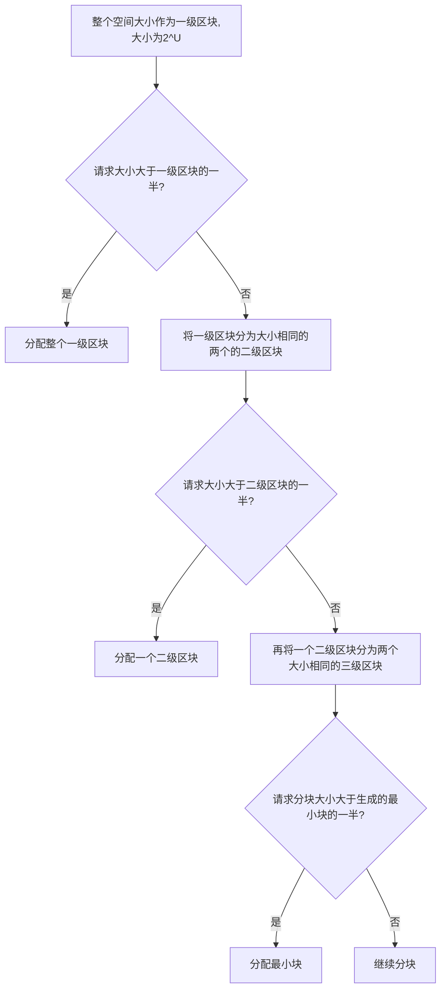
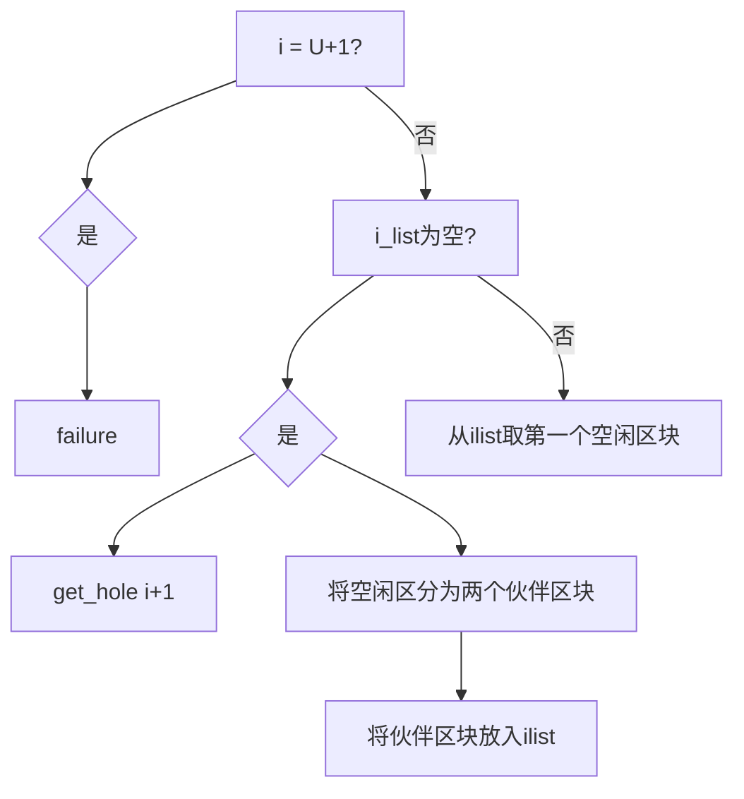

多道程序设计中，内存除了一部分供给 OS 使用（驻留监控程序、OS 内核等），还要进一步细分出“用户空间”供多进程的使用。

“细分内存”这一任务由 OS 动态完成，称为“**内存管理**”。

## 内存管理的需求
### 重定位
重定位技术的背景：
1. 可用内存空间被多个进程共享；
2. 程序员事先不知道程序在运行期间会有哪些程序驻留在内存中，也不知道该把程序放在哪里；
3. 通过就绪进程池，将活动进程换入内存或阻塞进程换出内存，可以使处理器利用率最大化，但是换入换出不能保证前后在内存中位置一致

![[Pasted image 20230821123552.png]]
根据进程映像的信息，可知 **OS 需要知道进程控制信息和运行栈的位置，以及进程开始执行的入口点**。

因此**处理器硬件和 OS 软件必须能够将程序代码中的内存访问逻辑地址转换为实际的物理内存地址**，并反应程序在内存中的当前位置。

### 保护
内存保护——用户进程不能访问 OS 的任何部分；进程不能在未经授权时跳转到另一进程的指令，不允许其他进程未经授权地访问。

重定位技术导致进程在内存中位置不定，增大了进程保护的难度，即*进程保护不能通过编译时检查逻辑地址来解决*——**必须在运行时检查进程产生的所有内存访问，以确保进程只访问分配获得的自身内存空间**。

内存保护必须由处理器硬件实现，而非操作系统满足。这是由于效率原因，OS 审查每个指令是否合法地访问内存，非常耗时。

而处理器硬件主要是通过基址寄存器和界限寄存器来实现内存访问保护的。
1. 基址寄存器: 存储每个程序的逻辑地址空间的起始物理地址。
2. 界限寄存器: 记录逻辑地址空间的大小, 即地址的上边界。
3. 在地址转换时, CPU 会检查访问的逻辑地址是否在基址和界限寄存器规定的范围内。
4. 如果逻辑地址超出了允许范围, 则触发内存访问异常, 由操作系统处理。
5. 通过检查边界, 限制每个程序只能访问自己地址空间的数据, 实现访问保护。
6. 操作系统可以灵活设置不同进程的基址和界限, 进行内存调度。
7. 现代处理器将基址和界限放在了段描述符中, 采用段表来管理。

### 共享
内存管理系统在不损害基本保护的前提下，必须允许**对内存共享区域进行受控访问**。

### 逻辑组织
计算机系统中内存和外存都以一维的地址空间进行组织，但程序本身的逻辑性是以模块组织的，要想将程序的模块映射到计算机中的线性地址空间，可以采用**分段**技术。

### 物理组织
计算机存储分为内存和外存两级，因此 OS 需要关注内存和外存之间信息流的组织。

**覆盖** *overlaying* 技术：程序和数据过大时，内存不足，这就产生不同模块被分配到同一内存区域的情况，因此 OS 需要在模块换入和换出时，覆写内存。

## 内存管理技术
| Technique            | Description                                                                                                              | Strengths                                                     | Weaknesses                                                                                            |
| -------------------- | ------------------------------------------------------------------------------------------------------------------------ | ------------------------------------------------------------- | ----------------------------------------------------------------------------------------------------- |
| Fixed Partitioning   |                                                                                                                          |                                                               |  |
| Dynamic Partitioning | Partitions are created dynamically, so each process is loaded into a partition of exactly the same size as that process. | No internal fragmentation; more efficient use of main memory. | Inefficient use of processor due to the need for compaction to counter external fragmenation.         |
|                      |                                                                                                                          |                                                               |                                                                                                       |

## 内存分区

### 固定分区
![[Pasted image 20230821140657.png]]

#### 大小相等的固定分区
**弊端**：
1. 程序太大而不能放到一个分区中。此时必须要用覆盖技术设计程序，任何时候只将需要用到的部分放入内存中，当需要部分不在内存时要装入、覆写；
2. 内存利用率很低，即使小程序也要占用一整个分区。

**放置策略**：
- 只要存在可用分区，进程就装入空闲分区中。使用哪个分区效果都一样。
- 若所有分区都被占用，则需要根据进程的调度策略换出进程。

#### 大小不等的分区
可以缓解 equal-sized partition 的两个缺点，但不能解决。

**放置策略**：
1. *将每个进程分配到能够容纳它的最小分区*；
	- 因此每个分区都要维护一个调度队列，用于保存从该分区换出的进程；
	- 优点是每个分区内部浪费的空间最少；
	- 缺点是可能造成有分区空闲，但因为没有满足该区域大小上下界的进程而继续空闲，浪费空间；
2. 为所有进程只提供一个等待队列，需要将进程装入内存时，选择可以容纳该进程的最小可用分区，若所有分区都被占用则必须进行交换。

![[Pasted image 20230821141645.png]]

#### 固定分区的优缺点
优点：实现简单，OS 软件的处理开销很小；
缺点：
1. 分区数量在系统生成阶段确定，限制了系统中活动进程的数量；
2. 分区大小预先设置，因此小作业不能有效利用分区空间，除非事先知道所有作业的内存需求。

### 动态分区
![[Pasted image 20230821143130.png]]
动态分区最初效果不错，但随着时间推移，内存中形成了越来越多的内存碎片，内存利用率快速下降。

为了克服外碎片，需要压缩技术 *compaction* ：操作系统不时移动进程，使进程占用的空间连续，并使所有空闲空间连成一片。

压缩的困难之处：
1. 浪费大量处理器时间，非常费时；
2. 需要动态重定位的能力，即将程序从内存的一块区域移动到另一块区域，并且不会使程序中的内存访问无效。

**放置策略**：
由于压缩操作的高昂代价，OS 需要选择合适的放置策略，尽量减少外碎片的产生。由此有三种方法：
1. 最佳适配 Best-fit：选择与需求最接近的块；
2. 首次适配 First-fit：从头开始扫描内存，选择第一个满足需求的可用块；
3. 下次适配 Next-fit：从上一次放置的位置开始，找到第一个可用块；
![[Pasted image 20230821144307.png]]

*一般性结论*：
1. 首次适配算法：最简单、最快、最好；
2. 下次适配算法：差于首次适配，常在内存末尾分配空间，导致存储空间末尾的最大空闲存储块很快分裂为小碎片，因此需要多次压缩；
3. 最佳适配：性能最差，不仅在查找时花费时间最多，而且会很快使内存中形成许多小到无法满足任何内存分配请求的小块，需要更频繁的压缩；

### 伙伴系统
buddy system 中可用内存块的大小是 $2^K$ 个字，而分配的最小块尺寸为 $2^L$ 字，最大块尺寸（整个内存空间）为 $2^U$ 字。它们关系是 $L\le K\le U$。



任何时候，伙伴系统为所有大小为 $2^i$ 的空闲区块维护一个列表，空闲区块可以通过对半分裂从 $i-1$ 级列表中移出，并在 $i$ 级列表中产生两个大小为 $2^i$ 的伙伴；当 $i$ 级列表中的一对伙伴都空闲时，将它们从 $i$ 级列表中移出，合并为 $i-1$ 级列表中的一个块。请求一个大小为 k ($2^{i-1}<k\le 2^{i}$)的块时，从下列递归算法找到一个大小为 $2^i$ 的空洞：
```
void get_hole(int i){
 if (i == (U + 1)) <failure>;
 if (<i_list empty>) {
	 get_hole(i + 1);
	 <split hole into buddies>;
	 <put buddies on i_list>;
 }
 <take first hole on i_list>;
}
```


举例：
![[Pasted image 20230821151546.png]]

![[Pasted image 20230821151632.png]]

### 重定位
几种地址的概念辨析：
- 逻辑地址：与当前数据在内存中的物理分配地址无关的访问地址，在执行对内存的访问之前必须转换为物理地址；
- 相对地址：逻辑地址的一个特例，是相对于某些已知点（程序开始点）的存储单元；
- 物理地址或绝对地址：数据在内存中的实际位置；

#静态重定位 ：在*每个分块都有调度队列的固定分区方案*中，装入新进程后不论是否换出、换入，都使用同一分区。实现这一方案需要 #简单重定位加载器 ——首次加载一个进程时，代码中的相对内存访问被绝对内存地址代替，这个绝对地址由进程被加载到的基地址确定。

#动态重定位 ：分块相等或只有一个公共调度队列的分块不等固定分区方案中，*进程在生命周期中可能占用不同的分区*，进程访问的位置不固定。因此*需要运行时动态加载的方式把使用相对地址的程序加载到内存，被加载进程的所有内存访问都相对于程序的开始点*。因此需要有相对地址转换为物理内存地址的硬件机制。

![[Pasted image 20230821153503.png]]
- 基址寄存器：存放程序在内存中的起始地址；
- 界限寄存器：指明程序的终止位置；这两个信息存放在进程的 PCB 中，进程在执行时将 PCB 中这两则信息放入寄存器中；
- 相对地址和基址相加得到的结果会与界限进行比较，越界会发出中断信号，不越界则正常查找；
- 每个进程映像根据基址和界限寄存器的内容隔离，以免受到其他进程的越权访问，即**内存保护**。

## 简单分页
内存被划分为大小固定、相等的若干块，称为页框 frame；每个进程也同样划分为若干同样大小的块，称为页 page。分页技术可以不产生外碎片，而只在每个进程的最后一页的最后部分形成内碎片。

![[Pasted image 20230821154335.png]]

可以看到 D 进程需要 5 个页框，而 e 状态没有一个空闲页框段可以满足，但是它被划分为两块分别存放。这是由于 OS 为每个进程维护一个页表 page table，页表中的页表项给出了进程每页所在页框的位置。

![[Pasted image 20230821155006.png]]

程序中每个逻辑地址包括一个页号和在该页中的偏移量，分页技术中，逻辑地址到物理地址的转换依然由处理器硬件完成，且处理器必须知道如何访问当前进程的页表。给出逻辑地址后，根据页号、偏移量处理器使用页表可以查找、产生物理地址（页框号、偏移量）

![[Pasted image 20230821155316.png]]
- 16 bit 地址，页大小为 1 KB。相对地址 1502 的二进制为 0000010111011110，页大小 1 KB 代表偏移量需要占用 10 bit，则剩余 6 bit 表示页号，即一个程序最多 $2^6=64$ 页。
- 通过简单分页的表示，可以看到相对地址 1502 映射到页 1 (000001) 的偏移量为 478 (0111011110)

要明确，逻辑地址方案对编程者、汇编器、链接器是透明的，程序的每个逻辑地址与其相对地址一致，硬件实现运行时动态地址转换的效率高、可靠性高、也较为简单。

![[Pasted image 20230821160146.png]]

简单分页类似于固定分区，但分块相当小，一个程序可以不连续地占用多个分区。

## 简单分段
分段技术可以把程序和相关数据划分到一个段中，段类似于页，但其内部有逻辑关系并自成模块。分段技术的逻辑地址也有两部分——段号和偏移量。

简单分段类似于动态分区，同样一个程序可以占用不连续的多个分区。分段技术消除了内碎片，但会产生外碎片。

分段对程序员是可见的。并且作为组织程序和数据的一种方便手段提供给程序员。程序员利用编译器将程序和数据指定到不同的段。

不便之处：
1. 程序员必须知道段的最大长度限制；
2. 逻辑地址和物理地址间不再简单对应，系统需要维护一个内存中的空闲块列表，并为每个进程维护一个段表。段表中的段表项给出相应段在内存中的起始地址、段长度。

![[Pasted image 20230821161256.png]]

与后文虚拟分页、分段、段页式的差别之处在于，简单分页、分段一次性将进程所有内容都装入内存。

## 虚拟内存

分页、分段技术有两个关键突破：
1. 进程中所有内存访问都是逻辑地址，逻辑地址在运行时由硬件动态地转换为物理地址；
2. 进程划分为若干块，块可以离散地分布于内存中，只需要利用页表或段表进行动态运行时地址转换。

虚存有更多突破：
- 进程执行中，不需要所有页或段都存在于内存，只要保存有待取下一条指令的块即可运行。
- 在内存中可以保留更多的进程，因为每个进程都只装入其部分块，任何时刻都至少有一个进程处于就绪态；
- 进程可以比内存的全部空间还大，而不必程序员手动通过覆盖技术分块过大的进程，这一切都由硬件和 OS 完成。
- 进程实际上是在内存中执行，这称为实存储器 real memory；程序员感知到的是更大的内存空间，由内存和外存共同组成，这称为虚存储器 virtual memory。
- 虚存支持更有效的系统并发度，并能解除用户与内存之间没有必要的紧密约束。

进程在任何执行阶段都放在内存的部分称为进程的常驻集 resident set。进程执行时若所有访问都在常驻集，则程序顺利进行；若要访问一个不在内存中的块，则会产生缺页异常中断，OS 置其为阻塞态，等待 IO 操作将需要的页读入内存。

### 局部性原理
程序的空间局部性原理表明，内存中装入过多的块实际上仍只有部分块得到利用，由此造成了内存的浪费。因此进程只保留必要的块在内存中，发生缺页异常时再移入需要的块。

有一个问题是在块被换出内存后，若短时间又需要使用它，就不得不换入，造成了大量处理器时间用于 IO，这称为抖动 thrashing。因此 OS 需要抉择较好的置换策略，最好是基于最近的历史猜测将来可能用到的块。这就是时间局部性。

虚存的基本支持原理就是局部性原理，要使虚存更加有效，需要：
1. 必须有对所采用分页或分段方案的硬件支持；
2. OS 必须有管理页或段在内存和辅存之间移动的软件支持；

### 分页
![[Pasted image 20230821171305.png]]

#### 页表结构
![[Pasted image 20230821171449.png]]

#### 多级页表
![[Pasted image 20230821171650.png]]

![[Pasted image 20230821171716.png]]

#### 倒排页表
![[Pasted image 20230821171952.png]]
#### 快表（转换检测缓冲区）
![[Pasted image 20230821172109.png]]

![[Pasted image 20230821172252.png]]

![[Pasted image 20230821172420.png]]

![[Pasted image 20230821172534.png]]

#### 页尺寸
![[Pasted image 20230821172708.png]]

### 分段
![[Pasted image 20230821171332.png]]
### 段页式
![[Pasted image 20230821171348.png]]
### 保护和共享

## OS 软件
### 读取策略

### 放置策略

### 置换策略

### 驻留集管理

### 清除策略

### 加载控制

## Linux 内存管理