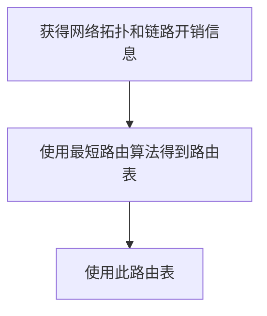
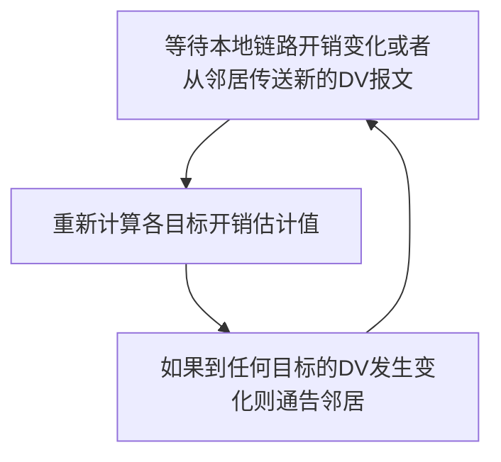

## 5.1 概述
### 控制平面介绍
控制平面的作用，就是对路由器的转发表/流表进行计算、维护、安装等操作。根据上一章的讲解，了解到有两种路由控制策略：

![[50-Network-layer-control-plane-perrouter-control.png]]
- ***Per-router control***. Figure 5.1 illustrates the case ==where a routing algorithm runs in each and every router; both a forwarding and a routing function are contained within each router==. Each router has a routing component that communicates with the routing components in other routers to compute the values for its forwarding table. This per-router control approach has been used in the Internet for decades. The OSPF and BGP protocols that we’ll study in Sections 5.3 and 5.4 are based on this per-router approach to control.
> 每一台路由器都运行路由选择算法（OSPF、BGP 等），每台路由器都包含转发和路由选择功能。
> 
> 每台路由器都由一个路由选择组件，用于与其它路由器中的路由选择组件通信，以计算其转发表的值。

![[50-Network-layer-control-plane-logically-centralized-control.png]]
- ***Logically centralized control***. Figure 5.2 illustrates the case in which ==a logically centralized controller computes and distributes the forwarding tables to be used by each and every router==. As we saw in Sections 4.4 and 4.5, the generalized match-plus-action abstraction allows the router to perform traditional IP forwarding as well as a rich set of other functions (load sharing, firewalling, and NAT) that had been previously implemented in separate middleboxes.
- The controller interacts with a control agent (CA) in each of the routers via a well-defined protocol to configure and manage that router’s flow table. Typically, the CA has minimum functionality; its job is to communicate with the controller, and to do as the controller commands. Unlike the routing algorithms in Figure 5.1, the CAs do not directly interact with each other nor do they actively take part in computing the forwarding table. This is a key distinction between per-router control and logically centralized control
> 控制协议与路由器中的控制代理进行交互，以配置和管理该路由器的流表。控制代理 CA 功能很少，只需与控制器通信并按命行事，CA 不能互相直接地交互、也不能主动参与计算流表。

### 路由
- 路由(route)：按照某种指标（传输延迟，所经过的站点数目等）找到一条从源节点到目标节点的较好路径
    - 较好路径：按照某种指标较小的路径
    - 指标：站数，延迟，费用，队列长度等，或者是一些单纯指标的加权平均
    - 采用什么样的指标，表示网络使用者希望网络在什么方面表现突出，什么指标网络使用者比较重视
- 以网络为单位（子网到子网）进行路由（路由信息通告+路由计算），而非主机到主机（主机到主机的路由规模比子网到子网大2-3个数量级）
    - 网络为单位进行路由，路由信息传输、计算和匹配的开销低
    - 前提条件是：一个网络所有节点地址前缀相同，且物理上聚集
    - **路由就是：计算网络到其他网络如何走的问题**
- 网络到网络的路由 = 路由器-路由器之间路由
    - 网络对应的路由器到其他网络对应的路由器的路由
    - 在一个网络中：路由器-主机之间的通信，链路层解决
    - 到了这个路由器就是到了这个网络
- 路由选择算法(routing algorithm)：网络层软件的一部分，完成路由功能

## 5.2 路由选择算法

### 网络的拓扑图抽象
![[50-Network-layer-control-plane-abstract-graph-network.png]]
- Graph $G = (N, E)$ is a set N of nodes and a collection E of edges, where each edge is a pair of nodes from N.
- In the context of network-layer routing, the ==nodes in the graph represent routers==—the points at which packet-forwarding decisions are made—
- and the ==edges connecting these nodes represent the physical links== between these routers.


边和路径的开销：
- For our purposes, we’ll simply take the edge costs as a given and won’t worry about how they are determined. For any edge (x, y) in E, we denote c (x, y) as the cost of the edge between nodes *x* and y. If the pair (x, y) does not belong to E, we set c (x, y) = ∞.
- Also, we’ll only consider undirected graphs in our discussion here, so that edge (x, y) is the same as edge (y, x) and that c (x, y) = c (y, x); however, the algorithms we’ll study can be easily extended to the case of directed links with a different cost in each direction.
- Also, a node *y* is said to be a ***neighbor*** of node *x* if (x, y) belongs to E.

网络拓扑图中的路径及路径开销：
- a path in a graph G = (N, E) is a sequence of nodes (x1, x2, g, xp) such that each of the pairs (x1, x2), (x2, x3), g, (xp-1, xp) are edges in E.
- The cost of a path (x1, x2, g, xp) is simply the sum of all the edge costs along the path, that is, c (x1, x2) + c (x2, x3) + g+ c (xp-1, xp). Given any two nodes *x* and y, there are typically many paths between the two nodes, with each path having a cost. One or more of these paths is a ***least-cost path***.
- $$ \text{Cost of path } (x_1, x_2, x_3, ... , x_p) = c(x_1, x_2) + c(x_2, x_3) + ... + c(x_{p-1}, x_p) $$
### 路由算法的目标与原则

路由算法的天然目标就是寻找最低开销路径：
- The least-cost problem is therefore clear: Find a path between the source and destination that has least cost.
- In Figure 5.3, for example, the least-cost path between source node u and destination node w is (u, x, y, w) with a path cost of 3.
- Note that if all edges in the graph have the same cost, the least-cost path is also the shortest path (that is, the path with the smallest number of links between the source and the destination).

最优化原则 (optimality principle)
- 汇集树 (sink tree)
    - 此节点到所有其它节点的最优路径形成的树——数据结构里的SPT
    - 路由选择算法就是为所有路由器找到并使用汇集树（最短路径树）

路由选择算法的原则
- 正确性 (correctness)：算法必须是正确的和完整的，使分组一站一站接力，正确发向目标站；完整：目标所有的站地址，在路由表中都能找到相应的表项；没有处理不了的目标站地址；
- 简单性 (simplicity)：算法在计算机上应简单：最优但复杂的算法，时间上延迟很大，不实用，不应为了获取路由信息增加很多的通信量；
- 健壮性 (robustness)：算法应能适应通信量和网络拓扑的变化：通信量变化，网络拓扑的变化算法能很快适应；不向很拥挤的链路发数据，不向断了的链路发送数据；
- 稳定性 (stability)：产生的路由不应该摇摆
- 公平性 (fairness)：对每一个站点都公平
- 最优性 (optimality)：某一个指标的最优，时间上，费用上，等指标，或综合指标；实际上，获取最优的结果开销较高，可以是次优的

### 路由算法的分类

- 全局或者局部路由信息？
    - 全局：集中式路由选择算法
        - 所有的路由器拥有完整的拓扑和边的开销的信息（上帝视角）
        - A ***centralized routing algorithm*** computes the least-cost path between a source and destination using complete, global knowledge about the network. That is, the algorithm takes the connectivity between all nodes and all link costs as inputs. ==This then requires that the algorithm somehow obtain this information before actually performing the calculation==. The calculation itself can be run at one site (e.g., a logically centralized controller as in Figure 5.2) or could be replicated in the routing component of each and every router (e.g., as in Figure 5.1). ==The key distinguishing== feature here, however, ==is that the algorithm has complete information about connectivity and link costs==. 
        - Algorithms with global state information are often referred to as ***link-state*** (LS) algorithms, since the algorithm must be aware of the cost of each link in the network. We’ll study LS algorithms in Section 5.2.1.
    - 分布式：分散式路由选择算法
        - 路由器只知道与它有物理连接关系的邻居路由器，和到相应邻居路由器的开销
        - 迭代地与邻居交换路由信息、计算路由信息
        - In a ***decentralized routing algorithm***, the calculation of the least-cost path is carried out in an iterative, distributed manner by the routers. ==No node has complete information about the costs of all network links. Instead, each node begins with only the knowledge of the costs of its own directly attached links==. Then, through an iterative process of calculation and exchange of information with its neighboring nodes, a node gradually calculates the least-cost path to a destination or set of destinations.
        - The decentralized routing algorithm we’ll study below in Section 5.2.2 is called a ***distance-vector*** (DV) algorithm, because ==each node maintains a vector of estimates of the costs (distances) to all other nodes in the network==. 
        - Such decentralized algorithms, with interactive message exchange between neighboring routers is perhaps ==more naturally suited to control planes where the routers interact directly with each other==, as in Figure 5.1.

- 静态或者动态的？
    - 静态：
        - 路由随时间变化缓慢
        - 人工手动调整
        - 非自适应算法 (non-adaptive algorithm)：不能适应网络拓扑和通信量的变化，路由表是事先计算好的
    - 动态：
        - 路由变化很快
        - 周期性更新
        - 根据链路开销的变化而变化
        - 容易受路由选择循环、路由震荡之类的问题影响
        - 自适应路由选择 (adaptive algorithm)：能适应网络拓扑和通信量的变化

负载敏感的还是迟钝的？
- In a ***load-sensitive algorithm***, link costs vary dynamically to reflect the current level of congestion in the underlying link. If a high cost is associated with a link that is currently congested, a routing algorithm will tend to choose routes around such a congested link. While early ARPAnet routing algorithms were load-sensitive `[McQuillan 1980]`, a number of difficulties were encountered `[Huitema 1998]`.
- Today’s Internet routing algorithms (such as RIP, OSPF, and BGP) are ***load-insensitive***, as a link’s cost does not explicitly reflect its current (or recent past) level of congestion.

### 链路状态路由选择算法
#### LS 路由的基本工作过程




1. 发现相邻节点，获知对方网络地址
	- 一个路由器上电之后，向所有线路发送广播分组
	- 其它路由器收到广播分组，回送应答，在应答分组中，告知自己的 IP 地址

2. 测量到相邻节点的开销（延迟，开销）
	- 实测法，发送一个分组要求对方立即响应
	- 回送一个 ECHO 分组
	- 通过测量时间可以估算出延迟情况

3. 组装一个 LS 分组，描述它到相邻节点的开销情况
	- 发送者 hostname + IP address
	- 序号，年龄
	- 列表：给出它相邻节点，和它到相邻节点的延迟/开销

4. 将分组通过泛洪扩散的方法发到所有其它路由器（这 4 步让每个路由器获得拓扑和边开销）
	- 顺序号：用于控制无穷的扩散，每个路由器都记录（源路由器，顺序号），发现重复的或老的就不扩散
		- 具体问题1：循环使用问题
		- 具体问题2：路由器崩溃之后序号从0开始
		- 具体问题3：序号出现错误
	- 解决问题的办法：年龄字段(age)
		- 生成一个分组时，年龄字段不为0
		- 每个一个时间段，AGE字段减1
		- AGE字段为0的分组将被抛弃
	- 关于扩散分组的数据结构
		- Source：从哪个节点收到LS分组
		- Seq.，Age：序号，年龄
		- Send flags：发送标记，必须向指定的哪些相邻站点转发LS分组
		- ACK flags：本站点必须向哪些相邻站点发送应答
		- DATA：来自source站点的LS分组
		- 如：节点B的数据结构

5. 通过 Dijkstra 算法找出最短路径（这才是路由算法）
	- 每个节点独立算出来到其他节点（路由器=网络）的最短路径
	- 迭代算法：第 k 步能够知道本节点到 k 个最近的其他节点（近指开销，不是物理上的举例）
		1. 路由器获得各站点 LS 分组和整个网络的拓扑
		2. 通过 Dijkstra 算法计算出到其它各路由器的最短路径
		3. 将计算结果安装到路由表中

#### LS的应用情况
- OSPF 协议是一种 LS 协议，被用于 Internet 上
- IS-IS(intermediate system-intermediate system)：被用于Internet主干中，Netware

#### Dijkstra 算法

- 符号标记：
    - $c(i, j)$：从节点 i 到 j 的链路开销（初始状态下非相邻节点之间的链路开销为 $\infty$ ）
    - $D(v)$：从源节点到节点 V 的最低开销路径的开销（节点的开销）
    - $p(v)$：从源到节点 V 的路径前序节点
    - $N'$：当前已经知道最优路径的的节点集合（永久节点的集合）

该集中式路由选择算法由一个初始化步骤和其后的循环组成，循环执行的次数与网络中的节点个数相同，一旦终止，该算法就计算出从源节点 u 到网络中每个其他节点的最短路径。（无向图中最短路径树是唯一的）

```
# Link-State Algorithm for Source Node u

Initialization: 
	N’ = {u}
	for all nodes v
		if v is a neighbor of u
			then D(v) = c(u,v) 
		else D(v) = ∞

Loop:
	find w not in N’ such that D(w) is a minimum
	add w to N’
	update D(v) for each neighbor v of w and not in N’:
		D(v) = min(D(v), D(w)+ c(w,v) )
	/* new cost to v is either old cost to v or known least path cost to w plus cost from w to v */
	until N’= N
```

- LS路由选择算法的工作原理
    - 节点标记：每一个节点使用(D(v), p(v)) 如：(3, B)标记
        - D(v)从源节点由已知最优路径到达本节点的距离
        - P(v)前序节点来标注
    - 算法过程中节点有两类：
        - 临时节点(tentative node)：还没有找到从源节点到此节点的最优路径的节点
        - 永久节点(permanent node) N'：已经找到了从源节点到此节点的最优路径的节点
- Dijkstra算法的框架
    1. 初始化
        - 除了源节点外，所有节点都为临时节点
        - 节点开销除了与源节点开销相邻的节点外,都为 $\infty$
    2. 从所有临时节点中找到一个节点开销最小的临时节点，将之变成永久节点（当前节点）W
    3. 对此节点的所有在临时节点集合中的邻节点(V)
        - 如果 D(v) > D(w) + C(w, v)，则重新标注此点为 (D(v) + C(w, v), W)
        - 否则，不重新标注
    4. 开始一个新的循环（第2步）
    5. 最终搜索得源节点到所有节点的最优路径，算法终止

>[! example] LS 算法的例子
> 考查网络：计算从 u 到所有可能目的地的最低开销路径
> ![[50-Network-layer-control-plane-abstract-graph-network.png]]
> 
> 计算过程如下表：
> ![[50-Network-layer-control-plane-ls-algo-on-fig5-3.png]]
> 
> 具体步骤如下：
> 1. In the ***initialization step***, the currently known least-cost paths from u to its directly attached neighbors, v, x, and w, are initialized to 2, 1, and 5, respectively. Note in particular that the cost to w is set to 5 (even though we will soon see that a lesser-cost path does indeed exist) since this is the cost of the direct (one hop) link from u to w. ==The costs to *y* and *z* are set to infinity because they are not directly connected to u==.
> 2. In the ***first iteration***, we look among those nodes not yet added to the set N′ and ==find that node with the least cost as of the end of the previous iteration==. That node is x, with a cost of 1, and thus *x* is added to the set N′. Line 12 of the LS algorithm is then performed to update D (v) for all nodes v, yielding the results shown in the second line (Step 1) in Table 5.1. The cost of the path to v is unchanged. The cost of the path to w (which was 5 at the end of the initialization) through node *x* is found to have a cost of 4. Hence this lower-cost path is selected and w’s predecessor along the shortest path from u is set to x. Similarly, the cost to *y* (through x) is computed to be 2, and the table is updated accordingly.
> 3. In the second iteration, nodes v and *y* are found to have the least-cost paths (2), and we break the tie arbitrarily and add *y* to the set N′ so that N′ now contains u, x, and y. The cost to the remaining nodes not yet in N′, that is, nodes v, w, and z, are updated via line 12 of the LS algorithm, yielding the results shown in the third row in Table 5.1.
> 4. And so on . . .
> 
> LS 算法终止时，每个节点都得到从源节点沿最低开销路径的前一节点，前一节点又有前一节点，直到串联起整个图，得到最小路径树（汇集树）
> 
> 通过对每个目的节点存放从 u 到目的地的最低开销路径的下一跳节点，在一个节点中的转发表能够根据此信息而构建：
> ![[50-Network-layer-control-plane-least-cost-path.png]]


- Dijkstra算法的复杂度：考虑 $n$ 节点的情况
	- 每一次迭代：需要检查所有不在永久集合 N 中的节点
	- $n(n+1)/2$ 次比较： $O(n^2)$
	- 有很有效的实现： $O(n\log{n})$ 最小堆 or 斐波那契堆

#### 震荡问题

![[50-Network-layer-control-plane-oscillations.png]]
- 链路开销非对称时：$c(u,v) \ne c(v,u)$ 
	- In this example, node *z* originates a unit of traffic destined for w, node *x* also originates a unit of traffic destined for w, and node *y* injects an amount of traffic equal to e, also destined for w. The initial routing is shown in Figure 5.5 (a) with the ==link costs corresponding to the amount of traffic carried==.
	- When the LS algorithm is next run, node *y* determines (based on the link costs shown in Figure 5.5 (a)) that the clockwise path to w has a cost of 1, while the counterclockwise path to w (which it had been using) has a cost of 1 + e. Hence y’s least-cost path to w is now clockwise. Similarly, *x* determines that its new least-cost path to w is also clockwise, resulting in costs shown in Figure 5.5 (b).
	- When the LS algorithm is run next, nodes x, y, and *z* all ==detect a zero-cost path to w in the counterclockwise direction, and all route their traffic to the counterclockwise routes==.
	- The next time the LS algorithm is run, x, y, and *z* all then route their traffic to the clockwise routes.
- 解决方案是让路由器不同时运行 LS 算法：
	- Interestingly, researchers have found that routers in the Internet can self-synchronize among themselves `[Floyd Synchronization 1994]`. That is, ==even though they initially execute the algorithm with the same period but at different instants of time, the algorithm execution instance can eventually become, and remain==, synchronized at the routers.
	- One way to avoid such ***self-synchronization*** is for each router to randomize the time it sends out a link advertisement.

### 距离向量路由选择算法

距离矢量路由选择(distance vector routing)：迭代式、异步、分布式算法
- It is ***distributed*** in that each node receives some information from one or more of its directly attached neighbors, performs a calculation, and then distributes the results of its calculation back to its neighbors.
- It is ***iterative*** in that this process ==continues on until no more information is exchanged between neighbors==. (Interestingly, the algorithm is also self-terminating—there is no signal that the computation should stop; it just stops.)
- The algorithm is ***asynchronous*** in that it does not require all of the nodes to operate in lockstep with each other. 

#### Bellman-Ford 方程

令 $d_{x}(y)$ 代表从节点 *x* 到节点 *y* 的最低路径开销，则其与 Bellman-Ford 方程相关：
$$d_x(y) = \min_{v}(c(x, v) + d_v(y))\quad (5-1)$$
- 其中 $c(x, v)$ 为 $x$ 到邻居 $v$ 的开销， $d_v(y)$ 为从邻居 $v$ 到目标 $y$ 的开销， $\min_v$ 为取所有 $x$ 的邻居取最小的 $v$ 
- 这个算法的本质思想是贪心——每一步都选择朝向目标方向的最短距离。

![[50-Network-layer-control-plane-bellman-ford-algo.png]]

>[! note] Bellman-Ford 方程的两个重要应用
>The Bellman-Ford equation is not just an intellectual curiosity. It actually has significant practical importance: 
>1. ***the solution to the Bellman-Ford equation provides the entries in node x’s forwarding table***.
>	- To see this, let v* be any neighboring node that achieves the minimum in Equation 5.1.
>	- Then, if node *x* wants to send a packet to node *y* along a least-cost path, it should first forward the packet to node v*. 
>	- Thus, node x’s forwarding table would specify node v* as the next-hop router for the ultimate destination y. 
>
>2. Another important practical contribution of the Bellman-Ford equation is that ***it suggests the form of the neighbor-to-neighbor communication that will take place in the DV algorithm***.

#### DV 算法的思想

每个节点 $x$ 以 $D_{x}(y)$ 开始，对网络 $N$ 中所有其他节点 $y$，估计从 $x$ 到 $y$ 的最低开销路径的开销。

1. 令 $\textbf{D}_{x}=[D_{x}(y):y\in N]$ 为节点 $x$ 的距离向量，其是从 $x$ 到网络 $N$ 中其它所有节点 $y$ 的开销的估计。

2. 使用 DV 算法，每个节点 $x$ 维护下列路由选择信息：
    - 从 $x$ 到所有直连邻居 $v$ 的开销记为 $c(x,v)$
    - 节点 $x$ 的距离向量 $\textbf{D}_{x}$，包含了 $x$ 到 $N$ 中所有目的地 $y$ 的开销的估计值 
    - 对于 $x$ 的每个邻居 $v$，各自维护 $\textbf{D}_v = [D_v(y): *y* \in N]$

3. DV 算法的核心思路：
    - 每个节点都将自己的距离矢量的副本传送给邻居，定时或者DV有变化时，让对方去算
    - 当 $x$ 从邻居那里收到新的距离向量时，保存 $v$ 的距离向量，然后使用 Bellman-Ford 方程更新 $x$ 自己的距离矢量：
        - $$D_x(y) \leftarrow \min_v{c(x,v) + D_v(y)}, \qquad \text{for every $y \in N$ } $$ 
        - 其中 $D_x(y)$ 为 $x$ 往 $y$ 的开销， $c(x,v)$ 为 $x$ 到邻居 $v$ 开销， $D_v(y)$ 为 $v$ 声称到 $y$ 的开销
    - 如果节点 $x$ 的距离向量因为这个步骤而改变，那么 $x$ 接下来将向它的每个邻居发送更新后的距离向量，继而让所有邻居扩散地更新各自的距离向量。
    - 只要所有的节点继续以异步的方式交换它们的距离向量，$D_x(y)$ 估计值最终会收敛于实际的最小开销值 $d_x(y)$



```
// Distance-Vector Algorithm

// At each node x:
Initialization: 
	for all destinations *y* in N: 
		Dx(y)= c(x,y)/* if *y* is not a neighbor then c(x,y)= ∞ */ 
	for each neighbor w
		Dw(y) = ? for all destinations *y* in N
	for each neighbor w
		send distance vector Dx = [Dx(y): *y* in N] to w

loop:
	wait (until I see a link cost change to some neighbor w or  until I receive a distance vector from some neighbor w)
	for each *y* in N:
		Dx(y) = min_v{c(x,v) + Dv(y)}
	
if Dx(y) changed for any destination y
	send distance vector Dx = [Dx(y): *y* in N] to all neighbors 
	
forever
```

In the DV algorithm, a node *x* updates its distance-vector estimate when it either sees a cost change in one of its directly attached links or receives a distance-vector update from some neighbor. But to update its own forwarding table for a given destination y, what node *x* really needs to know is not the shortest-path distance to *y* but instead the neighboring node v*(y) that is the next-hop router along the shortest path to y. As you might expect, the next-hop router v*(y) is the neighbor v that achieves the minimum in Line 15 of the DV algorithm. (If there are multiple neighbors v that achieve the minimum, then v*(y) can be any of the minimizing neighbors.) 
> DV 算法中，节点 *x* 在得知其直接链路开销的改变、或收到邻居更新后的距离向量，会更新自己的距离向量。但是为了更新自己通向远处节点 *y* 的转发表，x 并不直接与 *y* 通信，而是只需要了解能够到达 *y* 的最小开销路径的下一条路由器 v* 节点即可。

Thus, in Lines 14-15, for each destination y, node *x* also determines v*(y) and updates its forwarding table for destination y.

- Recall that the ***LS algorithm is a centralized*** algorithm in the sense that it requires each node to first obtain a complete map of the network before running the Dijkstra algorithm.
- The ***DV algorithm is decentralized*** and does not use such global information. Indeed, the only information a node will have is the costs of the links to its directly attached neighbors and information it receives from these neighbors. Each node waits for an update from any neighbor (Lines 13), calculates its new distance vector when receiving an update (Line 15), and distributes its new distance vector to its neighbors (Lines 17-18).

DV-like algorithms are used in many routing protocols in practice, including
- the Internet’s ***RIP*** and ***BGP***,
- ISO ***IDRP***,
- Novell ***IPx***,
- and the ***original ARPAnet***.

#### DV 算法的实例

- 距离矢量路由选择的基本思想
    - 各路由器维护一张路由表
    - 各路由器与相邻路由器交换路由表
    - 根据获得的路由信息，更新路由表
- 开销及相邻节点间开销的获得
    - 跳数 (hops)，延迟 (delay)，队列长度
    - 相邻节点间开销的获得：通过实测
- 路由信息的更新（定期测量它到相邻节点的开销，定期与相邻节点交换路由表 (DV)）
    - 根据实测得到本节点 A 到相邻站点的开销（如：延迟）
    - 根据各相邻站点声称它们到目标站点 B 的开销
    - 计算出本站点 A 经过各相邻站点到目标站点 B 的开销
    - 找到一个最小的开销，和相应的下一个节点 Z，到达节点 B 经过此节点 Z，并且开销为 A-Z-B 的开销
    - 其它所有的目标节点一个计算法

> [! example] 例子：DV 算法初始化、更新、停止
> 
> ![[50-Network-layer-control-plane-DV-operation.png]]
> 
> The leftmost column of the figure displays three initial routing tables for each of the three nodes. For example, the table in the upper-left corner is node x’s initial routing table.
> 
> Within a specific routing table, each row is a distance vector— specifically, each node’s routing table includes its own distance vector and that of each of its neighbors. Thus, the first row in node x’s initial routing table is $\textbf{D}_{x} = [D_{x}(x), D_{x}(y), D_{x}(z)] = [0, 2, 7]$. The second and third rows in this table are the most recently received distance vectors from nodes *y* and z, respectively. Because at initialization node *x* has not received anything from node *y* or z, the entries in the second and third rows are initialized to infinity.
> > 路由选择表的每一行是一个距离向量，而每个节点的路由表除了自身的距离向量外，还有直接邻居的距离向量的 copy。一开始还未从邻居接收到距离向量，因此初始化为无穷大。
> 
> After initialization, each node sends its distance vector to each of its two neighbors. This is illustrated in Figure 5.6 by the arrows from the first column of tables to the second column of tables. For example, node $x$ sends its distance vector $D_x = [0, 2, 7]$ to both nodes $y$ and $z$. After receiving the updates, each node recomputes its own distance vector. For example, node $x$ computes
> $$
  \begin{aligned}
  D_{x}(x) &= 0\\
  D_{x}(y) &= min\{c(x,y) + D_{y}(y), c(x,z) + D_{z}(y)\} = min\{2 + 0, 7 + 1\} = 2 \\
  Dx(z) &= min\{c(x,y) + D_{y}(z), c(x,z) + D_{z}(z)\} = min\{2 + 1, 7 + 0\} = 3
  \end{aligned}
> $$
> The second column therefore displays, for each node, the node’s new distance vector along with distance vectors just received from its neighbors.
> > 第二列路由转发表显示了根据邻居节点的新的距离向量进行计算后的结果，并且原封不动地保存了来自邻居的距离向量
> 
> Note, for example, that node x’s estimate for the least cost to node z, Dx (z), has changed from 7 to 3. Also note that for node x, neighboring node *y* achieves the minimum in line 15 of the DV algorithm; thus, at this stage of the algorithm, we have at node *x* that v*(y) = *y* and v*(z) = y.
> > 对于节点 x，在 DV 算法中确定了不论到 *y* 还是 z，下一跳 *y* 都是最近的路线，y 是下一条最近路线上的邻居。
> 
> After the nodes recompute their distance vectors, they again send their updated distance vectors to their neighbors (if there has been a change). This is illustrated in Figure 5.6 by the arrows from the second column of tables to the third column of tables. Note that only nodes *x* and *z* send updates: ***node y’s distance vector didn’t change so node *y* doesn’t send an update***. After receiving the updates, the nodes then recompute their distance vectors and update their routing tables, which are shown in the third column.
> > 注意到 *y* 节点的距离向量在上一轮没有变化，因此其不必再更新，也就不必再发送自己的距离向量通知邻居。
> 
> The process of receiving updated distance vectors from neighbors, recomputing routing table entries, and ==informing neighbors of changed costs of the least-cost path to a destination ***continues until no update messages are sent***==. At this point, since no update messages are sent, no further routing table calculations will occur and the algorithm will enter a quiescent state; that is, all nodes will be performing the wait in Lines 13 of the DV algorithm. The algorithm remains in the quiescent state until a link cost changes, as discussed next.
> > 没有更新报文发送时，停止路由转发表的计算，算法停留在静止状态。

#### DV 的无穷计算 Count-to-Infinity 问题

The settling of routes to best paths across the network is called convergence. Distance vector routing is useful as a simple technique by which routers can collectively compute shortest paths, but it has a serious drawback in practice: although it converges to the correct answer, it may do so slowly. In particular, it ***reacts rapidly to good news, but leisurely to bad news***. 

Consider a router whose best route to destination *x* is long. If, on the next exchange, neighbor A suddenly reports a short delay to x, the router just switches over to using the line to A to send traffic to x. In one vector exchange, the good news is processed.
> 好消息意味着断路变通路、长路边变短路，此时只需要一次向量交换即可传递好消息。

To see how fast good news propagates, consider the fiv e-node (linear) network of `Fig.5-10`, where the delay metric is the number of hops. Suppose A is down initially and all the other routers know this. In other words, they have all recorded the delay to A as infinity.
> 这里延迟的指标是跳数。最初时 A 宕机，其它所有节点都知道这一特点，即距离为无穷大。

![[50-Network-layer-control-plane-count-to-infinity.png]]
When A comes up, the other routers learn about it via the vector exchanges. For simplicity, we will assume that there is a gigantic gong somewhere that is struck periodically to initiate a vector exchange at all routers simultaneously. At the time of the first exchange, B learns that its left-hand neighbor has zero delay to A. B now makes an entry in its routing table indicating that A is one hop away to the left. All the other routers still think that A is down. At this point, the routing table entries for A are as shown in the second row of `Fig.5-10(a)`. On the next exchange, C learns that B has a path of length 1 to A, so it updates its routing table to indicate a path of length 2, but D and E do not hear the good news until later. Clearly, ==the good news is spreading at the rate of one hop per exchange==. In a network whose longest path is of length N hops, within N exchanges everyone will know about newly revived links and routers.
> 好消息传播时，每一次向量的交换可以向外传递一层（类似图的 BFS）。因此要传递到全图，需要的交换次数也不过是图的直径（顶点距离最长）。

Now let us consider the situation of `Fig.5-10(b)`, in which all the links and routers are initially up. Routers B, C, D, and E have distances to A of 1, 2, 3, and 4 hops, respectively. Suddenly, either A goes down or the link between A and B is cut (which is effectively the same thing from B’s point of view).
> 初始时路径开销为跳数，突然 A 宕机或 A 到 B 的链路切断，坏消息发生，并需要传递。
![[50-Network-layer-control-plane-count-to-infinity-2.png]]

At the first packet exchange, B does not hear anything from A. Fortunately, C says “Do not worry; I have a path to A of length 2.” Little does B suspect that C’s path runs through B itself. For all B knows, C might have 10 links all with separate paths to A of length 2. As a result, B thinks it can reach A via C, with a path length of 3. D and E do not update their entries for A on the first exchange.
> 在第一次数据包交换时，B 没有收到 A 的任何消息（AB 链路已断）。然而，C 的向量中到 A 的开销仍然为 2 没有改变，B 却没有怀疑 C 的路径穿过 B 本身，B 还以为 C 有其它通向 A 的路径。因此，B 认为它可以通过 C 到达 A，路径长度为 3。D 和 E 在第一次交换时由于更靠近 C，C 的距离向量不更新 CD 或 CE 之间的开销，因此 D 和 E 也不更新它们到 A 的条目。

On the second exchange, C notices that each of its neighbors claims to have a path to A of length 3. It picks one of them at random and makes its new distance to A 4, as shown in the third row of `Fig.5-10(b)`. Subsequent exchanges produce the history shown in the rest of `Fig.5-10(b)`.
> 在第二次交换中，C 注意到它的每个邻居都声称有一条长度为 3 的路径通往 A。它随机选择其中一个邻居，并将其到 A 的新距离定为 4，如图第三行所示。
> 随后的交换产生了其余部分所示的历史记录。

From this figure, it should be clear why bad news travels slowly: ***no router ever has a value more than one higher than the minimum of all its neighbors***. Gradually, all routers work their way up to infinity, but the number of exchanges required depends on the numerical value used for infinity. For this reason, it is wise to set infinity to the longest path plus 1. 
> 从这张图中，我们可以清楚地看到坏消息传播缓慢的原因：***没有一个路由器的数值比其所有邻居的最小值高出一个以上***。逐渐地，所有路由器都会达到无穷大，但所需的交换次数取决于无穷大的数值。
> 因此，将无穷大设置为最长路径加 1 是可选的。

Not entirely surprisingly, this problem is known as the ***count-to-infinity*** problem. There have been many attempts to solve it, for example, preventing routers from advertising their best paths back to the neighbors from which they heard them. Split horizon with poisoned reverse rule are discussed in `RFC 1058`. However, none of these heuristics work well in practice despite the colorful names. ==The core of the problem is that when *x* tells *y* that it has a path somewhere, *y* has no way of knowing whether it itself is on the path==.
> 即使是毒性逆转、水平分裂的方法在实践中也不是那么有效。这里的核心原因在于，当 *x* 告知 y——其有某条路径，但 *y* 却无法确定自身是否在这条路径之上。

#### 毒性逆转

![[50-Network-layer-control-plane-poisoned-reverse.png]]

***Poisoned Reverse***: if *z* routes through *y* to get to destination *x*, then *z* will advertise to *y* that its distance to *x* is infinity, that is, *z* will advertise to *y* that $D_{z}(x) = ∞$ (even though *z* knows $D_{z}(x) =5$ in truth). *z* will continue telling this little white lie to *y* as long as it routes to *x* via *y*. Since *y* believes that *z* has no path to *x*, *y* will never attempt to route to *x* via z, as long as *z* continues to route to *x* via *y* (and lies about doing so).
> **毒性逆转**：如果 *z* 需要经过 *y* 才能到达 *x* ，则 *z* 向 *y* 告知——z 到 *x* 的开销为∞，即 *y* 无法通过 *z* 到达 *x* 

Let’s now see how poisoned reverse solves the particular looping problem we encountered before in Figure 5.5(b). As a result of the poisoned reverse, *y*’s distance table indicates $D_{z}(x) = ∞$. When the cost of the (x, y) link changes from 4 to 60 at time t0, *y* updates its table and continues to route directly to *x*, albeit at a higher cost of 60, and informs *z* of its new cost to *x*, that is, $D_{y}(x) = 60$. After receiving the update at t1, *z* immediately shifts its route to *x* to be via the direct (*z*, *x*) link at a cost of 50. Since this is a new least-cost path to *x*, and since the path no longer passes through *y*, *z* now informs *y* that $D_{z}(x) = 50$ at t2. After receiving the update from *z*, *y* updates its distance table with $D_{y}(x) = 51$. Also, since *z* is now on *y*’s least-cost path to x, *y* poisons the reverse path from *z* to *x* by informing *z* at time t3 that $D_{y}(x) = ∞$ (even though *y* knows that $D_y(x)$ = 51 in truth). 
> 当链路（x,y）的开销在 t0时刻从 4增加至 60 时，y 相应地更新其路由表并通知 z—— $D_{y}(x)=60$。在 t1时刻 z 收到来自 y 的消息，于是立即知道通过（z,x）的直连路径开销更小（50），因此 z 不再通过 y 到达 x。于是 t2时刻 z 通知 y—— $D_{z}(x)=50$。接下来，t3时刻 y 得到 z 的消息，并更新自身到达 x 的开销—— $D_{y}(x)=51$，途中经过 z，因此同时为 `z->y->x` 添加毒性逆转—— $D_{y}(x)=∞$。

Does poisoned reverse solve the general count-to-infinity problem? It does not. you should convince yourself that loops involving three or more nodes (rather than simply two immediately neighboring nodes) will not be detected by the poisoned reverse technique.
> 毒性逆转策略并没有从根本上解决无穷计算的问题，事实上只要节点超过 3个，毒性逆转就会失效。

> [! note] 另一种说法——水平分裂
> 通过 水平分裂 (split horizon)算法 减少上面所说的坏消息的环路的情况
> - 水平分裂（毒性逆转）策略优化了什么？
> 	- C 知道要经过 B 才能到达 A，所以 C 向 B 报告它到 A 的距离为 INF；C 告诉 D 它到 A 的真实距离
> 	- D 告诉 E，它到 A 的距离，但 D 告诉 C 它通向 A 的距离为 INF
> 	- 第一次交换：B 通过测试发现到 A 的路径为 INF，而 C 也告诉 B 到 A 的距离为 INF，因此，B 到 A 的距离为 INF
> 	- 第二次交换：C 从 B 和 D 那里获知，到 A 的距离为 INF，因此将它到 A 的距离为 INF
> 	- ……
> 	- 坏消息以一次交换一个节点的速度传播
> 
> - 水平分裂存在的问题：在某些拓扑形式下会失败（存在环路）
> 	- 例子：
> 		- ![[50-Network-layer-control-plane-split-horizon.png]]
> 		- A, B 到 D 的距离为 2，C 到 D 的距离为1
> 		- 如果 C-D 路径失败
> 		- C 获知到 D 为 INF，从 A，B 获知到 D 的距离为 INF，因此 C 认为 D 不可达
> 		- A 从 C 获知 D 的距离为 INF，但从 B 处获知它到 D 的距离为 2。因此 A 到 B 的距离为3，导致 A 选择从 B 走
> 		- B 也有类似的问题
> 		- 经过无限次之后，A 和 B 都知道到 D 的距离为 INF 

### LS 与 DV 算法的比较

- 消息复杂度（DV胜出）
    - LS：有 N 个节点，E 条链路，要求每个节点知道通往全局链路的开销，因此发送报文 $O(|N|\times |E|)$ 个
        - 局部的路由信息改变时，需向全局传播新的链路开销；
    - DV：仅在链路状态改变时，和邻居交换信息
        - 通过局部的消息传递，进而获知全图；

- 收敛时间（LS胜出）
    - LS： $O(|N|^2)$ 算法，尽管有可能震荡
    - DV：收敛较慢
        - 可能存在路由环路
        - count-to-infinity 问题

- 健壮性：路由器故障会发生什么（LS胜出）
    - LS：
        - 节点会通告不正确的链路开销
        - 每个节点只计算自己的路由表，可以丢弃任何收到的 LS 广播分组
        - 错误信息影响较小，局部，路由较健壮
    - DV：
        - DV节点可能通告对全网所有节点的不正确路径开销
        - 每一个节点的路由表可能被其它节点使用，错误因此可能扩散到全网

## 5.3 因特网中自治系统内部的路由选择

LS 和 DV 路由算法的简单模型，并不能很好地概括巨构网络的形态，原因有下：
- ***Scale***. As the number of routers becomes large, the overhead involved in communicating, computing, and storing routing information becomes prohibitive. Today’s Internet consists of hundreds of millions of routers. ==Storing routing information for possible destinations at each of these routers would clearly require enormous amounts of memory==. The overhead required to broadcast connectivity and link cost updates among all of the routers would be huge! A distance-vector algorithm that iterated among such a large number of routers would surely never converge. Clearly, something must be done to reduce the complexity of route computation in a network as large as the Internet.
> 巨构网络中，存储路由信息的内存开销不可接受，并且 DS 算法永远不会真正地收敛。

- ***Administrative autonomy***. As described in Section 1.3, the Internet is a network of ISPs, with each ISP consisting of its own network of routers. An ISP generally desires to operate its network as it pleases (for example, to run whatever routing algorithm it chooses within its network) or to hide aspects of its network’s internal organization from the outside. Ideally, an organization should be able to operate and administer its network as it wishes, while still being able to connect its network to other outside networks.
> 区域管理自治：ISP 的局部网络，希望获得一定的自治权，自治系统 Autonomous System 在保护自身隐蔽的同时，一定程度上减轻了巨构网络的路由信息开销和复杂度。

自治系统内运行的路由选择算法，称为**自治系统内部路由选择协议**(Intra-autonomous system routing protocol) 或 **内部网关协议**(Interior Gateway Protocol)。

IGP 通常有三种：
1. 距离向量路由协议
	- *RIP*、*IGRP*
	- 这类协议使用 Bellman-Ford 算法计算路径。
	- 在距离-矢量路由协议中，每个路由器并不了解整个网络的拓扑信息。它们只是向其它路由器通告自己的距离、也从其它路由器那里收到类似的通告。每个路由器都通过这种路由通告来传播它的路由表。在之后的通告周期中，各路由器通告其整张路由表。该过程持续至所有路由器的路由表都收敛至一稳定状态为止。
	- 这类协议具有收敛缓慢、无穷计算的缺点，然而，它们通常容易处理且非常适合小型网络。

2. 连接状态路由协议
	- *OSPF*、*IS-IS*
	- 在链路状态路由协议中，每个节点都知晓整个网络的拓扑信息。各节点使用自己了解的网络拓扑情况来各自独立地对网络中每个可能的目的地址计算出其最佳的转发地址（下一跳）。所有最佳转发地址汇集到一起构成该节点的完整路由表。
	- 与距离-矢量路由协议使用的那种每个节点与其相邻节点分享自己的路由表的工作方式不同，链路状态路由协议的工作方式是节点间仅传播用于构造网络连通图所需的信息。
	- 最初创建这类协议就是为了解决距离-矢量路由协议收敛缓慢的缺点，然而，为此链路状态路由协议会消耗大量的内存与处理器能力。

3. 高级距离向量路由协议
	- *EIGRP*（思科研发的私有协议）
	- 又名混合路由协议或者平衡混合路由协议，是继距离-矢量路由协议与链路状态路由协议之后的又一个内部网关协议，强调了前两者的优点，规避了它们的不足。

### 5.3.1 RIP

#### 简介

RIP(Routing Information Protocol)
- 在1982年发布的 BSD-UNIX 中实现
- 基于 Distance vector 算法
    - 距离矢量：每条链路 cost=1，总跳数作为衡量到达目的网络的距离（跳数最大为 15，若 cost=16 即表示目标不可达）
- 通过 UDP 报文进行路由信息交换，使用端口号 520
- DV 每隔30秒和邻居交换 DV，通告(AD)
- 每个通告包括：最多25个目标子网

![[50-Network-layer-control-plane-RIP-hops.png]]

#### RIP 通告(advertisements)

- 在邻居之间每30秒交换通告报文
    - 定期，而且在改变路由的时候发送通告报文
    - 在对方的请求下可以发送通告报文
- 每一个通告：至多AS内部的25个目标网络的DV（用于小型网，开销小，简单）
    - 目标网络 + 跳数

> [! example] RIP 例子
> ![[50-Network-layer-control-plane-RIP.png]]
> 
> ![[50-Network-layer-control-plane-RIP-next.png]]

#### RIP：链路失效和恢复
- 如果180秒没有收到通告信息-->邻居或者链路失效
    - 发现经过这个邻居的路由已失效
    - 新的通告报文会传递给邻居
    - 邻居因此发出新的通告（如果路由变化的话）

- 链路失效在整网中传输，可能存在无穷计算问题。想要解决由于网络环路导致的低性能，有以下几种方法：
	- **水平分割**：水平分割指的是 RIP 从某个接口学到的路由，不会从该接口再发回给邻居设备。在帧中继和X.25等 NBMA 网络中，水平分割功能缺省为禁止状态。
	- **毒性逆转**：毒性逆转指的是 RIP 从某个接口学到路由后，将该路由的开销设置为16（即指明该路由不可达），并从原接口发回邻居设备。阻止 ping-pong 回路（不可达的距离：跳数无限 = 16 段）
	- **滞留计时器** (Hold-down timer): 一但抑制计时器被触发后，那么将会引起该路由进入长达 180 秒（即 6 个路由更新周期）的抑制状态阶段。在抑制计时器超时前，路由器不再接收关于这条路由的更新信息。
	- **触发更新**：触发更新是指路由信息发生变化时，立即向邻居设备发送触发更新报文，通知变化的路由信息。（触发更新不会触发接收路由器重置自己的更新定时器）

> [! tip] 水平分割和毒性逆转有什么不同？
> Distance vector protocols have no idea what the overall topology looks like.
> 
> They believe that their neighbors tell them, which can lead top issues in certain topologies where routers advertise a route that is no longer reachable, simply because they are still rxing that route from another peer.
> 
> This advertisement will happen over and over again until the protocols infinite metric (rip/eigrp) or infinite update ttl (eigrp) are reached.
> 
> ***Split horizon*** simply states that you shouldn't advertise a route out an interface upon which you learned the route.
> 
> ***Poison reverse*** takes this a step further. It says "if you've told me this route is unreachable through you, I WILL advertise that route to you, but with an infinite metric."
> 
> The end result is that the state information is kept much cleaner during topology changes, which means faster convergence.

#### RIP进程处理
- RIP以**应用进程**的方式实现：route-d (daemon)
- 通告报文通过UDP报文传送，周期性重复
- 网络层的协议使用了传输层的服务，以应用层实体的方式实现

![[50-Network-layer-control-plane-RIP-levels.png]]

### 5.3.2 OSPF

#### OSPF 特点

OSPF(Open Shortest Path First) 开放最短路径优先协议
- “open”：标准可公开获得
- 是一种 LS 协议：
	- **洪泛链路状态信息**：LS 分组在网络中（一个 AS 内部）分发，全局网络拓扑、开销在每一个节点中都保持
	- **Dijkstra 算法**在本地计算，确定以当前节点为根的全局最短路径树；
	- 链路开销的配置不固定——OSPF does not mandate a policy for how link weights are set (that is the job of the network administrator), but instead provides the mechanisms (protocol) for determining least-cost path routing for the given set of link weights.
- 向自治系统中的所有其它路由器广播路由选择信息，而不仅是邻居路由器
- 每当一条链路的状态变化时（如开销变化、连接或中断状态的变化等），路由器就会广播链路状态信息。
- 即使链路状态未发生变化，也要周期性地广播链路状态（通常 30min），这增加了健壮性；
- OSPF 通告(advertisement)包含在 OSPF 报文中，并且在 IP 数据报上直接传送 OSPF 报文，并以 89 作为协议号的标记。因此 OSPF 协议需要自己实现可靠报文传输、链路状态广播等功能；—— OSPF runs over IPv4 and IPv6, but does not use a transport protocol such as UDP or TCP. It encapsulates its data directly in IP packets with protocol number 89. This is in contrast to other routing protocols, such as the Routing Information Protocol (RIP) and the Border Gateway Protocol (BGP). OSPF implements its own transport error detection and correction functions. OSPF also uses multicast addressing for distributing route information within a broadcast domain. 
- 需要检查链路是否正在运行（向邻居发送 HELLO 报文），并允许 OSPF 路由器获得相邻路由器的网络范围链路状态的数据库。

#### OSPF 优点

- **安全**：所有的 OSPF 报文都是经过认证的（防止恶意的攻击），手段有简单密钥和 MD5；
- **允许有多个开销相同的路径存在**（在RIP协议中只有一个），可以在多条路径之上做负载均衡
- 对于每一个链路，对于不同的 TOS(Terms of Service) 有多重开销矩阵
    - 例如：卫星链路开销对于尽力而为的服务开销设置比较低，对实时服务开销设置的比较高
    - **支持按照不同的开销计算最优路径**，如：按照时间和延迟分别计算最优路径
- **对单播和多播的综合支持**: 
    - Multicast OSPF (MOSPF) 提供多播路由选择的扩展，使用现有的 OSPF 链路拓扑数据库，并为现有 OSPF 链路状态广播机制增加了一种新型的链路状态通告；
- **在大型网络中支持层次性 OSPF**：
	- ![[50-Network-layer-control-plane-OSPF-hierarchy.png]]
	- 层次化配置多个区域，==每个区域都运行自己的 OSPF 协议==，区域内的每台路由器都向该区域内的所有其他路由器广播链路状态；
	- 每个区域内，一台或多台==边界路由器==负责为流向该区域以外的分组提供路由选择；
	- OSPF 的层次性有 2 个级别：本地区域，主干区域。
		- 主干区域在同一个 AS 中只有一个，其主要作用就是为该 AS 中其他区域之间的流量提供路由选择。主干需要包含本 AS 中所有区域边界路由器；
		- 本地区域之间不直接连通，需要分组先路由到区域边界路由器，再通过主干路由到目的区域的区域边界路由器，进而最终到达目的地；
	- 特点总结：
		- 链路状态通告仅仅在本地区域 Area 范围内进行
		- 每一个节点拥有本地区域的拓扑信息；
			- 关于其他区域，知道去它的方向，通过区域边界路由器（最短路径）传到其他区域
		- 区域边界路由器：“汇总”到自己区域内网络的距离，向其它区域边界路由器通告（区域边界路由器参与多个区域的计算）
		- 骨干路由器：仅仅在骨干区域内，运行 OSPF 路由
		- 边界路由器：连接其它的 AS’s
		- 层次性的好处：每个链路状态分组仅仅在一个区域内进行泛洪

## 5.4 ISP之间的路由选择：BGP

- 分组若要跨越多个 AS 进行路由，则需要自治系统间路由选择协议 (Inter-autonomous System Routing Protocol)。
- AS 通信需要协调，因此采用统一的路由选择协议——边界网关协议 (Broder Gateway Protocol)
- BGP 是一种分布式的、异步的协议。

> [! note] 平面路由 Vs. 层次路由
> **平面路由**
> - 一个平面的路由
> 	- 一个网络中的所有路由器的地位一样
> 	- 通过 LS，DV，或者其他路由算法，所有路由器都要知道其他所有路由器（子网）如何走
> 	- 所有路由器在一个平面
> 
> - 平面路由的问题
> 	- 规模巨大的网络中，路由信息的存储、传输和计算开销巨大
> 		- DV：距离矢量很大，且不能够收敛
> 		- LS：几百万个节点的 LS 分组的泛洪传输，存储以及最短路径算法的计算
> 	- 管理问题：
> 		- 不同的网络所有者希望按照自己的方式管理网络
> 		- 希望对外隐藏自己网络的细节
> 		- 还希望和其它网络互联
> 
> **层次路由**
> - 层次路由：将互联网分成一个个 AS（路由器区域）
> 	- 某个区域内的路由器集合，自治系统“autonomous systems”(AS)
> 	- 一个 AS 用 AS Number (ASN)唯一标示
> 	- 一个 ISP 可能包括 1 个或者多个 AS
> - 路由变成了：2 个层次路由：自治区域内+自治区域间
> 	- AS 内部路由：在同一个 AS 内路由器运行相同的路由协议
> 		- “intra-AS” routing protocol：内部网关协议
> 		- 不同的 AS 可能运行着不同的内部网关协议（私有）
> 		- 能够解决规模和管理问题
> 		- 如：RIP, OSPF, IGRP
> 		- 网关路由器：AS 边缘路由器，可以连接到其他 AS
> 	- AS 间运行 AS 间路由协议（每个自治区域只表现为一个点）
> 		- “inter-AS” routing protocol：外部网关协议
> 		- 解决 AS 之间的路由问题，完成 AS 之间的互联互通
> - 层次路由的优点
> 	- 解决了规模问题
> 		- 内部网关协议解决：AS 内部数量有限的路由器相互到达的问题，AS 内部规模可控
> 		- 如 AS 节点太多，可分割 AS，使得 AS 内部的节点数量有限
> 		- AS 之间的路由的规模问题
> 		- 增加一个 AS，对于 AS 之间的路由从总体上来说，只是增加了一个节点=子网（每个 AS 可以用一个点来表示）
> 		- 对于其他 AS 来说只是增加了一个表项，就是这个新增的 AS 如何走的问题
> 		- 扩展性强：规模增大，性能不会减得太多
> 	- 解决了管理问题
> 		- 各个 AS 可以运行不同的内部网关协议（私有）
> 		- 可以使自己网络的细节不向外透露（安全）

### BGP 的作用

In BGP, packets are not routed to a specific destination address, but instead to CIDRized prefixes, with each prefix representing a subnet or a collection of subnets. In the world of BGP, a destination may take the form 138.16.68/22, which for this example includes 1,024 IP addresses. Thus, a router’s forwarding table will have entries of the form (x, I), where x is a prefix (such as 138.16.68/22) and I is an interface number for one of the router’s interfaces. 
> BGP 中分组不是路由到特定地址，而是 CIDR 化的前缀，这个前缀代表了一个子网或子网的集合。
> 例如目标地址为 138.16.68/22，则是向含有 2^(32-22)=1024个 IP 地址的子网中发送 BGP 分组，这用二元组 *(x, I)* 表示，*x* 是子网的地址，*I* 是路由器的接口号。

As an inter-AS routing protocol, BGP provides each router a means to: 
1. ***Obtain prefix reachability information from neighboring ASs***. In particular, BGP allows each subnet to advertise its existence to the rest of the Internet. A subnet screams, “I exist and I am here,” and BGP makes sure that all the routers in the Internet know about this subnet. If it weren’t for BGP, each subnet would be an isolated island—alone, unknown and unreachable by the rest of the Internet. 
> 从邻居 AS 获得前缀（目标子网）的可达信息。
> BGP 允许每个子网向因特网的其余部分通告它的存在。

2. ***Determine the “best” routes to the prefixes***. A router may learn about two or more different routes to a specific prefix. To determine the best route, the router will locally run a BGP route-selection procedure (using the prefix reachability information it obtained via neighboring routers). The best route will be determined based on policy as well as the reachability information.
> 路由器可能知道到达目的子网的多个路由路径，为了确定最好的路由，需要本地运行一个 BGP 路由选择过程。

### 通告 BSP 的路由信息

![[50-Network-layer-control-plane-BGP-ASnetwork.png]]
- 对于每个 AS，其中的路由器要么是网关路由器 gateway router，要么是内部路由器 internal router。
	- A **gateway router** is a router on the edge of an AS that directly connects to one or more routers in other ASs. 
	- An **internal router** connects only to hosts and routers within its own AS. 
	- In AS1, for example, router 1c is a gateway router; routers 1a, 1b, and 1d are internal routers.

- 在上述拓扑中，现实所有路由器通告对于前缀（子网）x 的可达性信息：
	- At a high level, this is straightforward. **First**, AS3 sends a BGP message to AS2, saying that *x* exists and is in AS3; let’s denote this message as “AS3 x”. 
	- Then AS2 sends a BGP message to AS1, saying that *x* exists and that you can get to *x* by first passing through AS2 and then going to AS3; let’s denote that message as “AS2 AS3 x”. 
	- In this manner, each of the autonomous systems will not only learn about the existence of x, but also learn about a path of autonomous systems that leads to x.

- 上面的描述给出了 BGP 报文路径穿越的大意，但在细节上还需继续考察：
	- In BGP, pairs of routers exchange routing information over semi-permanent TCP connections using port 179.
	- Each such TCP connection, along with all the BGP messages sent over the connection, is called a ***BGP connection***.
	- Furthermore, a BGP connection that spans two ASs is called an ***external BGP*** (eBGP) connection, and a BGP session between routers in the same AS is called an ***internal BGP*** (iBGP) connection.
	- ![[50-Network-layer-control-plane-BGP-eBGP.png]]
	- ***Note that iBGP connections do not always correspond to physical links***.
> BGP 中路由器通过端口号为 179 的半永久 TCP 连接交换路由选择信息。
> 注意区分 eBGP 和 iBGP，并且 iBGP 并不总是与物理链路对应。

- 区分 eBGP 和 iBGP 后，再次考虑向 AS1 和 AS2 中所有路由器通告前缀 x 的可达性信息：
	- In this process, gateway router 3a first sends an eBGP message “AS3 x” to gateway router 2c. Gateway router 2c then sends the iBGP message “AS3 x” to all of the other routers in AS2, including to gateway router 2a.
	- Gateway router 2a then sends the eBGP message “AS2 AS3 x” to gateway router 1c. Finally, gateway router 1c uses iBGP to send the message “AS2 AS3 x” to all the routers in AS1.
	- After this process is complete, each router in AS1 and AS2 is aware of the existence of x and is also aware of an AS path that leads to x.

### 确定最佳路由

When a router advertises a prefix across a BGP connection, it includes with the prefix several ***BGP attributes***. In BGP jargon, a prefix along with its attributes is called a route.
> 当一个路由器通过 BGP 连接通告一则前缀时，在前缀中需要包含一些 BGP 属性。在 BGP 的语境中，前缀+属性=路由。

Two of the more important attributes are ***AS-PATH*** and ***NEXT-HOP***. 
- The ***AS-PATH attribute*** contains the list of ASs through which the advertisement has passed, as we’ve seen in our examples above. To generate the AS-PATH value, when a prefix is passed to an AS, the AS adds its ASN to the existing list in the AS-PATH. For example, in Figure 5.10, there are two routes from AS1 to subnet x: one which uses the AS-PATH “AS2 AS3”; and another that uses the AS-PATH “A3”. BGP routers also use the AS-PATH attribute to detect and prevent looping advertisements; specifically, if a router sees that its own AS is contained in the path list, it will reject the advertisement.
> AS-PATH 属性包含了通告已经通过的 AS 的列表，例如 `AS2 AS3 x` 表示 AS1 经过 AS2、AS3 后可以到达目的前缀 x。
> 为了生成 AS-PATH，则在前缀 x 通过一个 AS 时，添加其对应的 ASN (AS 的标识)到现有的 AS-PATH 列表。如下图中：
> ![[50-Network-layer-control-plane-BGP-ASN.png]]
> AS1 到达 x 有两条路：
> 1. 经过 1d-AS2-AS3 到达：`AS-PATH = AS2 AS3`
> 2. 直接通过 1d 路由器到达 AS3 的 3d，再到达 x：`AS-PATH = AS3`
> 另外，AS-PATH 属性可以用来检测和防止通告环路——如果一台路由器在路径列表中看到了包含它自己的 AS，将拒绝该通告（毒性逆转策略）。

- Providing the critical link between the inter-AS and intra-AS routing protocols, the ***NEXT-HOP attribute*** has a subtle but important use. The NEXT-HOP is the IP address of the router interface that begins the AS-PATH. To gain insight into this attribute, let’s again refer to Figure 5.10. As indicated in Figure 5.10, the NEXTHOP attribute for the route “AS2 AS3 x” from AS1 to x that passes through AS2 is the IP address of the left interface on router 2a. The NEXT-HOP attribute for the route “AS3 x” from AS1 to x that bypasses AS2 is the IP address of the leftmost interface of router 3d.
> NEXT-HOP 属性在 AS 间和 AS 内部路由选择协议之间提供关键链路。
> NEXT-HOP 是 AS-PATH 起始的路由器接口的 IP 地址。如图 5-10 中，对于从 AS1 经过 AS2 到达 AS3中 x 的路由 `AS2 AS3 x` 来说，NEXT-HOP 是路由器 2a 最左边接口的 IP 地址；对 AS1直接到达 AS3中 x 的路由 `AS3 x` 来说，NEXT-HOP 是路由器3d 最左边接口的 IP 地址。

In summary, in this toy example, each router in AS1 becomes aware of two BGP routes to prefix x:
- IP address of leftmost interface for router 2a; AS2 AS3; x IP address of leftmost interface of router 3d; AS3; x 
- Here, each BGP route is written as a list with three components: NEXT-HOP; ASPATH; destination prefix. In practice, a BGP route includes additional attributes, which we will ignore for the time being. Note that the NEXT-HOP attribute is an IP address of a router that does not belong to AS1; however, the subnet that contains this IP address directly attaches to AS1.

### 路由选择算法

#### 热土豆路由选择 (hot potato routing)

![[50-Network-layer-control-plane-BGP-ASN.png]]
- Consider router 1b in the network in Figure 5.10. As just described, this router will learn about two possible BGP routes to prefix x. In hot potato routing, the route chosen (from among all possible routes) is that route with the least cost to the NEXT-HOP router beginning that route.
> 考查路由器 1b，它得知两条可能的 BGP 路由以到达前缀 x，而热土豆路由，意味着从所有可能的路由中，选择开销最小者，并路由到这个路径的 NEXT-HOP 路由器中。

- In this example, router 1b will consult its intra-AS routing information to find the least-cost intra-AS path to NEXT-HOP router 2a and the least-cost intra-AS path to NEXT-HOP router 3d, and then select the route with the smallest of these least-cost paths. For example, suppose that cost is defined as the number of links traversed. Then the least cost from router 1b to router 2a is 2, the least cost from router 1b to router 2d is 3, and router 2a would therefore be selected. Router 1b would then consult its forwarding table (configured by its intra-AS algorithm) and find the interface I that is on the least-cost path to router 2a. It then adds (x, I) to its forwarding table.
> 在本例中，路由器 1b 将查询其 AS 内路由信息，找出到 NEXT-HOP 路由器 2a 最低成本的 AS 内部路径，和到 NEXT-HOP 路由器 3d 最低成本的 AS 内部路径，然后选择这些路由中成本最低者。
> 
> 例如，假设成本定义为穿越的链路数。那么从路由器 1b 到路由器 2a 的最小成本是 2，从路由器 1b 到路由器 2d 的最小成本是 3，因此将选择路由器 2a。然后，路由器 1b 将查看其转发表（由其内部 AS 算法配置），并找到位于通往路由器 2a 的最小成本路径上的接口 I。然后，路由器 1b 会将 (x, I) 添加到其转发表中。

在路由器转发表中增加 AS 外部目的地的步骤：
![[50-Network-layer-control-plane-BGP-hot-potato.png]]
- 在转发表中增加 AS 向外前缀时，BGP 和 OSPF 都会用到；

热土豆路由的思想：
- The idea behind hot-potato routing is for router 1b to get packets out of its AS as quickly as possible (more specifically, with the least cost possible) without worrying about the cost of the remaining portions of the path outside of its AS to the destination. In the name “hot potato routing,” a packet is analogous to a hot potato that is burning in your hands. Because it is burning hot, you want to pass it off to another person (another AS) as quickly as possible. Hot potato routing is thus a selfish algorithm—it tries to reduce the cost in its own AS while ignoring the other components of the end-to-end costs outside its AS. Note that with hot potato routing, two routers in the same AS may choose two different AS paths to the same prefix. For example, we just saw that router 1b would send packets through AS2 to reach x. However, router 1d would bypass AS2 and send packets directly to AS3 to reach x.

#### 挑选合适的路由路径：BGP 路由器选择算法

If there is only one such route, then BGP obviously selects that route. If there are two or more routes to the same prefix, then BGP ==sequentially invokes the following elimination rules until one route remains==: 
1. A route is assigned a local preference value as one of its attributes (in addition to the AS-PATH and NEXT-HOP attributes). The local preference of a route could have been set by the router or could have been learned from another router in the same AS. The value of the local preference attribute is a policy decision that is left entirely up to the AS’s network administrator. (We will shortly discuss BGP policy issues in some detail.) The routes with the highest local preference values are selected. 
2. From the remaining routes (all with the same highest local preference value), the route with the shortest AS-PATH is selected. If this rule were the only rule for route selection, then BGP would be using a DV algorithm for path determination, where the distance metric uses the number of AS hops rather than the number of router hops. 
3. From the remaining routes (all with the same highest local preference value and the same AS-PATH length), hot potato routing is used, that is, the route with the closest NEXT-HOP router is selected. 
4. If more than one route still remains, the router uses BGP identifiers to select the route; see [Stewart 1999].

> [! example] BGP 路由选择的实例
> ![[50-Network-layer-control-plane-BGP-ASN.png]]
> As an example, let’s again consider router 1b in Figure 5.10. Recall that there are exactly two BGP routes to prefix x, one that passes through AS2 and one that bypasses AS2. Also recall that if hot potato routing on its own were used, then BGP would route packets through AS2 to prefix x. But in the above route-selection algorithm, rule 2 is applied before rule 3, causing BGP to select the route that bypasses AS2, since that route has a shorter AS PATH. So we see that with the above routeselection algorithm, BGP is no longer a selfish algorithm—it first looks for routes with short AS paths (thereby likely reducing end-to-end delay).

### IP 任播

### 路由选择策略

### 组装在一起：Internet的全貌

- 基于改进后的距离矢量算法（路径矢量）
    - 不仅仅是距离矢量，还包括到达各个目标网络的详细路径（AS序号的列表）能够避免简单DV算法的路由环路问题和无穷式的计算迭代


路径的属性 & BGP路由
- 当通告一个子网前缀时，通告包括 BGP 属性
    - prefix + attributes = “route”
- 2个重要的属性：
    - AS-PATH：前缀的通告所经过的AS列表: AS 67 AS 17 
        - 检测环路；多路径选择
        - 在向其它AS转发时，需要将自己的AS号加在路径上
    - NExT-HOP：从当前AS到下一跳AS有多个链路，在NETx-HOP属性中，告诉对方通过那个I转发。
    - 其它属性：路由偏好指标，如何被插入的属性
- 基于策略的路由：
    - 当一个网关路由器接收到了一个路由通告，使用输入策略来接受或过滤(accept/decline)
        - 过滤原因例1：不想经过某个AS，转发某些前缀的分组
        - 过滤原因例2：已经有了一条往某前缀的偏好路径
    - 策略也决定了是否向它别的邻居通告收到的这个路由信息

> BGP 路径通告例子：
> 
> - 路由器AS2.2c从AS3.3a接收到的AS3,x路由通告（通过eBGP）
> - 基于AS2的输入策略，AS2.2c决定接收AS3,x的通告，而且通过iBGP）向AS2的所有路由器进行通告
> - 基于AS2的策略，AS2路由器2a通过eBGP向AS1.1c路由器通告AS2,AS3,x 路由信息
>     - 路径上加上了AS2自己作为AS序列的一跳
> <br>
> - 网关路由器可能获取有关一个子网x的多条路径，从多个eBGP会话上：
>     - AS1网关路由器1c从2a学习到路径：AS2,AS3,x
>     - AS1网关路由器1c从3a处学习到路径AS3,x
>     - 基于策略（对路径进行打分，考虑政治上、经济上等），AS1路由器1c选择了路径：AS3,x，而且通过iBGP告诉所有AS1内部的路由器

BGP报文
- 使用TCP协议交换BGP报文。
- BGP 报文：
    - OPEN：打开TCP连接，认证发送方
    - UPDATE：通告新路径（或者撤销原路径）
    - KEEPALIVE：在没有更新时保持连接，也用于对OPEN 请求确认NOTIFICATION：报告以前消息的错误，也用来关闭连接

关于其他自治区域的可达信息，是由内部网关运算和外部网关运算协议的结果共同决定的。首先由外部网关协议规划到目标子网的路径，然后信息传输进入各子网内部后由内部网关协议决定出入口如何走

BGP 路径选择
- 路由器可能获得一个网络前缀的多个路径，路由器必须进行路径的选择，路由选择可以基于：
    - 本地偏好值属性：偏好策略决定
    - 最短AS-PATH：AS的跳数
    - 最近的NExT-HOP路由器：热土豆路由
    - 附加的判据：使用BGP标示
- 一个前缀对应着多种路径，采用消除规则直到留下一条路径

为什么内部网关协议和外部网关协议如此不同？（内部网关协议更关注性能，外部网关协议更关注策略）
- 策略：
    - Inter-AS：管理员需要控制通信路径，谁在使用它的网络进行数据传输；
    - Intra-AS：一个管理者，所以无需策略；
        - AS内部的各子网的主机尽可能地利用资源进行快速路由
- 规模：
    - AS间路由必须考虑规模问题，以便支持全网的数据转发
    - AS内部路由规模不是一个大的问题
        - 如果AS太大，可将此AS分成小的AS；规模可控
        - AS之间只不过多了一个点而已
        - 或者AS内部路由支持层次性，层次性路由节约了表空间，降低了更新的数据流量
- 性能：
    - Intra-AS：关注性能
    - Inter-AS：策略可能比性能更重要

## 5.5 SDN控制平面

前面关注了控制平面的传统方式，现在聚焦于SDN方式。

OpenFlow：控制器<-->交换机报文
- 一些关键的控制器到交换机的报文
    - 特性：控制器查询交换机特性，交换机应答
    - 配置：交换机查询/设置交换机的配置参数
    - 修改状态：增加删除修改OpenFlow表中的流表
    - packet-out：控制器可以将分组通过特定的端口发出
- 一些关键的交换机到控制器的报文
    - 分组进入：将分组（和它的控制）传给控制器，见来自控制器的packet-out报文
    - 流移除：在交换机上删除流表项
    - 端口状态：通告控制器端口的变化

*幸运的是，网络管理员不需要直接通过创建/发送流表来编程交换机，而是采用在控制器上的app自动运算和配置*

OpenDaylight (ODL) 控制器
- ODL Lithium 控制器
- 网络应用可以在SDN控制内或者外面
- 服务抽象层SAL：和内部以及外部的应用以及服务进行交互

ONOS 控制器
- 控制应用和控制器分离（应用app在控制器外部）
- 意图框架：服务的高级规范：描述什么而不是如何
- 相当多的重点聚焦在分布式核心上，以提高服务的可靠性，性能的可扩展性

SDN：面临的挑战
- 强化控制平面：可信、可靠、性能可扩展性、安全的分布式系统
    - 对于失效的鲁棒性：利用为控制平面可靠分布式系统的强大理论
    - 可信任，安全：从开始就进行铸造
- 网络、协议满足特殊任务的需求
    - e.g., 实时性，超高可靠性、超高安全性
- 互联网络范围内的扩展性
    - 而不是仅仅在一个AS的内部部署，全网部署

## 5.7 ICMP

## 5.8 SNMP
