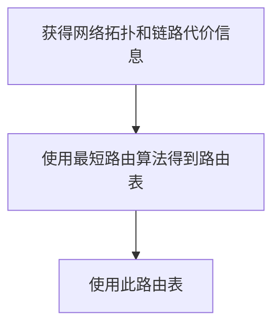
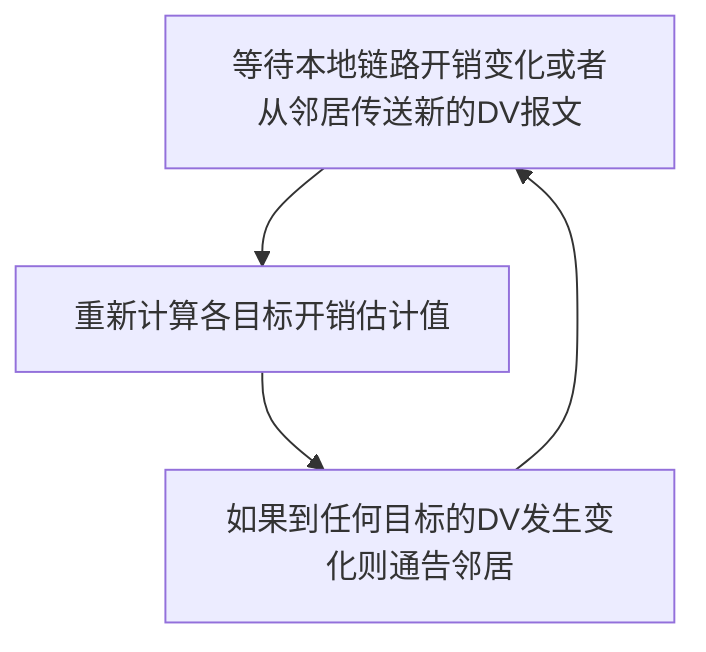

## 5.1 概述
### 控制平面介绍
控制平面的作用，就是对路由器的转发表/流表进行计算、维护、安装等操作。根据上一章的讲解，了解到有两种路由控制策略：

![[50-Network-layer-control-plane-perrouter-control.png]]
- ***Per-router control***. Figure 5.1 illustrates the case ==where a routing algorithm runs in each and every router; both a forwarding and a routing function are contained within each router==. Each router has a routing component that communicates with the routing components in other routers to compute the values for its forwarding table. This per-router control approach has been used in the Internet for decades. The OSPF and BGP protocols that we’ll study in Sections 5.3 and 5.4 are based on this per-router approach to control.
> 每一台路由器都运行路由选择算法（OSPF、BGP 等），每台路由器都包含转发和路由选择功能。
> 
> 每台路由器都由一个路由选择组件，用于与其它路由器中的路由选择组件通信，以计算其转发表的值。


![[50-Network-layer-control-plane-logically-centralized-control.png]]
- ***Logically centralized control***. Figure 5.2 illustrates the case in which ==a logically centralized controller computes and distributes the forwarding tables to be used by each and every router==. As we saw in Sections 4.4 and 4.5, the generalized match-plus-action abstraction allows the router to perform traditional IP forwarding as well as a rich set of other functions (load sharing, firewalling, and NAT) that had been previously implemented in separate middleboxes.
- The controller interacts with a control agent (CA) in each of the routers via a well-defined protocol to configure and manage that router’s flow table. Typically, the CA has minimum functionality; its job is to communicate with the controller, and to do as the controller commands. Unlike the routing algorithms in Figure 5.1, the CAs do not directly interact with each other nor do they actively take part in computing the forwarding table. This is a key distinction between per-router control and logically centralized control
> 控制协议与路由器中的控制代理进行交互，以配置和管理该路由器的流表。控制代理 CA 功能很少，只需与控制器通信并按命行事，CA 不能互相直接地交互、也不能主动参与计算流表。

### 路由
- 路由(route)：按照某种指标（传输延迟，所经过的站点数目等）找到一条从源节点到目标节点的较好路径
    - 较好路径：按照某种指标较小的路径
    - 指标：站数，延迟，费用，队列长度等，或者是一些单纯指标的加权平均
    - 采用什么样的指标，表示网络使用者希望网络在什么方面表现突出，什么指标网络使用者比较重视
- 以网络为单位（子网到子网）进行路由（路由信息通告+路由计算），而非主机到主机（主机到主机的路由规模比子网到子网大2-3个数量级）
    - 网络为单位进行路由，路由信息传输、计算和匹配的代价低
    - 前提条件是：一个网络所有节点地址前缀相同，且物理上聚集
    - **路由就是：计算网络到其他网络如何走的问题**
- 网络到网络的路由 = 路由器-路由器之间路由
    - 网络对应的路由器到其他网络对应的路由器的路由
    - 在一个网络中：路由器-主机之间的通信，链路层解决
    - 到了这个路由器就是到了这个网络
- 路由选择算法(routing algorithm)：网络层软件的一部分，完成路由功能

## 5.2 路由选择算法

### 网络的拓扑图抽象
![[50-Network-layer-control-plane-abstract-graph-network.png]]
- Graph $G = (N, E)$ is a set N of nodes and a collection E of edges, where each edge is a pair of nodes from N.
- In the context of network-layer routing, the ==nodes in the graph represent routers==—the points at which packet-forwarding decisions are made—
- and the ==edges connecting these nodes represent the physical links== between these routers.


边和路径的开销：
- For our purposes, we’ll simply take the edge costs as a given and won’t worry about how they are determined. For any edge (x, y) in E, we denote c (x, y) as the cost of the edge between nodes x and y. If the pair (x, y) does not belong to E, we set c (x, y) = ∞.
- Also, we’ll only consider undirected graphs in our discussion here, so that edge (x, y) is the same as edge (y, x) and that c (x, y) = c (y, x); however, the algorithms we’ll study can be easily extended to the case of directed links with a different cost in each direction.
- Also, a node y is said to be a ***neighbor*** of node x if (x, y) belongs to E.

网络拓扑图中的路径及路径开销：
- a path in a graph G = (N, E) is a sequence of nodes (x1, x2, g, xp) such that each of the pairs (x1, x2), (x2, x3), g, (xp-1, xp) are edges in E.
- The cost of a path (x1, x2, g, xp) is simply the sum of all the edge costs along the path, that is, c (x1, x2) + c (x2, x3) + g+ c (xp-1, xp). Given any two nodes x and y, there are typically many paths between the two nodes, with each path having a cost. One or more of these paths is a ***least-cost path***.
- $$ \text{Cost of path } (x_1, x_2, x_3, ... , x_p) = c(x_1, x_2) + c(x_2, x_3) + ... + c(x_{p-1}, x_p) $$
### 路由算法的目标与原则

路由算法的天然目标就是寻找最低开销路径：
- The least-cost problem is therefore clear: Find a path between the source and destination that has least cost.
- In Figure 5.3, for example, the least-cost path between source node u and destination node w is (u, x, y, w) with a path cost of 3.
- Note that if all edges in the graph have the same cost, the least-cost path is also the shortest path (that is, the path with the smallest number of links between the source and the destination).

最优化原则 (optimality principle)
- 汇集树 (sink tree)
    - 此节点到所有其它节点的最优路径形成的树——数据结构里的SPT
    - 路由选择算法就是为所有路由器找到并使用汇集树（最短路径树）

路由选择算法的原则
- 正确性 (correctness)：算法必须是正确的和完整的，使分组一站一站接力，正确发向目标站；完整：目标所有的站地址，在路由表中都能找到相应的表项；没有处理不了的目标站地址；
- 简单性 (simplicity)：算法在计算机上应简单：最优但复杂的算法，时间上延迟很大，不实用，不应为了获取路由信息增加很多的通信量；
- 健壮性 (robustness)：算法应能适应通信量和网络拓扑的变化：通信量变化，网络拓扑的变化算法能很快适应；不向很拥挤的链路发数据，不向断了的链路发送数据；
- 稳定性 (stability)：产生的路由不应该摇摆
- 公平性 (fairness)：对每一个站点都公平
- 最优性 (optimality)：某一个指标的最优，时间上，费用上，等指标，或综合指标；实际上，获取最优的结果代价较高，可以是次优的

### 路由算法的分类

- 全局或者局部路由信息？
    - 全局：集中式路由选择算法
        - 所有的路由器拥有完整的拓扑和边的代价的信息（上帝视角）
        - A ***centralized routing algorithm*** computes the least-cost path between a source and destination using complete, global knowledge about the network. That is, the algorithm takes the connectivity between all nodes and all link costs as inputs. ==This then requires that the algorithm somehow obtain this information before actually performing the calculation==. The calculation itself can be run at one site (e.g., a logically centralized controller as in Figure 5.2) or could be replicated in the routing component of each and every router (e.g., as in Figure 5.1). ==The key distinguishing== feature here, however, ==is that the algorithm has complete information about connectivity and link costs==. 
        - Algorithms with global state information are often referred to as ***link-state*** (LS) algorithms, since the algorithm must be aware of the cost of each link in the network. We’ll study LS algorithms in Section 5.2.1.
    - 分布式：分散式路由选择算法
        - 路由器只知道与它有物理连接关系的邻居路由器，和到相应邻居路由器的开销
        - 迭代地与邻居交换路由信息、计算路由信息
        - In a ***decentralized routing algorithm***, the calculation of the least-cost path is carried out in an iterative, distributed manner by the routers. ==No node has complete information about the costs of all network links. Instead, each node begins with only the knowledge of the costs of its own directly attached links==. Then, through an iterative process of calculation and exchange of information with its neighboring nodes, a node gradually calculates the least-cost path to a destination or set of destinations.
        - The decentralized routing algorithm we’ll study below in Section 5.2.2 is called a ***distance-vector*** (DV) algorithm, because ==each node maintains a vector of estimates of the costs (distances) to all other nodes in the network==. 
        - Such decentralized algorithms, with interactive message exchange between neighboring routers is perhaps ==more naturally suited to control planes where the routers interact directly with each other==, as in Figure 5.1.

- 静态或者动态的？
    - 静态：
        - 路由随时间变化缓慢
        - 人工手动调整
        - 非自适应算法 (non-adaptive algorithm)：不能适应网络拓扑和通信量的变化，路由表是事先计算好的
    - 动态：
        - 路由变化很快
        - 周期性更新
        - 根据链路代价的变化而变化
        - 容易受路由选择循环、路由震荡之类的问题影响
        - 自适应路由选择 (adaptive algorithm)：能适应网络拓扑和通信量的变化

负载敏感的还是迟钝的？
- In a ***load-sensitive algorithm***, link costs vary dynamically to reflect the current level of congestion in the underlying link. If a high cost is associated with a link that is currently congested, a routing algorithm will tend to choose routes around such a congested link. While early ARPAnet routing algorithms were load-sensitive `[McQuillan 1980]`, a number of difficulties were encountered `[Huitema 1998]`.
- Today’s Internet routing algorithms (such as RIP, OSPF, and BGP) are ***load-insensitive***, as a link’s cost does not explicitly reflect its current (or recent past) level of congestion.

### 链路状态路由选择算法
#### LS 路由的基本工作过程




1. 发现相邻节点，获知对方网络地址
	- 一个路由器上电之后，向所有线路发送广播分组
	- 其它路由器收到广播分组，回送应答，在应答分组中，告知自己的 IP 地址

2. 测量到相邻节点的代价（延迟，开销）
	- 实测法，发送一个分组要求对方立即响应
	- 回送一个 ECHO 分组
	- 通过测量时间可以估算出延迟情况

3. 组装一个 LS 分组，描述它到相邻节点的代价情况
	- 发送者 hostname + IP address
	- 序号，年龄
	- 列表：给出它相邻节点，和它到相邻节点的延迟/开销

4. 将分组通过泛洪扩散的方法发到所有其它路由器（这 4 步让每个路由器获得拓扑和边代价）
	- 顺序号：用于控制无穷的扩散，每个路由器都记录（源路由器，顺序号），发现重复的或老的就不扩散
		- 具体问题1：循环使用问题
		- 具体问题2：路由器崩溃之后序号从0开始
		- 具体问题3：序号出现错误
	- 解决问题的办法：年龄字段(age)
		- 生成一个分组时，年龄字段不为0
		- 每个一个时间段，AGE字段减1
		- AGE字段为0的分组将被抛弃
	- 关于扩散分组的数据结构
		- Source：从哪个节点收到LS分组
		- Seq.，Age：序号，年龄
		- Send flags：发送标记，必须向指定的哪些相邻站点转发LS分组
		- ACK flags：本站点必须向哪些相邻站点发送应答
		- DATA：来自source站点的LS分组
		- 如：节点B的数据结构

5. 通过 Dijkstra 算法找出最短路径（这才是路由算法）
	- 每个节点独立算出来到其他节点（路由器=网络）的最短路径
	- 迭代算法：第 k 步能够知道本节点到 k 个最近的其他节点（近指代价，不是物理上的举例）
		1. 路由器获得各站点 LS 分组和整个网络的拓扑
		2. 通过 Dijkstra 算法计算出到其它各路由器的最短路径
		3. 将计算结果安装到路由表中

#### LS的应用情况
- OSPF 协议是一种 LS 协议，被用于 Internet 上
- IS-IS(intermediate system-intermediate system)：被用于Internet主干中，Netware

#### Dijkstra 算法

- 符号标记：
    - $c(i, j)$：从节点 i 到 j 的链路代价（初始状态下非相邻节点之间的链路代价为 $\infty$ ）
    - $D(v)$：从源节点到节点 V 的最低开销路径的代价（节点的代价）
    - $p(v)$：从源到节点 V 的路径前序节点
    - $N'$：当前已经知道最优路径的的节点集合（永久节点的集合）

该集中式路由选择算法由一个初始化步骤和其后的循环组成，循环执行的次数与网络中的节点个数相同，一旦终止，该算法就计算出从源节点 u 到网络中每个其他节点的最短路径。（无向图中最短路径树是唯一的）

```
# Link-State Algorithm for Source Node u

Initialization: 
	N’ = {u}
	for all nodes v
		if v is a neighbor of u
			then D(v) = c(u,v) 
		else D(v) = ∞

Loop:
	find w not in N’ such that D(w) is a minimum
	add w to N’
	update D(v) for each neighbor v of w and not in N’:
		D(v) = min(D(v), D(w)+ c(w,v) )
	/* new cost to v is either old cost to v or known least path cost to w plus cost from w to v */
	until N’= N
```

- LS路由选择算法的工作原理
    - 节点标记：每一个节点使用(D(v), p(v)) 如：(3, B)标记
        - D(v)从源节点由已知最优路径到达本节点的距离
        - P(v)前序节点来标注
    - 算法过程中节点有两类：
        - 临时节点(tentative node)：还没有找到从源节点到此节点的最优路径的节点
        - 永久节点(permanent node) N'：已经找到了从源节点到此节点的最优路径的节点
- Dijkstra算法的框架
    1. 初始化
        - 除了源节点外，所有节点都为临时节点
        - 节点代价除了与源节点代价相邻的节点外,都为 $\infty$
    2. 从所有临时节点中找到一个节点代价最小的临时节点，将之变成永久节点（当前节点）W
    3. 对此节点的所有在临时节点集合中的邻节点(V)
        - 如果 D(v) > D(w) + C(w, v)，则重新标注此点为 (D(v) + C(w, v), W)
        - 否则，不重新标注
    4. 开始一个新的循环（第2步）
    5. 最终搜索得源节点到所有节点的最优路径，算法终止

>[! example] LS 算法的例子
> 考查网络：计算从 u 到所有可能目的地的最低开销路径
> ![[50-Network-layer-control-plane-abstract-graph-network.png]]
> 
> 计算过程如下表：
> ![[50-Network-layer-control-plane-ls-algo-on-fig5-3.png]]
> 
> 具体步骤如下：
> 1. In the ***initialization step***, the currently known least-cost paths from u to its directly attached neighbors, v, x, and w, are initialized to 2, 1, and 5, respectively. Note in particular that the cost to w is set to 5 (even though we will soon see that a lesser-cost path does indeed exist) since this is the cost of the direct (one hop) link from u to w. ==The costs to y and z are set to infinity because they are not directly connected to u==.
> 2. In the ***first iteration***, we look among those nodes not yet added to the set N′ and ==find that node with the least cost as of the end of the previous iteration==. That node is x, with a cost of 1, and thus x is added to the set N′. Line 12 of the LS algorithm is then performed to update D (v) for all nodes v, yielding the results shown in the second line (Step 1) in Table 5.1. The cost of the path to v is unchanged. The cost of the path to w (which was 5 at the end of the initialization) through node x is found to have a cost of 4. Hence this lower-cost path is selected and w’s predecessor along the shortest path from u is set to x. Similarly, the cost to y (through x) is computed to be 2, and the table is updated accordingly.
> 3. In the second iteration, nodes v and y are found to have the least-cost paths (2), and we break the tie arbitrarily and add y to the set N′ so that N′ now contains u, x, and y. The cost to the remaining nodes not yet in N′, that is, nodes v, w, and z, are updated via line 12 of the LS algorithm, yielding the results shown in the third row in Table 5.1.
> 4. And so on . . .
> 
> LS 算法终止时，每个节点都得到从源节点沿最低开销路径的前一节点，前一节点又有前一节点，直到串联起整个图，得到最小路径树（汇集树）
> 
> 通过对每个目的节点存放从 u 到目的地的最低开销路径的下一跳节点，在一个节点中的转发表能够根据此信息而构建：
> ![[50-Network-layer-control-plane-least-cost-path.png]]


- Dijkstra算法的复杂度：考虑 $n$ 节点的情况
	- 每一次迭代：需要检查所有不在永久集合 N 中的节点
	- $n(n+1)/2$ 次比较： $O(n^2)$
	- 有很有效的实现： $O(n\log{n})$ 最小堆 or 斐波那契堆

#### 震荡问题

![[50-Network-layer-control-plane-oscillations.png]]
- 链路开销非对称时：$c(u,v) \ne c(v,u)$ 
	- In this example, node z originates a unit of traffic destined for w, node x also originates a unit of traffic destined for w, and node y injects an amount of traffic equal to e, also destined for w. The initial routing is shown in Figure 5.5 (a) with the ==link costs corresponding to the amount of traffic carried==.
	- When the LS algorithm is next run, node y determines (based on the link costs shown in Figure 5.5 (a)) that the clockwise path to w has a cost of 1, while the counterclockwise path to w (which it had been using) has a cost of 1 + e. Hence y’s least-cost path to w is now clockwise. Similarly, x determines that its new least-cost path to w is also clockwise, resulting in costs shown in Figure 5.5 (b).
	- When the LS algorithm is run next, nodes x, y, and z all ==detect a zero-cost path to w in the counterclockwise direction, and all route their traffic to the counterclockwise routes==.
	- The next time the LS algorithm is run, x, y, and z all then route their traffic to the clockwise routes.
- 解决方案是让路由器不同时运行 LS 算法：
	- Interestingly, researchers have found that routers in the Internet can self-synchronize among themselves `[Floyd Synchronization 1994]`. That is, ==even though they initially execute the algorithm with the same period but at different instants of time, the algorithm execution instance can eventually become, and remain==, synchronized at the routers.
	- One way to avoid such ***self-synchronization*** is for each router to randomize the time it sends out a link advertisement.

### 距离向量路由选择算法

距离矢量路由选择(distance vector routing)：迭代式、异步、分布式算法
- It is ***distributed*** in that each node receives some information from one or more of its directly attached neighbors, performs a calculation, and then distributes the results of its calculation back to its neighbors.
- It is ***iterative*** in that this process ==continues on until no more information is exchanged between neighbors==. (Interestingly, the algorithm is also self-terminating—there is no signal that the computation should stop; it just stops.)
- The algorithm is ***asynchronous*** in that it does not require all of the nodes to operate in lockstep with each other. 

#### Bellman-Ford 方程

令 $d_{x}(y)$ 代表从节点 x 到节点 y 的最低路径开销，则其与 Bellman-Ford 方程相关：
$$d_x(y) = \min_{v}(c(x, v) + d_v(y))\quad (5-1)$$
- 其中 $c(x, v)$ 为 $x$ 到邻居 $v$ 的代价， $d_v(y)$ 为从邻居 $v$ 到目标 $y$ 的开销， $\min_v$ 为取所有 $x$ 的邻居取最小的 $v$ 
- 这个算法的本质思想是贪心——每一步都选择朝向目标方向的最短距离。

![[50-Network-layer-control-plane-bellman-ford-algo.png]]

>[! note] Bellman-Ford 方程的两个重要应用
>The Bellman-Ford equation is not just an intellectual curiosity. It actually has significant practical importance: 
>1. ***the solution to the Bellman-Ford equation provides the entries in node x’s forwarding table***.
>	- To see this, let v* be any neighboring node that achieves the minimum in Equation 5.1.
>	- Then, if node x wants to send a packet to node y along a least-cost path, it should first forward the packet to node v*. 
>	- Thus, node x’s forwarding table would specify node v* as the next-hop router for the ultimate destination y. 
>
>2. Another important practical contribution of the Bellman-Ford equation is that ***it suggests the form of the neighbor-to-neighbor communication that will take place in the DV algorithm***.

#### DV 算法的思想

每个节点 $x$ 以 $D_{x}(y)$ 开始，对网络 $N$ 中所有其他节点 $y$，估计从 $x$ 到 $y$ 的最低开销路径的开销。

1. 令 $\textbf{D}_{x}=[D_{x}(y):y\in N]$ 为节点 $x$ 的距离向量，其是从 $x$ 到网络 $N$ 中其它所有节点 $y$ 的开销的估计。

2. 使用 DV 算法，每个节点 $x$ 维护下列路由选择信息：
    - 从 $x$ 到所有直连邻居 $v$ 的开销记为 $c(x,v)$
    - 节点 $x$ 的距离向量 $\textbf{D}_{x}$，包含了 $x$ 到 $N$ 中所有目的地 $y$ 的开销的估计值 
    - 对于 $x$ 的每个邻居 $v$，各自维护 $\textbf{D}_v = [D_v(y): y \in N]$

3. DV 算法的核心思路：
    - 每个节点都将自己的距离矢量的副本传送给邻居，定时或者DV有变化时，让对方去算
    - 当 $x$ 从邻居那里收到新的距离向量时，保存 $v$ 的距离向量，然后使用 Bellman-Ford 方程更新 $x$ 自己的距离矢量：
        - $$D_x(y) \leftarrow \min_v{c(x,v) + D_v(y)}, \qquad \text{for every $y \in N$ } $$ 
        - 其中 $D_x(y)$ 为 $x$ 往 $y$ 的开销， $c(x,v)$ 为 $x$ 到邻居 $v$ 开销， $D_v(y)$ 为 $v$ 声称到 $y$ 的开销
    - 如果节点 $x$ 的距离向量因为这个步骤而改变，那么 $x$ 接下来将向它的每个邻居发送更新后的距离向量，继而让所有邻居扩散地更新各自的距离向量。
    - 只要所有的节点继续以异步的方式交换它们的距离向量，$D_x(y)$ 估计值最终会收敛于实际的最小开销值 $d_x(y)$



```
// Distance-Vector Algorithm

// At each node x:
Initialization: 
	for all destinations y in N: 
		Dx(y)= c(x,y)/* if y is not a neighbor then c(x,y)= ∞ */ 
	for each neighbor w
		Dw(y) = ? for all destinations y in N
	for each neighbor w
		send distance vector Dx = [Dx(y): y in N] to w

loop:
	wait (until I see a link cost change to some neighbor w or  until I receive a distance vector from some neighbor w)
	for each y in N:
		Dx(y) = min_v{c(x,v) + Dv(y)}
	
if Dx(y) changed for any destination y
	send distance vector Dx = [Dx(y): y in N] to all neighbors 
	
forever
```

In the DV algorithm, a node x updates its distance-vector estimate when it either sees a cost change in one of its directly attached links or receives a distance-vector update from some neighbor. But to update its own forwarding table for a given destination y, what node x really needs to know is not the shortest-path distance to y but instead the neighboring node v*(y) that is the next-hop router along the shortest path to y. As you might expect, the next-hop router v*(y) is the neighbor v that achieves the minimum in Line 15 of the DV algorithm. (If there are multiple neighbors v that achieve the minimum, then v*(y) can be any of the minimizing neighbors.) 
> DV 算法中，节点 x 在得知其直接链路开销的改变、或收到邻居更新后的距离向量，会更新自己的距离向量。但是为了更新自己通向远处节点 y 的转发表，x 并不直接与 y 通信，而是只需要了解能够到达 y 的最小开销路径的下一条路由器 v* 节点即可。

Thus, in Lines 14-15, for each destination y, node x also determines v*(y) and updates its forwarding table for destination y.

- Recall that the ***LS algorithm is a centralized*** algorithm in the sense that it requires each node to first obtain a complete map of the network before running the Dijkstra algorithm.
- The ***DV algorithm is decentralized*** and does not use such global information. Indeed, the only information a node will have is the costs of the links to its directly attached neighbors and information it receives from these neighbors. Each node waits for an update from any neighbor (Lines 13), calculates its new distance vector when receiving an update (Line 15), and distributes its new distance vector to its neighbors (Lines 17-18).

DV-like algorithms are used in many routing protocols in practice, including
- the Internet’s ***RIP*** and ***BGP***,
- ISO ***IDRP***,
- Novell ***IPX***,
- and the ***original ARPAnet***.

#### DV 算法的实例

- 距离矢量路由选择的基本思想
    - 各路由器维护一张路由表
    - 各路由器与相邻路由器交换路由表
    - 根据获得的路由信息，更新路由表
- 开销及相邻节点间开销的获得
    - 跳数 (hops)，延迟 (delay)，队列长度
    - 相邻节点间开销的获得：通过实测
- 路由信息的更新（定期测量它到相邻节点的开销，定期与相邻节点交换路由表 (DV)）
    - 根据实测得到本节点 A 到相邻站点的开销（如：延迟）
    - 根据各相邻站点声称它们到目标站点 B 的开销
    - 计算出本站点 A 经过各相邻站点到目标站点 B 的开销
    - 找到一个最小的开销，和相应的下一个节点 Z，到达节点 B 经过此节点 Z，并且开销为 A-Z-B 的开销
    - 其它所有的目标节点一个计算法

> [! example] 例子：DV 算法初始化、更新、停止
> 
> ![[50-Network-layer-control-plane-DV-operation.png]]
> 
> The leftmost column of the figure displays three initial routing tables for each of the three nodes. For example, the table in the upper-left corner is node x’s initial routing table.
> 
> Within a specific routing table, each row is a distance vector— specifically, each node’s routing table includes its own distance vector and that of each of its neighbors. Thus, the first row in node x’s initial routing table is $\textbf{D}_{x} = [D_{x}(x), D_{x}(y), D_{x}(z)] = [0, 2, 7]$. The second and third rows in this table are the most recently received distance vectors from nodes y and z, respectively. Because at initialization node x has not received anything from node y or z, the entries in the second and third rows are initialized to infinity.
> > 路由选择表的每一行是一个距离向量，而每个节点的路由表除了自身的距离向量外，还有直接邻居的距离向量的 copy。一开始还未从邻居接收到距离向量，因此初始化为无穷大。
> 
> After initialization, each node sends its distance vector to each of its two neighbors. This is illustrated in Figure 5.6 by the arrows from the first column of tables to the second column of tables. For example, node $x$ sends its distance vector $D_x = [0, 2, 7]$ to both nodes $y$ and $z$. After receiving the updates, each node recomputes its own distance vector. For example, node $x$ computes
> $$
  \begin{aligned}
  D_{x}(x) &= 0\\
  D_{x}(y) &= min\{c(x,y) + D_{y}(y), c(x,z) + D_{z}(y)\} = min\{2 + 0, 7 + 1\} = 2 \\
  Dx(z) &= min\{c(x,y) + D_{y}(z), c(x,z) + D_{z}(z)\} = min\{2 + 1, 7 + 0\} = 3
  \end{aligned}
> $$
> The second column therefore displays, for each node, the node’s new distance vector along with distance vectors just received from its neighbors.
> > 第二列路由转发表显示了根据邻居节点的新的距离向量进行计算后的结果，并且原封不动地保存了来自邻居的距离向量
> 
> Note, for example, that node x’s estimate for the least cost to node z, Dx (z), has changed from 7 to 3. Also note that for node x, neighboring node y achieves the minimum in line 15 of the DV algorithm; thus, at this stage of the algorithm, we have at node x that v*(y) = y and v*(z) = y.
> > 对于节点 x，在 DV 算法中确定了不论到 y 还是 z，下一跳 y 都是最近的路线，y 是下一条最近路线上的邻居。
> 
> After the nodes recompute their distance vectors, they again send their updated distance vectors to their neighbors (if there has been a change). This is illustrated in Figure 5.6 by the arrows from the second column of tables to the third column of tables. Note that only nodes x and z send updates: ***node y’s distance vector didn’t change so node y doesn’t send an update***. After receiving the updates, the nodes then recompute their distance vectors and update their routing tables, which are shown in the third column.
> > 注意到 y 节点的距离向量在上一轮没有变化，因此其不必再更新，也就不必再发送自己的距离向量通知邻居。
> 
> The process of receiving updated distance vectors from neighbors, recomputing routing table entries, and ==informing neighbors of changed costs of the least-cost path to a destination ***continues until no update messages are sent***==. At this point, since no update messages are sent, no further routing table calculations will occur and the algorithm will enter a quiescent state; that is, all nodes will be performing the wait in Lines 13 of the DV algorithm. The algorithm remains in the quiescent state until a link cost changes, as discussed next.
> > 没有更新报文发送时，停止路由转发表的计算，算法停留在静止状态。


DV的无穷计算问题
- DV的特点
    - 好消息传的快，坏消息传的慢
- 好消息的传播以每一个交换周期前进一个路由器的速度进行
    - 好消息：某个路由器接入或有更短的路径（链路由断变为通，链路开销由大变小），举例：

        

    - 坏消息的传播速度非常慢（无穷计算问题）
        - 例子：第一次交换之后，B从C处获得信息，C可以到达A（C-A，要经过B本身），但是路径是2，因此B变成3，从C处走；第二次交换，C从B处获得消息，B可以到达A，路径为3，因此，C到A从B走，开销为3；无限此之后，到A的距离变成INF，不可达

            

通过 水平分裂(split horizon)算法 减少上面所说的坏消息的环路的情况
- 一种对无穷计算问题的解决办法
    - C知道要经过B才能到达A，所以C向B报告它到A的距离为INF；C 告诉D它到A的真实距离
    - D告诉E，它到A的距离，但D告诉C它通向A的距离为INF
    - 第一次交换：B通过测试发现到A的路径为INF，而C也告诉B到A的距离为INF，因此，B到A的距离为INF
    - 第二次交换：C从B和D那里获知，到A的距离为INF，因此将它到A的距离为INF
    - ……坏消息以一次交换一个节点的速度传播
- 水平分裂的问题：在某些拓扑形式下会失败（存在环路）
    - 例子：
        - A,B到D的距离为2，C到D的距离为1
        - 如果C-D路径失败
        - C获知到D为INF，从A，B获知到D的距离为INF，因此C认为D不可达
        - A从C获知D的距离为INF，但从B处获知它到D的距离为2。因此A到B的距离为3，从B走
        - B也有类似的问题
        - 经过无限次之后，A和B都知道到D的距离为INF

### LS 与 DV 算法的比较

*2种路由选择算法都有其优缺点，而且在互联网上都有应用*

- 消息复杂度（DV胜出）
    - LS：有n节点，E条链路，发送报文O(nE)个
        - 局部的路由信息；全局传播
    - DV：只和邻居交换信息
        - 全局的路由信息；局部传播
- 收敛时间（LS胜出）
    - LS： $O(n^2)$ 算法
        - 有可能震荡
    - DV：收敛较慢
        - 可能存在路由环路
        - count-to-infinity 问题
- 健壮性：路由器故障会发生什么（LS胜出）
    - LS：
        - 节点会通告不正确的链路代价
        - 每个节点只计算自己的路由表
        - 错误信息影响较小，局部，路由较健壮
    - DV：
        - DV节点可能通告对全网所有节点的不正确路径代价
            - 距离矢量
        - 每一个节点的路由表可能被其它节点使用
            - 错误可以扩散到全网

## 5.3 因特网中自治系统内部的路由选择

互联网中的内部网关协议有两种常见协议：RIP 和 OSPF

### 5.3.1 RIP

RIP(Routing Information Protocol)
- 在1982年发布的BSD-UNIX中实现
- 基于 Distance vector 算法
    - 距离矢量：每条链路cost=1，# of hops (max = 15 hops) 跳数 （跳数为16表示目标不可达）
    - DV每隔30秒和邻居交换DV，通告(AD)
    - 每个通告包括：最多25个目标子网

    

RIP 通告(advertisements)
- DV：在邻居之间每30秒交换通告报文
    - 定期，而且在改变路由的时候发送通告报文
    - 在对方的请求下可以发送通告报文
- 每一个通告：至多AS内部的25个目标网络的DV（用于小型网，代价小，简单）
    - 目标网络 + 跳数

> 例子：
> 
> 
> <br>
> 

RIP：链路失效和恢复
- 如果180秒没有收到通告信息-->邻居或者链路失效
    - 发现经过这个邻居的路由已失效
    - 新的通告报文会传递给邻居
    - 邻居因此发出新的通告（如果路由变化的话）
    - 链路失效快速（？）地在整网中传输
    - 使用毒性逆转(poison reverse)阻止ping-pong回路（不可达的距离：跳数无限 = 16 段）

RIP进程处理
- RIP以应用进程的方式实现：route-d (daemon)
- 通告报文通过UDP报文传送，周期性重复
- 网络层的协议使用了传输层的服务，以应用层实体的方式实现


### 5.3.2 OSPF

OSPF(Open Shortest Path First) 开放最短路径优先协议
- “open”：标准可公开获得
- 使用LS算法
    - LS分组在网络中（一个AS内部）分发
    - 全局网络拓扑、代价在每一个节点中都保持
    - 路由计算采用Dijkstra算法
- OSPF通告信息中携带：每一个邻居路由器一个表项
- 通告信息会传遍AS全部（通过泛洪）
    - 在IP数据报上直接传送OSPF报文（而不是通过UDP和TCP）
- IS-IS路由协议：几乎和OSPF一样

OSPF“高级”特性（在RIP中的没有的）
- 安全：所有的OSPF报文都是经过认证的（防止恶意的攻击）
- 允许有多个代价相同的路径存在（在RIP协议中只有一个），可以在多条路径之上做负载均衡
- 对于每一个链路，对于不同的TOS有多重代价矩阵
    - 例如：卫星链路代价对于尽力而为的服务代价设置比较低，对实时服务代价设置的比较高
    - 支持按照不同的代价计算最优路径，如：按照时间和延迟分别计算最优路径
- 对单播和多播的集成支持: 
    - Multicast OSPF (MOSPF) 使用相同的拓扑数据库，就像在OSPF中一样
- 在大型网络中支持层次性OSPF

层次化的OSPF路由


- 2个级别的层次性：本地区域，骨干区域
    - 链路状态通告仅仅在本地区域Area范围内进行
    - 每一个节点拥有本地区域的拓扑信息；
        - 关于其他区域，知道去它的方向，通过区域边界路由器（最短路径）传到其他区域
- 区域边界路由器：“汇总（聚集）”到自己区域内网络的距离，向其它区域边界路由器通告（区域边界路由器参与多个区域的计算）
- 骨干路由器：仅仅在骨干区域内，运行OSPF路由
- 边界路由器：连接其它的AS’s
- 层次性的好处：每个链路状态分组仅仅在一个区域内进行泛洪

## 5.4 ISP之间的路由选择（外部网关协议）：BGP

平面路由
- 一个平面的路由
    - 一个网络中的所有路由器的地位一样
    - 通过LS，DV，或者其他路由算法，所有路由器都要知道其他所有路由器（子网）如何走
    - 所有路由器在一个平面
- 平面路由的问题
    - 规模巨大的网络中，路由信息的存储、传输和计算代价巨大
        - DV：距离矢量很大，且不能够收敛
        - LS：几百万个节点的LS分组的泛洪传输，存储以及最短路径算法的计算
    - 管理问题：
        - 不同的网络所有者希望按照自己的方式管理网络
        - 希望对外隐藏自己网络的细节
        - 当然，还希望和其它网络互联
- 所以需要层次化路由！

层次路由
- 层次路由：将互联网分成一个个AS（路由器区域）
    - 某个区域内的路由器集合，自治系统“autonomous systems”(AS)
    - 一个AS用AS Number(ASN)唯一标示
    - 一个ISP可能包括1个或者多个AS
- 路由变成了：2个层次路由：自治区域内+自治区域间
    - AS内部路由：在同一个AS内路由器运行相同的路由协议
        - “intra-AS” routing protocol：内部网关协议
        - 不同的AS可能运行着不同的内部网关协议（私有）
        - 能够解决规模和管理问题
        - 如：RIP, OSPF, IGRP
        - 网关路由器：AS边缘路由器，可以连接到其他AS
    - AS间运行AS间路由协议（每个自治区域只表现为一个点）
        - “inter-AS” routing protocol：外部网关协议
        - 解决AS之间的路由问题，完成AS之间的互联互通

层次路由的优点
- 解决了规模问题
    - 内部网关协议解决：AS内部数量有限的路由器相互到达的问题，AS内部规模可控
        - 如AS节点太多，可分割AS，使得AS内部的节点数量有限
    - AS之间的路由的规模问题
        - 增加一个AS，对于AS之间的路由从总体上来说，只是增加了一个节点=子网（每个AS可以用一个点来表示）
        - 对于其他AS来说只是增加了一个表项，就是这个新增的AS如何走的问题
        - 扩展性强：规模增大，性能不会减得太多
- 解决了管理问题
    - 各个AS可以运行不同的内部网关协议（私有）
    - 可以使自己网络的细节不向外透露（安全）

互联网AS间路由：BGP
- BGP (Border Gateway Protocol)：自治区域间路由协议“事实上的”标准（非某机构制定，而是大家约定俗成）
    - “将互联网各个AS粘在一起的胶水”
- BGP 提供给每个AS以以下方法：
    - eBGP：从相邻的ASes那里获得子网可达信息
    - iBGP：将获得的子网可达信息传遍到AS内部的所有路由器
    - 根据子网可达信息和策略来决定到达子网的“好”路径
    - 注：eBGP, iBGP 连接

        

- 允许子网向互联网其他网络通告“我在这里”
- 基于改进后的距离矢量算法（路径矢量）
    - 不仅仅是距离矢量，还包括到达各个目标网络的详细路径（AS序号的列表）能够避免简单DV算法的路由环路问题和无穷式的计算迭代

BGP基础
- BGP会话：2个BGP路由器(“peers”)在一个半永久的TCP连接上交换BGP报文：
    - 通告向不同目标子网前缀的“路径”（BGP是一个“路径矢量”协议）
- 当AS3网关路由器3a向AS2的网关路由器2c通告路径：AS3,X 
    - 3a参与AS内路由运算，知道本AS所有子网X信息
    - 语义上：AS3向AS2承诺，它可以向子网X转发数据报
    - 3a是2c关于X的下一跳(next hop)

路径的属性 & BGP路由
- 当通告一个子网前缀时，通告包括 BGP 属性
    - prefix + attributes = “route”
- 2个重要的属性：
    - AS-PATH：前缀的通告所经过的AS列表: AS 67 AS 17 
        - 检测环路；多路径选择
        - 在向其它AS转发时，需要将自己的AS号加在路径上
    - NEXT-HOP：从当前AS到下一跳AS有多个链路，在NETX-HOP属性中，告诉对方通过那个I转发。
    - 其它属性：路由偏好指标，如何被插入的属性
- 基于策略的路由：
    - 当一个网关路由器接收到了一个路由通告，使用输入策略来接受或过滤(accept/decline)
        - 过滤原因例1：不想经过某个AS，转发某些前缀的分组
        - 过滤原因例2：已经有了一条往某前缀的偏好路径
    - 策略也决定了是否向它别的邻居通告收到的这个路由信息

> BGP 路径通告例子：
> 
> - 路由器AS2.2c从AS3.3a接收到的AS3,X路由通告（通过eBGP）
> - 基于AS2的输入策略，AS2.2c决定接收AS3,X的通告，而且通过iBGP）向AS2的所有路由器进行通告
> - 基于AS2的策略，AS2路由器2a通过eBGP向AS1.1c路由器通告AS2,AS3,X 路由信息
>     - 路径上加上了AS2自己作为AS序列的一跳
> <br>
> - 网关路由器可能获取有关一个子网X的多条路径，从多个eBGP会话上：
>     - AS1网关路由器1c从2a学习到路径：AS2,AS3,X
>     - AS1网关路由器1c从3a处学习到路径AS3,X
>     - 基于策略（对路径进行打分，考虑政治上、经济上等），AS1路由器1c选择了路径：AS3,X，而且通过iBGP告诉所有AS1内部的路由器

BGP报文
- 使用TCP协议交换BGP报文。
- BGP 报文：
    - OPEN：打开TCP连接，认证发送方
    - UPDATE：通告新路径（或者撤销原路径）
    - KEEPALIVE：在没有更新时保持连接，也用于对OPEN 请求确认NOTIFICATION：报告以前消息的错误，也用来关闭连接

关于其他自治区域的可达信息，是由内部网关运算和外部网关运算协议的结果共同决定的。首先由外部网关协议规划到目标子网的路径，然后信息传输进入各子网内部后由内部网关协议决定出入口如何走

BGP 路径选择
- 路由器可能获得一个网络前缀的多个路径，路由器必须进行路径的选择，路由选择可以基于：
    - 本地偏好值属性：偏好策略决定
    - 最短AS-PATH：AS的跳数
    - 最近的NEXT-HOP路由器：热土豆路由
    - 附加的判据：使用BGP标示
- 一个前缀对应着多种路径，采用消除规则直到留下一条路径

热土豆路由
- 假设2d通过iBGP获知，它可以通过2a或者2c到达X
- 热土豆策略（“赶紧甩掉烫手的山芋”）：选择具备最小内部区域代价的网关作为往X的出口（如：2d选择2a，即使往X可能有比较多的AS跳数）：不要操心域间的代价！

为什么内部网关协议和外部网关协议如此不同？（内部网关协议更关注性能，外部网关协议更关注策略）
- 策略：
    - Inter-AS：管理员需要控制通信路径，谁在使用它的网络进行数据传输；
    - Intra-AS：一个管理者，所以无需策略；
        - AS内部的各子网的主机尽可能地利用资源进行快速路由
- 规模：
    - AS间路由必须考虑规模问题，以便支持全网的数据转发
    - AS内部路由规模不是一个大的问题
        - 如果AS太大，可将此AS分成小的AS；规模可控
        - AS之间只不过多了一个点而已
        - 或者AS内部路由支持层次性，层次性路由节约了表空间，降低了更新的数据流量
- 性能：
    - Intra-AS：关注性能
    - Inter-AS：策略可能比性能更重要

## 5.5 SDN控制平面

前面关注了控制平面的传统方式，现在聚焦于SDN方式。

OpenFlow：控制器<-->交换机报文
- 一些关键的控制器到交换机的报文
    - 特性：控制器查询交换机特性，交换机应答
    - 配置：交换机查询/设置交换机的配置参数
    - 修改状态：增加删除修改OpenFlow表中的流表
    - packet-out：控制器可以将分组通过特定的端口发出
- 一些关键的交换机到控制器的报文
    - 分组进入：将分组（和它的控制）传给控制器，见来自控制器的packet-out报文
    - 流移除：在交换机上删除流表项
    - 端口状态：通告控制器端口的变化

*幸运的是，网络管理员不需要直接通过创建/发送流表来编程交换机，而是采用在控制器上的app自动运算和配置*

OpenDaylight (ODL) 控制器
- ODL Lithium 控制器
- 网络应用可以在SDN控制内或者外面
- 服务抽象层SAL：和内部以及外部的应用以及服务进行交互

ONOS 控制器
- 控制应用和控制器分离（应用app在控制器外部）
- 意图框架：服务的高级规范：描述什么而不是如何
- 相当多的重点聚焦在分布式核心上，以提高服务的可靠性，性能的可扩展性

SDN：面临的挑战
- 强化控制平面：可信、可靠、性能可扩展性、安全的分布式系统
    - 对于失效的鲁棒性：利用为控制平面可靠分布式系统的强大理论
    - 可信任，安全：从开始就进行铸造
- 网络、协议满足特殊任务的需求
    - e.g., 实时性，超高可靠性、超高安全性
- 互联网络范围内的扩展性
    - 而不是仅仅在一个AS的内部部署，全网部署

## 5.7 ICMP

## 5.8 SNMP
